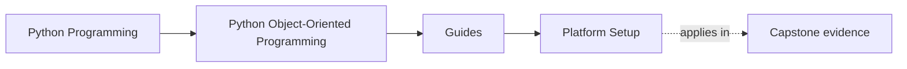
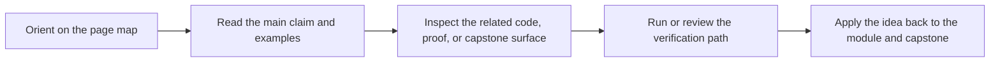

# Platform Setup

<!-- page-maps:start -->
## Page Maps




<!-- page-maps:end -->

Read the first diagram as a timing map: this page exists for setup pressure, not for
general course reading. Read the second diagram as the setup loop: check the owning
surface, run one route, then stop once the environment contract is visible.

Python Object-Oriented Programming uses a monitoring-system capstone as executable design
proof. The environment needs to be stable enough that ownership and invariant questions
stay about the design, not about shell drift.

## Minimum tooling

You need:

- Python 3.10 or newer
- Git on the command line
- a writable local filesystem for `artifacts/`
- the capstone-managed virtual environment created through `make install`

## Supported toolchain contract

Use these as the authoritative setup surfaces:

| Surface | What it tells you |
| --- | --- |
| `capstone/pyproject.toml` | supported Python floor |
| `capstone/Makefile` `install` target | how the supported environment is built |
| `capstone/Makefile` `inspect`, `verify-report`, and `proof` targets | which saved proof routes the environment must support |
| [Command Guide](../capstone/command-guide.md) | how to choose the right executable route once setup is stable |

The support promise is tied to the capstone-managed virtual environment, not to a global
Python that happens to have pytest already.

## Repository-root setup

From the repository root:

```bash
make PROGRAM=python-programming/python-object-oriented-programming docs-build
make PROGRAM=python-programming/python-object-oriented-programming test
make PROGRAM=python-programming/python-object-oriented-programming capstone-walkthrough
```

Use `test` to build the supported environment and run the raw suite. Use
`capstone-walkthrough` only after setup is stable and you are ready for the saved review
route.

## Capstone setup

From `capstone/`:

```bash
make install
make test
make inspect
make verify-report
```

That sequence creates the virtual environment, installs the editable package plus pytest,
checks the suite, and then verifies that the saved inspection and review
bundles can be built.

## What to verify before deeper proof

Check these in order:

1. `make install` completes and creates the virtual environment under `artifacts/venv/...`.
2. `make test` passes before you trust saved bundles.
3. `make inspect` produces the saved state bundle.
4. `make verify-report` succeeds before you escalate to `make proof`.

If step 2 fails, the right next move is environment repair, not architecture review.

## Common setup failures

| Symptom | Likely cause | Fix |
| --- | --- | --- |
| `venv` creation fails | unsupported Python on the path | install Python 3.10+ and rerun `make install` |
| `service_monitoring` import errors during tests | editable install missing from the virtual environment | rerun `make install` inside `capstone/` |
| inspection commands work differently across shells | global Python and capstone virtual environment are mixed | use the documented Make targets instead of ad hoc shell commands |
| saved bundles are missing under `artifacts/` | route run from the wrong directory or stale environment | rerun the documented route from the repository root or `capstone/` exactly |

## Drift signals

Treat these as reasons to re-check the setup contract:

- Python changed locally and the capstone virtual environment was not recreated
- tests pass, but `inspect` or `verify-report` fail from the documented routes
- the command list in [Command Guide](../capstone/command-guide.md) no longer matches the Makefile
- a global package upgrade changes behavior that the capstone environment did not request

## What this page does not promise

- It does not promise support for arbitrary global installs outside the capstone
  environment.
- It does not treat “the command exists” as enough; the saved proof routes still decide
  whether the environment is trustworthy.
- It does not replace [Proof Ladder](proof-ladder.md) when the real question is evidence
  depth rather than setup readiness.
