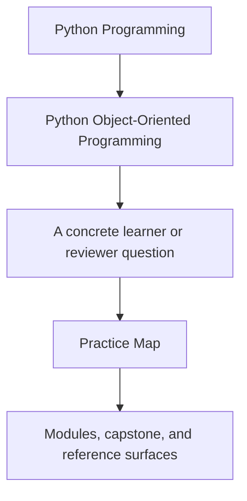
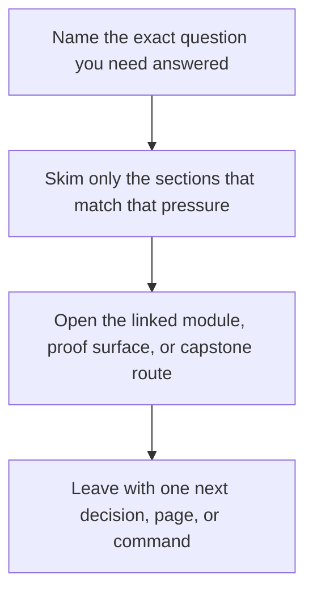

# Practice Map

<!-- page-maps:start -->
## Guide Fit

<!-- page-maps:end -->

Read the first diagram as a timing map: this guide is for a named pressure, not for wandering the whole course-book. Read the second diagram as the guide loop: arrive with a concrete question, use only the matching sections, then leave with one smaller and more honest next move.

This page translates the course into a repeatable rehearsal loop. The goal is not only
to finish reading. The goal is to improve judgment under change.

## Recommended practice rhythm

1. Read the module overview first.
2. Read the chapter sequence in order.
3. Pause after each major concept and write one sentence that begins with: "This object owns..."
4. Inspect the capstone file that most directly expresses that ownership.
5. Run or review the matching executable proof.
6. Rephrase the lesson in terms of change: what can now change locally?

## Practice questions that travel across modules

- What is authoritative here?
- What is only a derived view?
- Which object should reject invalid state?
- What extension should remain possible without editing the aggregate?
- What runtime behavior must stay outside the domain?

## Module-by-module rehearsal loop

| Module range | Write this ownership sentence | Inspect this capstone surface | Prove it with |
| --- | --- | --- | --- |
| Modules 01-03 | "This object owns identity, value, or lifecycle meaning because..." | `model.py` and lifecycle tests | `make inspect` |
| Modules 04-05 | "This boundary owns the invariant because..." | `ARCHITECTURE.md`, `read_models.py`, `runtime.py` | `make verify-report` |
| Modules 06-07 | "This runtime or persistence concern stays outside the aggregate because..." | `repository.py`, `runtime.py`, unit-of-work tests | `make verify-report` |
| Modules 08-10 | "This proof, public surface, or operational review belongs here because..." | `tests/`, proof guides, saved bundles | `make confirm` or `make proof` |

## What to write down after practice

- one owner you are more confident about than before
- one boundary that still feels risky under change
- one capstone file or bundle you would revisit first next time

## When to revisit a page

- revisit Module 01 when equality, copying, or mutation feel fuzzy
- revisit Module 03 when lifecycles or validation become informal
- revisit Module 04 when collaboration ownership becomes unclear
- revisit Module 08 when tests feel disconnected from design claims

## What this prevents

This practice loop prevents passive reading, diagram memorization, and the common mistake
of admiring an architecture without being able to say how it absorbs change.
