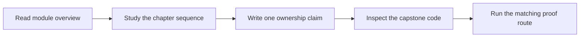
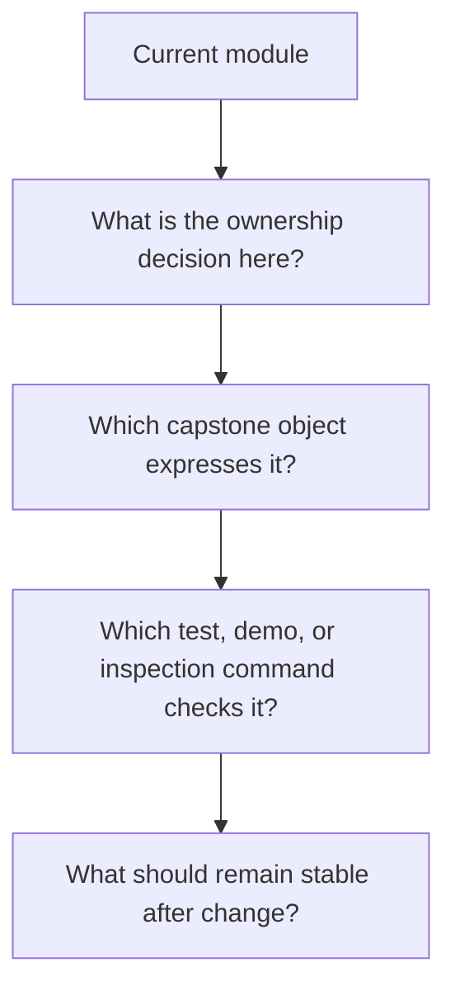

# Practice Map

<!-- page-maps:start -->
## Page Maps

<!-- page-maps:end -->

This page translates the course into a repeatable rehearsal loop. The goal is not only
to finish reading. The goal is to improve judgment under change.

## Recommended practice rhythm

1. Read the module overview first.
2. Read the chapter sequence in order.
3. Pause after each major concept and write one sentence that begins with: "This object owns..."
4. Inspect the capstone file that most directly expresses that ownership.
5. Run or review the matching executable proof.
6. Rephrase the lesson in terms of change: what can now change locally?

## Practice questions that travel across modules

- What is authoritative here?
- What is only a derived view?
- Which object should reject invalid state?
- What extension should remain possible without editing the aggregate?
- What runtime behavior must stay outside the domain?

## When to revisit a page

- revisit Module 01 when equality, copying, or mutation feel fuzzy
- revisit Module 03 when lifecycles or validation become informal
- revisit Module 04 when collaboration ownership becomes unclear
- revisit Module 08 when tests feel disconnected from design claims

## What this prevents

This practice loop prevents passive reading, diagram memorization, and the common mistake
of admiring an architecture without being able to say how it absorbs change.
