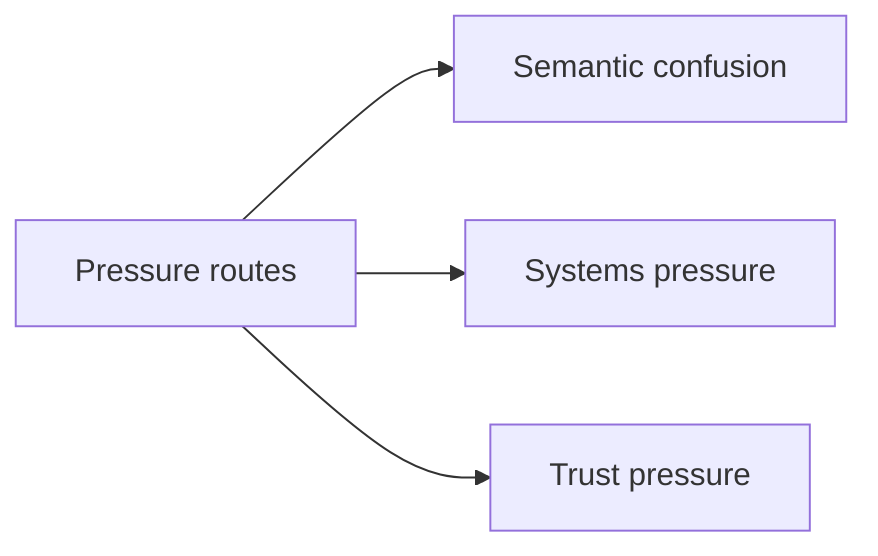
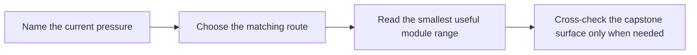

# Pressure Routes

<!-- page-maps:start -->
## Page Maps

<!-- page-maps:end -->

Use this page when you do not want the full front-to-back route. It gives the smallest
honest entry path based on the pressure you are under right now.

## Route by pressure

| Pressure | Start here | Then | Capstone cross-check |
| --- | --- | --- | --- |
| I cannot explain what this object actually means | Module 01 | Module 02 | capstone value types and entity boundaries |
| I do not know where behavior belongs | Module 02 | Module 03 | domain objects, policies, adapters |
| Illegal states keep leaking through | Module 03 | Module 04 | lifecycle and aggregate rules |
| Cross-object invariants are scattered | Module 04 | Module 05 | aggregate root and projection surfaces |
| Cleanup, retries, and errors feel random | Module 05 | Module 06 | runtime facade and unit-of-work boundary |
| Persistence is flattening the domain | Module 06 | Module 08 | repository and projection tests |
| Threads, queues, or async code are corrupting ownership | Module 07 | Module 08 | runtime orchestration and proof route |
| I need to know if this system is trustworthy | Module 08 | Module 09 and 10 | proof and public review guides |
| I need to expose a public API or plugin seam safely | Module 09 | Module 10 | facade and extension review |
| The system is already in production and I need an operational review | Module 10 | then revisit Module 05 or 08 as needed | confirm and inspection routes |

## Bad route choices to avoid

- starting at Module 09 when the real problem is object semantics
- starting at Module 10 when the system still has no clear owner for invariants
- reading only concurrency material when the shared-state model is already broken
- using the capstone proof route as a substitute for understanding the earlier modules

## If you have only one hour

- read [Course Home](../index.md)
- read [Module Promise Map](module-promise-map.md)
- pick one route from the table above
- end with the matching capstone guide instead of the strongest proof command

This course gets stronger when the learner can enter from pressure honestly instead of
pretending every reader should always start from the same place.
