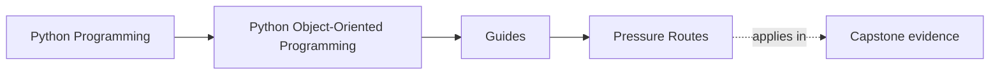
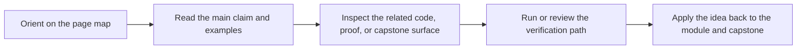

# Pressure Routes

<!-- page-maps:start -->
## Page Maps

<!-- page-maps:end -->

Read the first diagram as a timing map: this guide is for a named pressure, not for wandering the whole course-book. Read the second diagram as the guide loop: arrive with a concrete question, use only the matching sections, then leave with one smaller and more honest next move.

Use this page when you do not want the full front-to-back route. It gives the smallest
honest entry path based on the pressure you are under right now.

## Route by design question

| If the question is... | Start with | Keep nearby | Capstone cross-check |
| --- | --- | --- | --- |
| What kind of object is this, and what contract should it carry? | Modules 01 to 03 | [Module Promise Map](module-promise-map.md) | model and lifecycle tests |
| Should this be a value object, entity, service, or policy? | Module 02 | [Module Checkpoints](module-checkpoints.md) | domain objects, policies, and adapters |
| How do I stop illegal states from leaking through? | Module 03 | [Module Checkpoints](module-checkpoints.md) | lifecycle APIs and validation surfaces |
| Which object should own a cross-object invariant? | Module 04 | [Capstone Architecture Guide](../capstone/capstone-architecture-guide.md) | aggregate root, events, and projections |
| Where should retries, cleanup, or recovery behavior live? | Module 05 | [Proof Matrix](proof-matrix.md) | runtime facade and unit-of-work boundary |
| How do I add persistence without flattening the model? | Module 06 | [Capstone File Guide](../capstone/capstone-file-guide.md) | repository and projection boundaries |
| How do clocks, queues, or async work without corrupting ownership? | Module 07 | [Proof Ladder](proof-ladder.md) | runtime coordination and tests |
| Do the tests actually prove the intended contracts? | Module 08 | [Capstone Proof Guide](../capstone/capstone-proof-guide.md) | test suite and saved review bundles |
| What should be public, internal, or extensible? | Module 09 | [Capstone Review Worksheet](../capstone/capstone-review-worksheet.md) | facade and extension seams |
| Is this design operationally trustworthy? | Module 10 | [Proof Ladder](proof-ladder.md) | inspect, verify-report, confirm, and proof routes |

## Route by pressure

| Pressure | Start here | Then | Capstone cross-check |
| --- | --- | --- | --- |
| I cannot explain what this object actually means | Module 01 | Module 02 | capstone value types and entity boundaries |
| I do not know where behavior belongs | Module 02 | Module 03 | domain objects, policies, adapters |
| Illegal states keep leaking through | Module 03 | Module 04 | lifecycle and aggregate rules |
| Cross-object invariants are scattered | Module 04 | Module 05 | aggregate root and projection surfaces |
| Cleanup, retries, and errors feel random | Module 05 | Module 06 | runtime facade and unit-of-work boundary |
| Persistence is flattening the domain | Module 06 | Module 08 | repository and projection tests |
| Threads, queues, or async code are corrupting ownership | Module 07 | Module 08 | runtime orchestration and proof route |
| I need to know if this system is trustworthy | Module 08 | Module 09 and 10 | proof and public review guides |
| I need to expose a public API or plugin seam safely | Module 09 | Module 10 | facade and extension review |
| The system is already in production and I need an operational review | Module 10 | then revisit Module 05 or 08 as needed | confirm and inspection routes |

## Bad route choices to avoid

- starting at Module 09 when the real problem is object semantics
- starting at Module 10 when the system still has no clear owner for invariants
- reading only concurrency material when the shared-state model is already broken
- using the capstone proof route as a substitute for understanding the earlier modules

## If you have only one hour

- read [Course Home](../index.md)
- read [Module Promise Map](module-promise-map.md)
- pick one route from the table above
- end with the matching capstone guide instead of the strongest proof command

## If the second half of the course feels heavier than the first

Use this shorter arc instead of treating Modules 04 to 10 as seven isolated topics:

1. Start at Module 04 for cross-object authority.
2. Move to Module 05 for failure, cleanup, and evolution cost.
3. Move to Module 06 and Module 07 for persistence and runtime pressure.
4. End at Modules 08 to 10 for proof depth, public boundaries, and production review.

At each step, inspect one capstone surface before escalating to the strongest proof
route.

This course gets stronger when you can enter from pressure honestly instead of
pretending every route should always start from the same place.
