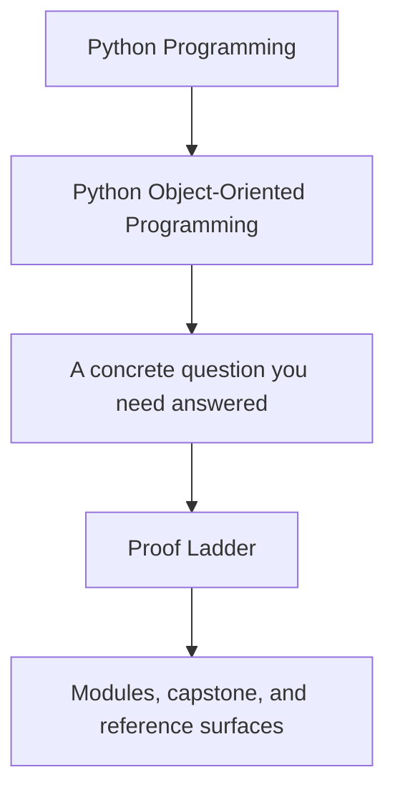
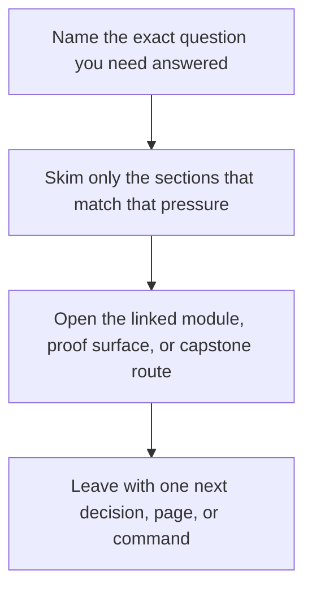

# Proof Ladder

<!-- page-maps:start -->
## Guide Fit

<!-- page-maps:end -->

Read the first diagram as a timing map: this guide is for a named pressure, not for wandering the whole course-book. Read the second diagram as the guide loop: arrive with a concrete question, use only the matching sections, then leave with one smaller and more honest next move.

Use this page when you are deciding how much proof you need. Not every OOP question
needs the strongest capstone command, and using the heaviest route too early often
hides the actual design issue.

## The ladder

| Need | Smallest honest proof | Escalate when |
| --- | --- | --- |
| understand the course promise | [Course Home](../index.md) and [Start Here](start-here.md) | you still cannot place the module you need |
| understand one module promise | [Module Promise Map](module-promise-map.md) and the module overview | the ownership rule is still fuzzy |
| know whether you are ready to move on | [Module Checkpoints](module-checkpoints.md) | you cannot explain the checkpoint in code |
| inspect the capstone shape | [Capstone Map](../capstone/capstone-map.md) and [Capstone File Guide](../capstone/capstone-file-guide.md) | you need executable evidence |
| review architecture and boundaries | [Capstone Architecture Guide](../capstone/capstone-architecture-guide.md) and [Capstone Walkthrough](../capstone/capstone-walkthrough.md) | you need durable saved evidence |
| review executable evidence | [Capstone Proof Guide](../capstone/capstone-proof-guide.md) and `make PROGRAM=python-programming/python-object-oriented-programming capstone-confirm` | you need to modify or extend the capstone itself |

## What each rung cannot prove on its own

- reading pages can explain the intended ownership, but they cannot prove current behavior
- inspection bundles can show state and narrative clearly, but they cannot replace targeted behavioral checks
- confirmation routes can prove the current local contract, but they cannot repair a vague question or an unclear ownership claim
- published proof routes can prove the public review path still works, but they are too heavy for every narrow design question

## Rules for escalation

- Read before you run when the question is architectural.
- Run before you speculate when the question is behavioral.
- Use the smallest proof that answers the current question.
- Escalate one rung at a time instead of jumping directly to confirmation.

## Common misuse

- using `capstone-confirm` to answer a question that a module overview already settles
- treating saved proof artifacts as if they replace reading the design surfaces
- reading the capstone without knowing what module promise you are trying to confirm
- escalating to the strongest route before deciding which object or boundary is actually under review

## Escalation checkpoints

Before you move up one rung, make sure you can answer these:

- what exact claim am I trying to prove
- which object or boundary should own that claim
- what weaker route already failed to answer it honestly

The ladder keeps the proof route proportional. That makes the capstone support the
course instead of overshadowing it.
