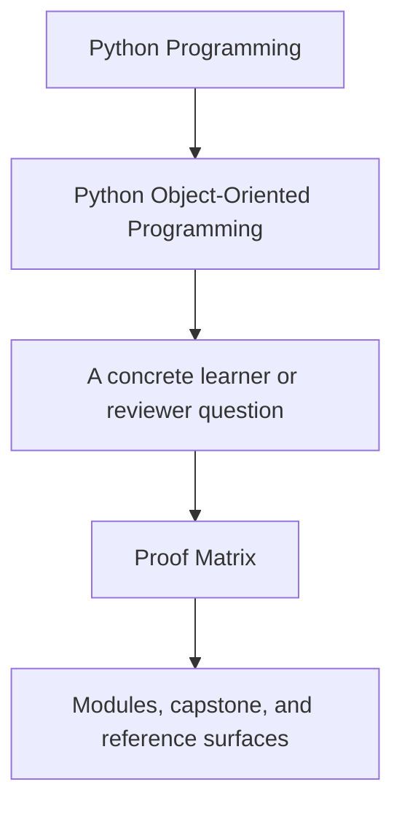
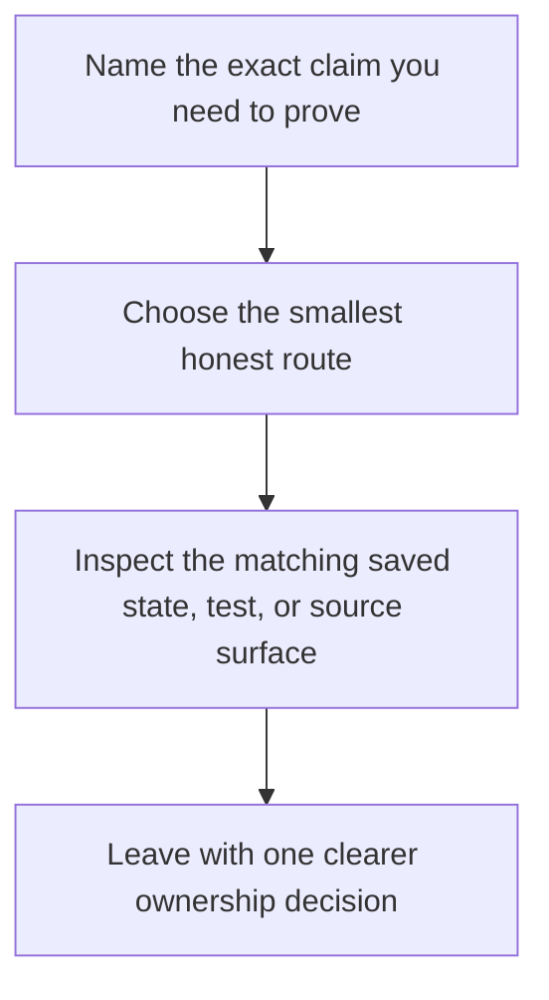

# Proof Matrix

<!-- page-maps:start -->
## Guide Fit

<!-- page-maps:end -->

Read the first diagram as a timing map: this guide exists for claim-to-evidence routing,
not for broad course browsing. Read the second diagram as the loop: choose the smallest
honest route, inspect the matching surface, then stop once the claim is settled.

Use this page when you know the object-design claim and need the fastest honest route to
evidence.

## Core design claims

| Claim | Best first command | Best first surface |
| --- | --- | --- |
| current policy and incident state stay legible without reading internals first | `make PROGRAM=python-programming/python-object-oriented-programming inspect` | `summary.txt`, `snapshot.json` |
| lifecycle rules remain explicit instead of spread across ad hoc flags | `make PROGRAM=python-programming/python-object-oriented-programming inspect` | `rules.txt`, `tests/test_policy_lifecycle.py`, `model.py` |
| historical and timeline views stay derived rather than authoritative | `make PROGRAM=python-programming/python-object-oriented-programming inspect` | `history.txt`, `timeline.txt`, `read_models.py` |
| retirement and rate-of-change scenarios stay reviewable under change | `make PROGRAM=python-programming/python-object-oriented-programming inspect` | `retirement.txt`, `rate_of_change.txt`, `runtime.py` |
| one executable scenario still communicates the domain story honestly | `make PROGRAM=python-programming/python-object-oriented-programming demo` | terminal walkthrough plus `tests/test_demo.py` |
| the raw executable suite still matches the ownership model | `make PROGRAM=python-programming/python-object-oriented-programming test` | `tests/`, especially lifecycle, runtime, application, and evaluation suites |

## Bundle and review claims

| Claim | Best first command | Best first surface |
| --- | --- | --- |
| a learner can read the capstone in one bounded walkthrough | `make PROGRAM=python-programming/python-object-oriented-programming capstone-walkthrough` | `walkthrough.txt`, `TOUR.md`, `WALKTHROUGH_GUIDE.md` |
| executable tests and learner-facing state still agree | `make PROGRAM=python-programming/python-object-oriented-programming capstone-verify-report` | `pytest.txt`, `summary.txt`, `history.txt`, `snapshot.json` |
| the strongest local confirmation route still holds | `make PROGRAM=python-programming/python-object-oriented-programming capstone-confirm` | executable suite plus saved learner-facing bundles |
| the full learner-facing proof route still builds end to end | `make PROGRAM=python-programming/python-object-oriented-programming proof` | inspection, walkthrough, and verification bundles together |

## Course contract to proof surface

| Course outcome | Best first route | Best first surface |
| --- | --- | --- |
| model value objects and entities without confusing their contracts | `inspect` | `summary.txt`, `rules.txt`, lifecycle tests |
| choose composition, inheritance, protocols, or plain functions deliberately | `capstone-walkthrough` | `walkthrough.txt`, `application.py`, `model.py` |
| design state transitions so illegal states are difficult to construct | `inspect` | `rules.txt`, `tests/test_policy_lifecycle.py`, `snapshot.json` |
| enforce cross-object invariants through aggregate roots and disciplined APIs | `capstone-verify-report` | `history.txt`, `timeline.txt`, runtime and application tests |
| evolve storage, codecs, and compatibility boundaries without flattening the domain | `capstone-verify-report` | `retirement.txt`, `rate_of_change.txt`, repository and runtime surfaces |
| publish public APIs and extension points that remain governable under change | `proof` | saved learner-facing bundles plus the public-capstone guides |

## Module-to-proof bridge

| Module range | Main learner question | Best first evidence surface |
| --- | --- | --- |
| Modules 01 to 03 | what do identity, roles, and lifecycle rules actually own | `summary.txt`, `rules.txt`, lifecycle tests |
| Modules 04 to 05 | where do cross-object invariants and failure boundaries actually live | `history.txt`, `timeline.txt`, `runtime.py`, `tests/test_unit_of_work.py` |
| Modules 06 to 07 | how do persistence and runtime pressure stay outside the aggregate | `retirement.txt`, `rate_of_change.txt`, repository and runtime tests |
| Modules 08 to 10 | which proof layer or public surface actually defends the design | `capstone-verify-report`, `capstone-confirm`, `proof` |

## Review questions

| Question | Best first command | Best first surface |
| --- | --- | --- |
| which object or boundary should own this claim | [Proof Ladder](proof-ladder.md) | this page plus [Capstone Map](../capstone/capstone-map.md) |
| where should I start when the issue is the current scenario state | `inspect` | `summary.txt`, `snapshot.json` |
| where should I start when the issue is lifecycle or rule ownership | `inspect` | `rules.txt`, `tests/test_policy_lifecycle.py` |
| where should I start when the issue is a full-system review | `capstone-verify-report` | `pytest.txt`, saved learner-facing state, and [Capstone Proof Guide](../capstone/capstone-proof-guide.md) |
| which route should I use before approving a larger change | `capstone-confirm` or `proof` | executable suite plus the saved bundles |

## Best companion pages

- [Proof Ladder](proof-ladder.md)
- [Pressure Routes](pressure-routes.md)
- [Command Guide](../capstone/command-guide.md)
- [Capstone Map](../capstone/capstone-map.md)
- [Capstone Proof Guide](../capstone/capstone-proof-guide.md)
