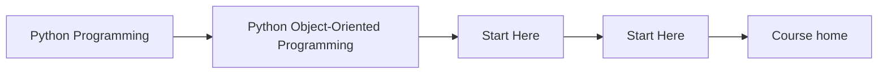
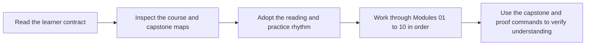

# Start Here

<!-- page-maps:start -->
## Page Maps

<!-- page-maps:end -->

This page is the shortest honest route into the course. Read it before browsing the
module tree. The subject is not class syntax. The subject is how Python object models
stay coherent when they carry state, invariants, collaboration, persistence, and runtime
pressure for a long time.

## Use This Course If

- you design or review Python systems where object semantics, invariants, or ownership are still fuzzy
- you need clearer boundaries around state, collaboration, persistence, or orchestration
- you want stronger criteria for deciding whether an object-heavy design is trustworthy

## Do Not Start Here If

- you only want class syntax or pattern trivia without system design trade-offs
- you want inheritance advice before you understand object semantics and ownership
- you want to treat the capstone as an optional appendix

## Readiness check

You are ready for the course if most of these already feel routine:

- writing a small class with a meaningful constructor and a pytest test
- explaining the difference between identity and equality in plain Python terms
- using `dataclass` for a simple value type without guessing what it generates
- describing why shared mutable state can create non-local bugs

If those still feel shaky, slow down and treat [Orientation](../module-00-orientation/index.md) plus [Module 01](../module-01-object-model/index.md) as a deliberate on-ramp instead of trying to browse the whole course.

## Best Reading Route

1. Read [Course Home](../index.md) for the course promise and module arc.
2. Read [Course Guide](course-guide.md) for the module sequence and page roles.
3. Read [Learning Contract](learning-contract.md) before you start Module 01.
4. Read [Orientation](../module-00-orientation/index.md) and [Course Map](../module-00-orientation/course-map.md) for the full structure.
5. Use [Design Question Map](design-question-map.md), [Module Promise Map](module-promise-map.md), and [Module Checkpoints](module-checkpoints.md) to keep the titles honest as you move forward.
6. Keep [Capstone](capstone.md) open while reading so the ownership claims stay tied to one executable system.
7. Use [Proof Ladder](proof-ladder.md), [Command Guide](command-guide.md), and [Capstone Map](capstone-map.md) when you want the executable route.

## If you have one hour

1. Read [Course Home](../index.md).
2. Read [Orientation](../module-00-orientation/index.md).
3. Read [Module Promise Map](module-promise-map.md).
4. Choose one row from [Pressure Routes](pressure-routes.md).
5. End with [Capstone](capstone.md) or [Capstone Map](capstone-map.md), not the strongest proof command.

## Use The Arcs Deliberately

- Modules 01 to 03 when object semantics, equality, or state design feel fuzzy
- Modules 04 to 07 when the main difficulty is collaboration, persistence, or runtime pressure
- Modules 08 to 10 when the design already exists and you need to decide whether it is trustworthy under tests, public use, and operations

## Success Signal

You are using the course correctly if each module makes one design question easier to
answer in the capstone: what changed, who should own it, and why that owner is the least
surprising place for the behavior to live.

## First Pages To Keep Open

- [Course Home](../index.md)
- [Course Guide](course-guide.md)
- [Orientation](../module-00-orientation/index.md)
- [Capstone](capstone.md)
