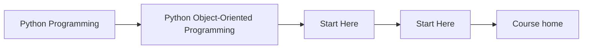
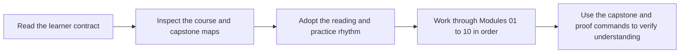

# Start Here

<!-- page-maps:start -->
## Page Maps

<!-- page-maps:end -->

This page is the shortest honest route into the course. Read it before browsing the
module tree. The subject is not class syntax. The subject is how Python object models
stay coherent when they carry state, invariants, collaboration, persistence, and runtime
pressure for a long time.

## What this course is really teaching

The course teaches object-oriented Python as a discipline of ownership:

- which object owns an invariant
- which boundary is authoritative
- which behavior belongs in orchestration instead of the domain
- which changes should stay local instead of rippling across the system

If you keep those questions in view, the modules feel cumulative instead of scattered.

## Best reading route

1. Read [Course Home](../index.md) for the course promise and module arc.
2. Read [Module Promise Map](module-promise-map.md) so each module has a clear contract before you start.
3. Read [Orientation](../module-00-orientation/index.md) and [Course Map](../module-00-orientation/course-map.md) for the full structure.
4. Read [Course Guide](course-guide.md) and [Learning Contract](learning-contract.md) before you start Module 01.
5. Keep [Module Checkpoints](module-checkpoints.md) open while reading so you know the module exit bar.
6. Use [Pressure Routes](pressure-routes.md) when you are entering from a concrete code-review or design problem.
7. Keep [Capstone](capstone.md) open while reading so the ownership claims stay tied to one executable system.
8. Use [Proof Ladder](proof-ladder.md), [Command Guide](command-guide.md), and [Capstone Map](capstone-map.md) when you want the executable route.

## When to use each arc

- Modules 01-03: use them when object semantics, equality, or state design feel fuzzy.
- Modules 04-07: use them when the main difficulty is collaboration, persistence, or runtime pressure.
- Modules 08-10: use them when the design already exists and you need to decide whether it is trustworthy under tests, public use, and operations.

## What to avoid

- jumping into advanced modules without the earlier semantic foundation
- treating the capstone as an optional appendix
- reading the chapters as pattern trivia instead of ownership decisions
- assuming a class hierarchy is progress by itself

## Success signal

You are using the course correctly if each module makes one design question easier to
answer in the capstone: what changed, who should own it, and why that owner is the least
surprising place for the behavior to live.
