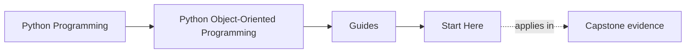
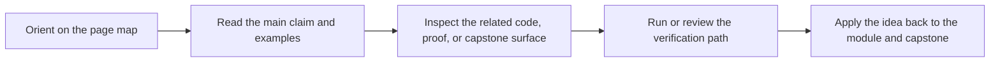

# Start Here

<!-- page-maps:start -->
## Page Maps

<!-- page-maps:end -->

Read the first diagram as a timing map: this guide is for a named pressure, not for wandering the whole course-book. Read the second diagram as the guide loop: arrive with a concrete question, use only the matching sections, then leave with one smaller and more honest next move.

This page is the shortest honest route into the course. Read it before browsing the
module tree. The subject is not class syntax. The subject is how Python object models
stay coherent when they carry state, invariants, collaboration, persistence, and runtime
pressure for a long time.

## Use This Course If

- you design or review Python systems where object semantics, invariants, or ownership are still fuzzy
- you need clearer boundaries around state, collaboration, persistence, or orchestration
- you want stronger criteria for deciding whether an object-heavy design is trustworthy

## Do Not Start Here If

- you only want class syntax or pattern trivia without system design trade-offs
- you want inheritance advice before you understand object semantics and ownership
- you want to treat the capstone as an optional appendix

## Readiness check

You are ready for the course if most of these already feel routine:

- writing a small class with a meaningful constructor and a pytest test
- explaining the difference between identity and equality in plain Python terms
- using `dataclass` for a simple value type without guessing what it generates
- describing why shared mutable state can create non-local bugs

If those still feel shaky, slow down and treat [Orientation](../module-00-orientation/index.md) plus [Module 01](../module-01-object-semantics-data-model/index.md) as a deliberate on-ramp instead of trying to browse the whole course.

## Best Reading Route

1. Read [Course Home](../index.md) for the course promise and module arc.
2. Read [Course Guide](course-guide.md) for the module sequence and page roles.
3. Read [Learning Contract](learning-contract.md) before you start Module 01.
4. Read [Proof Matrix](proof-matrix.md) so the course promises stay tied to evidence from the start.
5. Read [Orientation](../module-00-orientation/index.md) and [Course Map](../module-00-orientation/course-map.md) for the full structure.
6. Read [Platform Setup](platform-setup.md) before your first executable route or after local Python drift.
7. Use [Pressure Routes](pressure-routes.md), [Module Promise Map](module-promise-map.md), and [Module Checkpoints](module-checkpoints.md) to keep the titles honest as you move forward.
8. Keep [Capstone](../capstone/index.md) open while reading so the ownership claims stay tied to one executable system.
9. Use [Proof Ladder](proof-ladder.md), [Command Guide](../capstone/command-guide.md), and [Capstone Map](../capstone/capstone-map.md) when you want the executable route.

## Choose a reading mode before you continue

- Choose a foundation route if you are still learning how ownership, identity, lifecycle, and collaboration fit together.
- Choose a diagnosis route if one real design problem is already in front of you and you need the narrowest honest module.
- Choose a review route if the design already exists and your main question is whether it deserves confidence.

The course is easier to trust when you decide which mode you are in before opening more
pages.

## If you need a session-sized plan

Use this simple session recipe instead of opening more route pages:

- 20 minutes: read one module overview, inspect one named capstone file, and stop after one stable ownership answer.
- 45 minutes: read one overview, one key chapter, and one checkpoint or promise page, then inspect one capstone file and one proof surface.
- 90 minutes: read one full module, inspect the matching capstone guide and source surface, then use the narrowest proof route that actually answers the question.

If the second half of the course is the real source of density, switch to the
Modules 04 to 10 arc inside [Pressure Routes](pressure-routes.md) instead of browsing the shelf.

## If you have one hour

1. Read [Course Home](../index.md).
2. Read [Orientation](../module-00-orientation/index.md).
3. Read [Module Promise Map](module-promise-map.md).
4. Choose one row from [Pressure Routes](pressure-routes.md).
5. End with [Capstone](../capstone/index.md) or [Capstone Map](../capstone/capstone-map.md), not the strongest proof command.

## If you are tired but still want honest progress

1. Read one module overview only.
2. Read one support page that narrows the question: [Pressure Routes](pressure-routes.md) or [Module Checkpoints](module-checkpoints.md).
3. Inspect one capstone surface named by that page.
4. Stop after you can say which boundary owns the behavior.

## Use The Arcs Deliberately

- Modules 01 to 03 when object semantics, equality, or state design feel fuzzy
- Modules 04 to 07 when the main difficulty is collaboration, persistence, or runtime pressure
- Modules 08 to 10 when the design already exists and you need to decide whether it is trustworthy under tests, public use, and operations

## Success Signal

You are using the course correctly if each module makes one design question easier to
answer in the capstone: what changed, who should own it, and why that owner is the least
surprising place for the behavior to live.

## First Pages To Keep Open

- [Course Home](../index.md)
- [Course Guide](course-guide.md)
- [Orientation](../module-00-orientation/index.md)
- [Platform Setup](platform-setup.md)
- [Capstone](../capstone/index.md)
