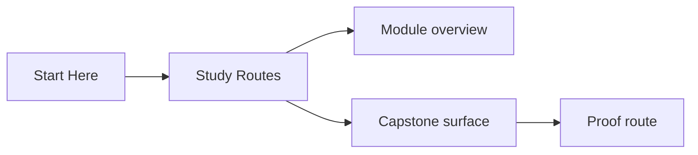
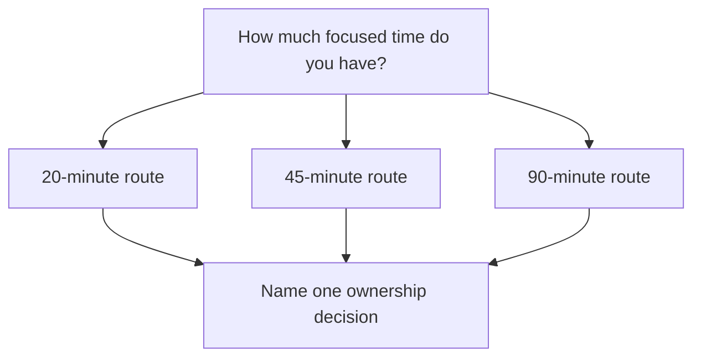

# Study Routes

<!-- page-maps:start -->
## Page Maps

<!-- page-maps:end -->

Use this page when the course feels clear in principle but hard to schedule honestly.
These routes turn the course into repeatable study sessions instead of a pile of pages.

## Route by available focus

| Route | Read | Inspect | Prove |
| --- | --- | --- | --- |
| 20-minute route | one module overview plus one support guide | one named capstone file | one inspection command or one targeted test |
| 45-minute route | one module overview, one key chapter, one checkpoint or promise page | one guide plus one capstone file | `make inspect`, `make tour`, or one targeted test file |
| 90-minute route | one module overview, the full chapter sequence for that module, and one support guide | the matching capstone guide and source surface | `make verify-report`, `make confirm`, or the strongest route that still answers the question narrowly |

## Route by learner need

| If you need to... | Start here | Continue with | Stop when you can say... |
| --- | --- | --- | --- |
| rebuild semantics | Module 01, Module 02, or Module 03 overview | `module-promise-map.md` and `practice-map.md` | which object owns identity, value semantics, or lifecycle rules |
| review collaboration boundaries | Modules 04 to 07 | `pressure-routes.md` and `capstone-map.md` | which boundary owns coordination and which one only derives views |
| audit a design for trust | Modules 08 to 10 | `module-checkpoints.md` and `capstone-proof-guide.md` | which claim is proven by which saved route or test suite |

## Session recipe

1. Name one question before you open the next page.
2. Pick the shortest route that can answer that question honestly.
3. Inspect one capstone surface before escalating to a stronger proof route.
4. End by writing one sentence beginning with `This boundary owns...`.

## When to stop instead of pushing through

- stop after one stable ownership answer instead of reading until attention collapses
- stop when the next page would only add vocabulary without changing your judgment
- stop when the proof route confirms the claim and you can place the next likely change

## Good pairings

- pair this page with [Practice Map](practice-map.md) when you want each session tied to rehearsal
- pair this page with [Pressure Routes](pressure-routes.md) when the best route depends on the problem you are under
- pair this page with [Systems Route](systems-route.md) when the second half of the course is the main source of density
- pair this page with [Capstone Proof Guide](capstone-proof-guide.md) when the session is mainly about confidence rather than reading
