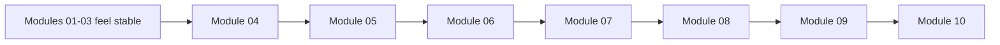
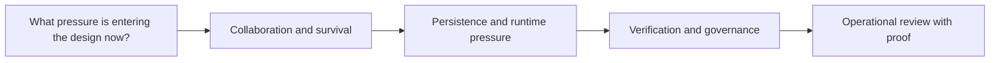

# Systems Route

<!-- page-maps:start -->
## Page Maps

<!-- page-maps:end -->

Use this page when Modules 01 to 03 already feel grounded and the remaining challenge is
the heavier systems half of the course. This route keeps Modules 04 to 10 tied together
as one design story instead of seven isolated advanced topics.

## The route

| Module | Main pressure | First capstone surface | Move on when you can say... |
| --- | --- | --- | --- |
| Module 04 | cross-object authority | `model.py`, `read_models.py`, `ARCHITECTURE.md` | which boundary is authoritative once multiple objects collaborate |
| Module 05 | failure, cleanup, and evolution cost | `runtime.py`, `repository.py`, `EXTENSION_GUIDE.md` | who pays for retries, cleanup, and compatibility drift |
| Module 06 | storage and serialized shape | `repository.py`, `PROOF_GUIDE.md`, unit-of-work tests | which representation is domain meaning versus storage convenience |
| Module 07 | time, cancellation, and concurrency pressure | `runtime.py`, `TOUR.md`, runtime tests | which objects should know about clocks, queues, or async boundaries |
| Module 08 | executable confidence | `TEST_GUIDE.md`, `PROOF_GUIDE.md` | which test or route would fail first if the design drifted |
| Module 09 | public surface and extension governance | `application.py`, `PACKAGE_GUIDE.md`, `EXTENSION_GUIDE.md` | which seams deserve publication and which should stay private |
| Module 10 | production review | `TARGET_GUIDE.md`, `INSPECTION_GUIDE.md`, `PROOF_GUIDE.md` | which operational changes preserve the ownership model and which ones corrupt it |

## Best pace for the second half

1. Read the module overview before any leaf chapter.
2. Inspect the named capstone surface before escalating to the strongest proof route.
3. End each module by writing one sentence that starts with `This boundary remains authoritative because...`.

## If the route starts to blur

- go back to Module 04 if the question is still "who owns this cross-object rule"
- go back to Module 05 if failure or compatibility pressure is being blamed on "infrastructure"
- go back to Module 08 if you can describe the design but not the evidence that would defend it

## Good companion pages

- [Pressure Routes](pressure-routes.md) when the real entry point is a current design problem
- [Study Routes](study-routes.md) when you need a session-sized plan for one module
- [Capstone Map](capstone-map.md) when you want the module sequence tied directly to repository surfaces
