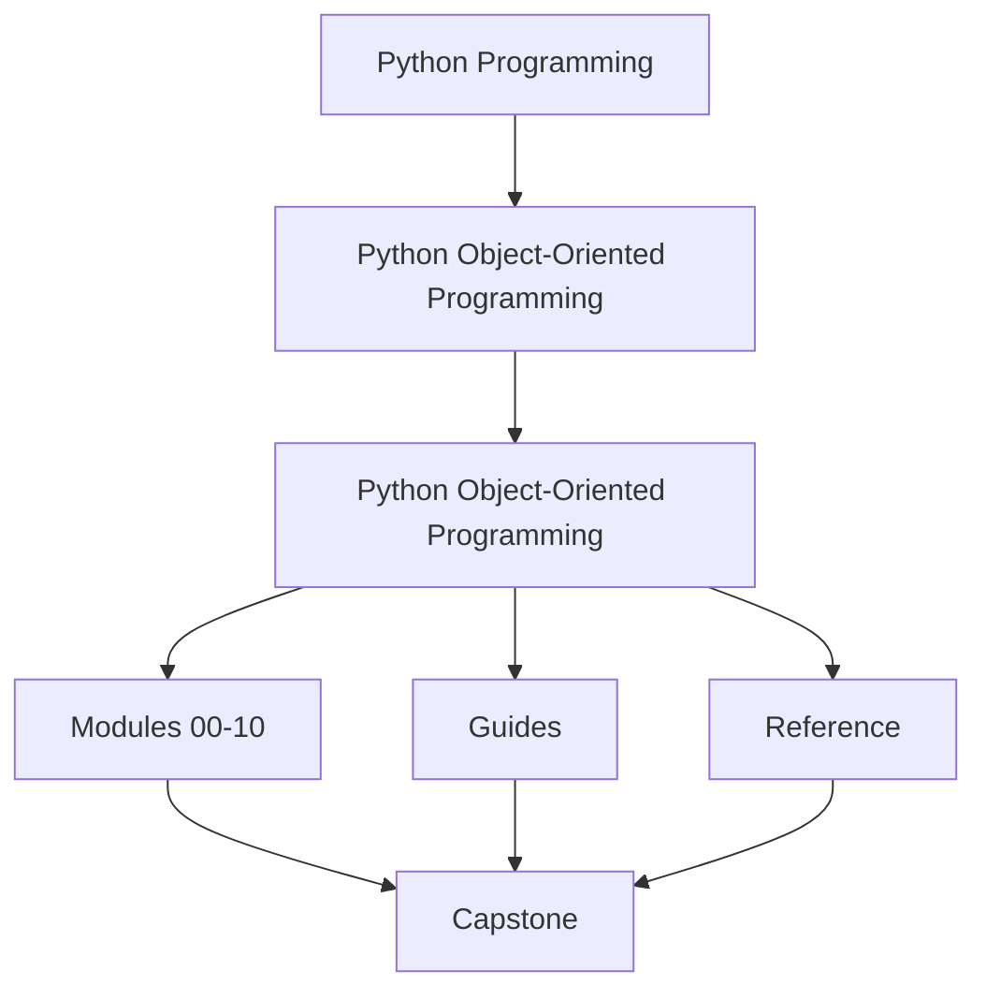
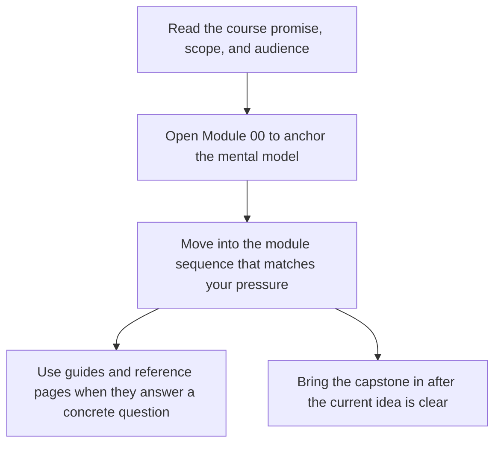

# Python Object-Oriented Programming

<!-- page-maps:start -->
## Course Shape

<!-- page-maps:end -->

Read the first diagram as the shape of the whole book: it shows where the home page sits relative to the module sequence, the support shelf, and the capstone. Read the second diagram as the intended entry route so learners do not mistake the capstone or reference pages for the first stop.

This course teaches object-oriented Python as a discipline of explicit semantics,
clear responsibilities, and long-lived system boundaries. The focus is not on class
syntax in isolation. The focus is on how object models behave under mutation,
inheritance, refactoring, and operational change.

## Use this course if

- you already know basic Python class syntax and now need stronger design judgment
- you design or review systems where ownership, invariants, or lifecycle rules feel blurry
- you want object-oriented material that stays tied to tests, capstone proof, and long-lived change

## Do not use this course as

- a first introduction to `class`, `self`, or inheritance syntax
- a pattern catalog detached from Python runtime behavior
- a reason to force classes into problems that should stay plain functions or plain data

## Why this course exists

Many Python OOP resources stop at surface mechanics: classes, inheritance, and a few
design patterns. That is not enough to build systems that remain readable and correct
after a year of feature growth.

This course is organized around harder questions:

- What is the semantic contract of an object in Python?
- When should identity matter more than value equality?
- Where do invariants live when multiple objects collaborate?
- How do you keep object-heavy systems from becoming tangled or brittle?
- How do you evolve APIs, storage, and behaviors without breaking callers?
- How do you add runtime pressure, verification depth, and operational hardening without losing design clarity?

## Reading contract

This is not a browse-at-random reference. The course is designed as a sequence:

1. Learn the object model before discussing architecture.
2. Learn role assignment before discussing state transitions.
3. Learn state transitions before discussing aggregates and cross-object invariants.
4. Learn collaboration boundaries before discussing persistence, time, and verification.
5. Learn public API and operational hardening after the internal model is stable.

If you skip that order, later chapters will still be readable, but the design trade-offs
will feel arbitrary instead of principled.

If you want the shortest stable entry route, start with [Start Here](guides/start-here.md).

## Fast entry routes

- Use [Start Here](guides/start-here.md) when you need the shortest honest route into the course.
- Use [Course Guide](guides/course-guide.md) when you want the ten-module arc explained before you start reading.
- Use [Proof Matrix](guides/proof-matrix.md) when you want every promise tied to one evidence route.
- Use [Pressure Routes](guides/pressure-routes.md) when you already have a concrete design or review problem.
- Use [Capstone](capstone/index.md) only after the module idea is clear enough that you know what you are trying to prove.

## Keep these references nearby

- [Object Design Checklist](reference/object-design-checklist.md)
- [Boundary Review Prompts](reference/boundary-review-prompts.md)
- [Topic Boundaries](reference/topic-boundaries.md)
- [Anti-Pattern Atlas](reference/anti-pattern-atlas.md)

## Guides

- [Guides Home](guides/index.md)
- [Start Here](guides/start-here.md)
- [Course Guide](guides/course-guide.md)
- [Learning Contract](guides/learning-contract.md)
- [Proof Matrix](guides/proof-matrix.md)
- [Module Promise Map](guides/module-promise-map.md)
- [Module Checkpoints](guides/module-checkpoints.md)
- [Pressure Routes](guides/pressure-routes.md)
- [Proof Ladder](guides/proof-ladder.md)

## What to keep open while reading

- [Module Promise Map](guides/module-promise-map.md) when you need the title of a module translated into a learner contract
- [Module Checkpoints](guides/module-checkpoints.md) when you want the "done" bar to stay visible
- [Capstone Map](capstone/capstone-map.md) when you want the module-to-repository bridge
- [Proof Ladder](guides/proof-ladder.md) when you want to choose the smallest honest proof route

## Module Table of Contents

| Module | Title | Why it matters |
| --- | --- | --- |
| [Module 00](module-00-orientation/index.md) | Orientation and Study Practice | establishes the reading contract, proof routes, and capstone timing |
| [Module 01](module-01-object-semantics-data-model/index.md) | Object Semantics and the Python Data Model | defines identity, equality, copying, and object contracts |
| [Module 02](module-02-design-roles-interfaces-layering/index.md) | Design Roles, Interfaces, and Layering | assigns responsibilities across values, services, adapters, and layers |
| [Module 03](module-03-state-validation-typestate/index.md) | State, Validation, and Typestate | makes lifecycle rules and illegal states explicit |
| [Module 04](module-04-aggregates-events-collaboration-boundaries/index.md) | Aggregates, Events, and Collaboration Boundaries | coordinates multiple objects without losing invariant ownership |
| [Module 05](module-05-resources-failures-safe-evolution/index.md) | Resources, Failures, and Safe Evolution | handles cleanup, recovery, and compatibility under change |
| [Module 06](module-06-persistence-serialization-schema-evolution/index.md) | Persistence, Serialization, and Schema Evolution | keeps storage and rehydration from flattening the domain |
| [Module 07](module-07-time-scheduling-concurrency-boundaries/index.md) | Time, Scheduling, and Concurrency Boundaries | makes time pressure and concurrency explicit in the model |
| [Module 08](module-08-testing-contracts-verification-depth/index.md) | Testing, Contracts, and Verification Depth | turns verification into a design discipline, not an afterthought |
| [Module 09](module-09-public-apis-extension-governance/index.md) | Public APIs, Extension Seams, and Governance | publishes stable surfaces without losing review control |
| [Module 10](module-10-performance-observability-security-review/index.md) | Performance, Observability, and Security Review | closes with operational hardening and full capstone review |

## Working model

The course uses a monitoring-system domain as the running example. That domain is
small enough to reason about and rich enough to force real design choices around
state, interfaces, aggregates, events, failure handling, construction boundaries,
and persistence-session pressure.

## How to use the running example

- Read each module overview first to understand the design pressure for that stage.
- Keep the capstone open while reading the later modules so every abstraction stays attached to one domain.
- Use the refactor chapters as checkpoints rather than optional appendices.
- Re-run the capstone tests after modules that materially change how you think about boundaries.

## What you will build

By the end of the course, you should be able to:

- model value objects and entities without confusing their contracts
- choose composition, inheritance, protocols, or plain functions deliberately
- design state transitions so illegal states are difficult to construct
- enforce cross-object invariants through aggregate roots and disciplined APIs
- evolve storage, codecs, and compatibility boundaries without flattening the domain
- keep time, concurrency, logging, retries, and observability explicit
- publish public APIs and extension points that remain governable under change

## Common failure modes this course is trying to prevent

- treating classes as containers instead of contracts
- using inheritance because it feels reusable rather than because it preserves substitutability
- using `super()`, mixins, or framework base classes without being able to explain the call chain
- hiding invalid states behind `None`, ad hoc flags, or informal conventions
- scattering invariants across multiple objects with no clear owner
- mixing domain rules, orchestration, persistence, and integrations in the same class
- leaking construction, configuration, or service location into domain code
- flattening failures into generic exceptions with no recovery contract
- letting ORM sessions and lazy loading redefine the apparent object contract
- introducing "small" changes that silently widen public API or lifecycle obligations
- letting serialized shapes, async wrappers, or plugin hooks bypass the intended boundaries
- optimizing or instrumenting the system in ways that quietly change semantics or expose secrets

## Reading order

- Start with [Start Here](guides/start-here.md).
- Continue with [Proof Matrix](guides/proof-matrix.md), [Module Promise Map](guides/module-promise-map.md), [Course Guide](guides/course-guide.md), and [Learning Contract](guides/learning-contract.md).
- Use [Module Checkpoints](guides/module-checkpoints.md) and [Pressure Routes](guides/pressure-routes.md) when you need a more intentional route.
- Start with [Orientation](module-00-orientation/index.md).
- Work through Modules 01 to 10 in order.
- Use the [Capstone](capstone/index.md) and [Proof Ladder](guides/proof-ladder.md) to connect the prose to runnable code honestly.

## Expected learner rhythm

- Read one module overview before touching its chapters.
- Read chapter prose in order unless you are deliberately reviewing.
- Pause at each refactor chapter and explain the design shift in your own words.
- Use the capstone as a design mirror, not only as a code sample.
