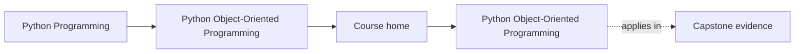
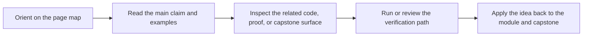

# Python Object-Oriented Programming

<!-- page-maps:start -->
## Page Maps

<!-- page-maps:end -->

This course teaches object-oriented Python as a discipline of explicit semantics,
clear responsibilities, and long-lived system boundaries. The focus is not on class
syntax in isolation. The focus is on how object models behave under mutation,
inheritance, refactoring, and operational change.

## Why this course exists

Many Python OOP resources stop at surface mechanics: classes, inheritance, and a few
design patterns. That is not enough to build systems that remain readable and correct
after a year of feature growth.

This course is organized around harder questions:

- What is the semantic contract of an object in Python?
- When should identity matter more than value equality?
- Where do invariants live when multiple objects collaborate?
- How do you keep object-heavy systems from becoming tangled or brittle?
- How do you evolve APIs, storage, and behaviors without breaking callers?
- How do you add runtime pressure, verification depth, and operational hardening without losing design clarity?

## Reading contract

This is not a browse-at-random reference. The course is designed as a sequence:

1. Learn the object model before discussing architecture.
2. Learn role assignment before discussing state transitions.
3. Learn state transitions before discussing aggregates and cross-object invariants.
4. Learn collaboration boundaries before discussing persistence, time, and verification.
5. Learn public API and operational hardening after the internal model is stable.

If you skip that order, later chapters will still be readable, but the design trade-offs
will feel arbitrary instead of principled.

If you want the shortest stable entry route, start with [Start Here](guides/start-here.md).

## Keep these references nearby

- [Object Design Checklist](reference/object-design-checklist.md)
- [Boundary Review Prompts](reference/boundary-review-prompts.md)

## Guides

- [Guides Home](guides/index.md)
- [Start Here](guides/start-here.md)
- [Course Guide](guides/course-guide.md)
- [Learning Contract](guides/learning-contract.md)

## Course shape

- [Orientation](module-00-orientation/index.md) establishes the reading discipline and course map.
- [Modules 01-03](module-01-object-model/index.md) through [module-03-state-and-typestate/index.md](module-03-state-and-typestate/index.md) build the semantic and state-design floor.
- [Modules 04-07](module-04-aggregates-and-collaboration/index.md) through [module-07-time-and-concurrency/index.md](module-07-time-and-concurrency/index.md) apply that floor to collaboration, persistence, and runtime pressure.
- [Modules 08-10](module-08-testing-and-verification/index.md) through [module-10-performance-observability-and-security/index.md](module-10-performance-observability-and-security/index.md) audit whether the design is actually trustworthy under tests, public use, and operations.
- [Capstone](guides/capstone.md) keeps the whole route tied to one executable system.

## Ten-module roadmap

1. [Module 01](module-01-object-model/index.md): object semantics and the Python data model.
2. [Module 02](module-02-design-and-layering/index.md): responsibility assignment and collaboration boundaries.
3. [Module 03](module-03-state-and-typestate/index.md): state, validation, and lifecycle rules.
4. [Module 04](module-04-aggregates-and-collaboration/index.md): aggregates, events, policies, and projections.
5. [Module 05](module-05-resources-and-evolution/index.md): cleanup, failure handling, and safe evolution.
6. [Module 06](module-06-persistence-and-schema-evolution/index.md): repositories, storage mapping, and schema change.
7. [Module 07](module-07-time-and-concurrency/index.md): clocks, scheduling, concurrency, and async boundaries.
8. [Module 08](module-08-testing-and-verification/index.md): executable proof and confidence design.
9. [Module 09](module-09-public-apis-and-extension-governance/index.md): public surfaces, extension seams, and governance.
10. [Module 10](module-10-performance-observability-and-security/index.md): operational review, observability, security, and capstone mastery.

## Working model

The course uses a monitoring-system domain as the running example. That domain is
small enough to reason about and rich enough to force real design choices around
state, interfaces, aggregates, events, and failure handling.

## How to use the running example

- Read each module overview first to understand the design pressure for that stage.
- Keep the capstone open while reading the later modules so every abstraction stays attached to one domain.
- Use the refactor chapters as checkpoints rather than optional appendices.
- Re-run the capstone tests after modules that materially change how you think about boundaries.

## What you will build

By the end of the course, you should be able to:

- model value objects and entities without confusing their contracts
- choose composition, inheritance, protocols, or plain functions deliberately
- design state transitions so illegal states are difficult to construct
- enforce cross-object invariants through aggregate roots and disciplined APIs
- evolve storage, codecs, and compatibility boundaries without flattening the domain
- keep time, concurrency, logging, retries, and observability explicit
- publish public APIs and extension points that remain governable under change

## What each module contributes

- [Orientation](module-00-orientation/index.md) establishes the learner contract, prerequisites, and course map.
- [Module 01](module-01-object-model/index.md) defines the semantic floor: identity, state, equality, attribute lookup, and copying.
- [Module 02](module-02-design-and-layering/index.md) assigns responsibilities across values, entities, services, policies, and adapters.
- [Module 03](module-03-state-and-typestate/index.md) turns state transitions, validation, and typestate into explicit design work.
- [Module 04](module-04-aggregates-and-collaboration/index.md) moves from single-object correctness to coherent collaboration boundaries.
- [Module 05](module-05-resources-and-evolution/index.md) focuses on survivability: cleanup, failure handling, compatibility, and change.
- [Module 06](module-06-persistence-and-schema-evolution/index.md) adds repositories, serialization, conflicts, and schema evolution.
- [Module 07](module-07-time-and-concurrency/index.md) adds clocks, schedulers, queues, async bridges, and concurrency-safe runtime boundaries.
- [Module 08](module-08-testing-and-verification/index.md) turns verification into a design discipline with contracts, properties, and confidence layers.
- [Module 09](module-09-public-apis-and-extension-governance/index.md) defines the public surface, extension seams, and governance rules for long-lived reuse.
- [Module 10](module-10-performance-observability-and-security/index.md) closes the course with measurement, observability, security, and full capstone review.
- [Capstone](guides/capstone.md) provides the executable slice that keeps the prose honest.

## Common failure modes this course is trying to prevent

- treating classes as containers instead of contracts
- using inheritance because it feels reusable rather than because it preserves substitutability
- hiding invalid states behind `None`, ad hoc flags, or informal conventions
- scattering invariants across multiple objects with no clear owner
- mixing domain rules, orchestration, persistence, and integrations in the same class
- introducing "small" changes that silently widen public API or lifecycle obligations
- letting serialized shapes, async wrappers, or plugin hooks bypass the intended boundaries
- optimizing or instrumenting the system in ways that quietly change semantics or expose secrets

## Reading order

- Start with [Start Here](guides/start-here.md).
- Continue with [Course Guide](guides/course-guide.md) and [Learning Contract](guides/learning-contract.md).
- Start with [Orientation](module-00-orientation/index.md).
- Work through Modules 01 to 10 in order.
- Use the [Capstone](guides/capstone.md) to connect the prose to runnable code.

## Expected learner rhythm

- Read one module overview before touching its chapters.
- Read chapter prose in order unless you are deliberately reviewing.
- Pause at each refactor chapter and explain the design shift in your own words.
- Use the capstone as a design mirror, not only as a code sample.
