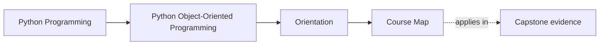
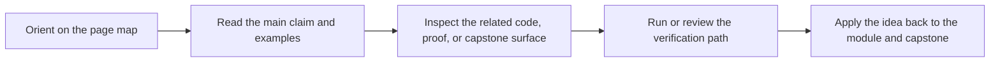

# Course Map

<!-- page-maps:start -->
## Page Maps

<!-- page-maps:end -->

Read the first diagram as a placement map: this page is one concept inside its parent module, not a detached essay, and the capstone is the pressure test for whether the idea holds. Read the second diagram as the working rhythm for the page: name the problem, study the example, identify the boundary, then carry one review question forward.

This page is the orientation hub for the full course. The progression is deliberate:
start with the Python object model, move into responsibility and layering, then into
state design, collaboration boundaries, persistence, runtime pressure, verification,
public APIs, and finally operational mastery.

The running example is a monitoring system. Each module sharpens that system from ad
hoc scripts into a design with explicit value types, aggregate roots, lifecycle
controls, and compatibility boundaries.

## How to read the course

- Use the staged maps below instead of trying to hold the whole ten-module sequence in memory at once.
- Treat each module as answering a different class of object-design question.
- Use the local refactor chapter in each module as the synthesis checkpoint before moving on.
- Return to the capstone after each module to locate the same ideas in executable code.

## Route by design question

| If your current question is... | Start with | Then |
| --- | --- | --- |
| What is this object, and what contract does it carry? | First-Contact Map | Modules 01-03 |
| Where should behavior and invariants live across collaborating objects? | Mid-Course Map | Modules 04-05 |
| How does this design survive persistence, time, and runtime pressure? | Mid-Course Map | Modules 06-07 |
| Can this design be trusted, exposed, and hardened over time? | Mastery Map | Modules 08-10 |

This keeps the map tied to human questions instead of forcing you to remember module numbers first.

## Staged maps

### [First-Contact Map](first-contact-map.md)

Use this when you are starting the course or re-orienting after time away.

- Modules 1-3
- object model, responsibilities, dataclasses, validation, typestate
- the minimum route for understanding how the monitoring domain becomes a disciplined object model

### [Mid-Course Map](mid-course-map.md)

Use this once the object model and state model feel stable.

- Modules 4-7
- aggregates, events, persistence, schema evolution, time, concurrency, and async boundaries
- the route where the codebase becomes a coherent system instead of a collection of classes

### [Mastery Map](mastery-map.md)

Use this when you are reviewing capstone hardening or planning real extensions.

- Modules 8-10
- verification strategy, public APIs, extension governance, performance, observability, security
- the route for deciding whether the design is ready to evolve under production pressure

## Quick module summary

| Stage | Modules | Main design question |
| --- | --- | --- |
| First contact | 1-3 | What is an object here, what should it own, and what states are legal? |
| Mid-course | 4-7 | How do those objects collaborate, persist, and survive time and concurrency pressure? |
| Mastery | 8-10 | How do we verify, govern, expose, and harden the system over time? |

## What to open with each map

- First-Contact Map: keep [Module Promise Map](../guides/module-promise-map.md) open.
- Mid-Course Map: keep [Pressure Routes](../guides/pressure-routes.md) and [Capstone Map](../capstone/capstone-map.md) open.
- Mastery Map: keep [Proof Ladder](../guides/proof-ladder.md) and [Capstone Review Worksheet](../capstone/capstone-review-worksheet.md) open.
