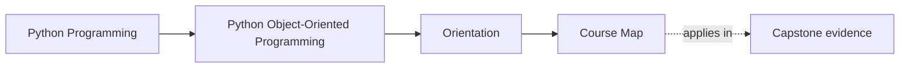

# Course Map

<!-- page-maps:start -->
## Page Maps

<!-- page-maps:end -->

This map shows the full progression of the course. The sequence is deliberate:
start with the Python object model, move into responsibility and layering, then
into state design, collaboration boundaries, persistence, runtime pressure,
verification, public APIs, and finally operational mastery.

The running example is a monitoring system. Each module sharpens that system from
ad hoc scripts into a design with explicit value types, aggregate roots, lifecycle
controls, and compatibility boundaries.

## How to read this map

- Treat each module as answering a different class of design question.
- Use the final refactor chapter in each module as the local synthesis checkpoint.
- Return to the capstone after each module to locate the same ideas in executable code.
- If a later module feels abstract, move backward until the missing earlier contract is clear.

## Module 1 – Python’s Object Model, Identity, and the Data Model

**Theme:** Understand what Python objects *really* are: identity, layout, equality, collections, and the data model. No hand-holding.

- **Core 01 – Object Identity, State, Behaviour (Python’s Real Model)**
- **Core 02 – Attribute Layout: `__dict__`, Class vs Instance, Descriptors in the Chain**
- **Core 03 – Construction Discipline: `__init__`, Required State, and Half-Baked Objects**
- **Core 04 – Encapsulation and Public Surface: Representations, Debuggability, and Leaks**
- **Core 05 – Equality, Ordering, and Hashing: Contracts with Containers**
- **Core 06 – Collections Hazards: Aliasing, Mutable Keys, and Shared State**
- **Core 07 – Copying and Cloning: Shallow, Deep, and Custom Semantics**
- **Core 08 – Python Data Model as Design Surface (Iteration, Containers, Context, Numeric)**
- **Core 09 – When OOP Is the Wrong Tool in Python**
- **Core 10 – Refactor 0: Script → Object Model with Correct Identity/Data-Model Semantics**

---

## Module 2 – Responsibilities, Interfaces, Inheritance, and Layering

**Theme:** From individual objects to **collaborating roles**: composition first, inheritance when justified, explicit interfaces, and layered design.

- **Core 11 – Responsibilities, Cohesion, and Object Smells**
- **Core 12 – Composition over Inheritance as Default**
- **Core 13 – Value Objects vs Entities: Identity and Lifecycle**
- **Core 14 – Avoiding Primitive Obsession: Semantic Types, Not Raw Str/Int**
- **Core 15 – Service Objects and Operations vs Stateful Entities**
- **Core 16 – Layering: Domain, Application, Infrastructure in a Python Codebase**
- **Core 17 – Inheritance: Legit Use Cases and the Fragile Base Class Problem**
- **Core 18 – Template Method and Tiny Hierarchies without a Framework Zoo**
- **Core 19 – Interfaces in Python: Duck Typing, ABCs, Protocols (Prescriptive Choices)**
- **Core 20 – Refactor 1: Thin Layered Architecture with Explicit Roles & Small Hierarchies**

---

## Module 3 – State, Dataclasses, Validation, Nulls, and Typestate

**Theme:** State as a **designed object**: dataclasses, immutability, validation, null/optional propagation, lifecycles, typestate, and property-based tests.

**Core 21 – Properties and Computed Attributes: Clarity vs Hidden Work**
When `@property` improves readability; when it hides I/O or heavy work; invariants for property use; migration strategies away from “property as mini-coroutine”.

**Core 22 – Descriptors Mental Model (Without Writing Your Own)**
What a descriptor is; what `@property` actually expands to; why “data vs non-data descriptor” matters for attribute resolution; enough model to debug and design, not to impress.

**Core 23 – Dataclasses, the Good: Concise Value and Entity Definitions**
Using `@dataclass` for value and entity types: default factories, equality, ordering; designing fields intentionally; when to say “no dataclass here”.

**Core 24 – Dataclasses, the Ugly: Inheritance, Defaults, Slots, Frozen Pitfalls**
Real bug gallery: field order, base-class fields, `slots=True` and tooling, “frozen but not really” interactions; how these break equality, hashing, and copying; safe subsets you can rely on.

**Core 25 – Post-Init Validation and “Invalid States Unrepresentable”**
Using `__post_init__` and helper constructors to enforce invariants; centralising validation logic; eliminating “partially valid” instances.

**Core 26 – Boundary Validation Libraries: Where Pydantic and Friends Belong**
Using Pydantic (or similar) at I/O boundaries (JSON, HTTP) while keeping internal domain objects clean; mapping between external schemas and core dataclasses; avoiding “Pydantic everywhere” as a smell.

**Core 27 – Nulls, Optionals, and Partial Objects: Designing Instead of Hoping**
Systematic treatment of `None`: optional fields, sentinel objects, partial aggregates, and how nulls propagate across layers; when to push null handling to the edges vs represent it explicitly.

**Core 28 – Lifecycle and Typestate: Draft → Active → Retired Objects**
Modeling object lifecycles as explicit states; design patterns for legal transitions; how typestate interacts with collections, caches, and persistence.

**Core 29 – Enforcing Typestate in Python APIs (Without Fancy Type Systems)**
Designing APIs that make illegal states/operations hard: separate types vs runtime checks vs constructor patterns; trade-offs; when typestate is worth the complexity.

**Core 30 – Refactor 2: Configs and Rules → Dataclasses, Null-Safe APIs, Typestate & Hypothesis**
Replace dict-based `Rule` configs with dataclasses; introduce null/optional semantics deliberately; encode `Rule` lifecycle; add Hypothesis tests for transitions, validity, and error conditions.

---

## Module 4 – Aggregates, Domain Events, Object Graphs, and Collaboration Patterns

**Theme:** Move from isolated objects to **coherent domains**: aggregates, events, patterns, and debuggable object graphs.

**Core 31 – Aggregates and Consistency Boundaries in a Python Service**
Define aggregates (`AlertAggregate` owning `Rule` plus `MetricHistory`); deciding where invariants live; who is allowed to mutate what and how.

**Core 32 – Cross-Object Invariants and Aggregate-Level Validation**
Invariants spanning multiple objects (e.g. “no open alerts without rules”); enforcing them at aggregate root; designing methods/commands that preserve those invariants.

**Core 33 – Aggregate Lifecycle and Failure Semantics**
Create/activate/deactivate aggregates; what happens when an operation partially fails; how to represent and surface failure at the aggregate level without leaking infrastructure detail.

**Core 34 – Domain Events for Decoupling (Without Full Event Sourcing)**
Designing `AlertTriggered`, `RuleChanged`, etc. as domain events; using events to decouple parts of the system in a **single process**; what you deliberately *do not* model (no CQRS, no distributed log).

**Core 35 – In-Process Event Dispatch: Tiny Observer and Event Bus**
Implement a minimal synchronous event bus: subscribers, dispatch order, error handling strategies; how this differs from global signals or raw callbacks.

**Core 36 – Projections, Read Models, and Object-Graph Debug Views**
Using events and aggregate state to build read models (dashboards, summaries) and **debug views**: who owns whom, what states are active, where cycles exist.

**Core 37 – Strategy and Policy Objects for Rule Evaluation and Decisions**
Implement Strategy for rule evaluation; representing rules as data + pluggable behaviour; defining a stable interface for adding new rule types later.

**Core 38 – Adapter and Bridge: Wrapping External Systems and Storage**
Wrapping third-party metric sources and storage backends; designing “ports and adapters” at the object level; avoiding leakage of HTTP/DB concerns into domain code.

**Core 39 – Designing Collaboration Surfaces: How Objects Talk Without Tangle**
Choosing method signatures that minimise coupling: “tell, don’t ask”; capability surfaces; avoiding “omniscient” god services that know every concrete class.

**Core 40 – Refactor 3: Monolithic Logic → Aggregates + Events + Strategies + Debuggable Graph**
Restructure the monitoring system to: a clear `AlertAggregate`, event emission on state changes, pluggable rule strategies, adapters for source/storage; add tests that assert expected events and verify object-graph sanity.

---

## Module 5 – Resources, Failures, Smells, Boundaries, and Evolution (Core Level)

**Theme:** Make object systems **survive**: resources, failure handling, smells & refactoring, copying semantics, and basic evolution/compatibility.

**Core 41 – Resources and Context Managers: Objects That Own Things**
Designing resource objects that encapsulate files, network connections, cursors; responsibilities for acquisition and release; when to implement `__enter__`/`__exit__` vs use helpers.

**Core 42 – Unit-of-Work: Grouping Changes and Handling Failures**
Grouping aggregate operations under a single “unit of work”; basic commit/rollback semantics purely in memory; how to structure application services around this pattern.

**Core 43 – Deterministic Cleanup and Leak Prevention in Pure Python**
Using `ExitStack`, `try/finally`, and object lifetimes to guarantee cleanup; where relying on GC is a bug; designing APIs that don’t force callers into cleanup hell.

**Core 44 – Idempotent Operations and Safe Retries (Sync-Only Context)**
Designing operations so that retrying doesn’t double-apply side effects: idempotent commands vs unsafe ones; how this interacts with aggregates and events, even in a single-process system.

**Core 45 – Logging and Error Propagation as Part of Object Contracts**
Designing logging as a deliberate contract: what gets logged, with what IDs/context; how domain errors propagate across layers; avoiding “log everywhere, fix nowhere” patterns.

**Core 46 – Public vs Internal Modules and Facades for OOP Codebases**
Defining which packages and classes are the public API; designing `monitoring.api` or similar; hiding infrastructure details behind facades; how this shapes later evolution.

**Core 47 – Design Smells and Refactoring Patterns in OOP Python**
Catalogue of critical smells (God objects, feature envy, long parameter lists, inappropriate intimacy, cyclic dependencies); concrete refactorings using tools from Modules 1–4.

**Core 48 – Copying and Versioning of Objects and Aggregates Over Time**
Designing clones and snapshots of entities/aggregates; how copying semantics interact with future evolution; when to snapshot state vs recompute; serialisation boundaries.

**Core 49 – Evolution Basics and Compatibility Contracts**
Semantic versioning for object APIs and serialized forms; distinguishing structural vs behavioural vs format compatibility; where to be strict vs tolerant in a Python service.

**Core 50 – Refactor 4: Introduce New Feature, Preserve Old Behaviour, Document Smell Fixes**
Add a non-trivial feature (e.g. new rule type or new metric dimension) to the monitoring system:
– without breaking existing callers or stored data,
– after cleaning up key smells,
– with explicit tests for compatibility, logs, and resource correctness.

---

## Module 6 – Persistence, Repositories, Serialization, and Schema Evolution

**Theme:** Keep rich object models intact when they cross storage and wire boundaries: repositories, codecs, conflicts, migrations, and compatibility.

**Core 51 – Repository Contracts and Aggregate Rehydration**
Define repositories in aggregate language; rehydrate through domain invariants instead of treating persistence as loose row assembly.

**Core 52 – Mapping Domain Objects to Storage Models**
Separate semantic domain types from storage records; convert raw primitives at the boundary rather than widening the whole codebase.

**Core 53 – Serialization Boundaries and Explicit Codecs**
Use boundary codecs for JSON, files, or messages so serialized forms become reviewable contracts instead of scattered convenience methods.

**Core 54 – Snapshots, Events, and Rebuild Trade-Offs**
Choose when snapshots, stored events, or a hybrid model make sense; distinguish audit value from unnecessary event-sourcing theater.

**Core 55 – Schema Versioning and Upcasters**
Add explicit format versions and small upcasters so older persisted payloads can evolve safely without infecting the domain model.

**Core 56 – Optimistic Concurrency and Conflict Detection**
Handle stale writes with explicit version tokens and surface conflicts as real application behavior instead of silent overwrite.

**Core 57 – Transactional Boundaries and Outbox Thinking**
Keep save-and-publish workflows coherent; persist publication intent with state changes so downstream delivery does not drift from the source of truth.

**Core 58 – Persistence Tests and Backend Swappability**
Use contract suites to prove repository implementations preserve the same semantic guarantees across in-memory, file-backed, and database-backed variants.

**Core 59 – Migrating Stored Data without Domain Corruption**
Treat migrations as reviewed production code; keep one-off repair logic separate from everyday loading and validate semantics after structural change.

**Core 60 – Refactor 5: Repositories, Codecs, and Schema Evolution**
Extend the monitoring system with storage-aware boundaries, versioned codecs, conflict detection, and migration paths without flattening aggregate ownership.

---

## Module 7 – Time, Scheduling, Concurrency, and Async Boundaries

**Theme:** Model clocks, worker coordination, and async integration explicitly so concurrency pressure sharpens design instead of dissolving it.

**Core 61 – Clocks, Timezones, and Monotonic Time**
Separate wall-clock timestamps from elapsed-time measurement; inject clocks so temporal behavior stays testable and reviewable.

**Core 62 – Deadlines, Timeouts, and Expiration Policies**
Model durations, deadlines, and time-based business rules explicitly instead of scattering raw integers and hidden `now()` calls.

**Core 63 – Schedulers, Timers, and Coordination Objects**
Keep polling cadence and delayed work in orchestration objects so domain entities do not become timer-driven mini-frameworks.

**Core 64 – Threads, Locks, and Owned Mutation**
Choose explicit mutation ownership, synchronization boundaries, or ownership transfer rather than relying on incidental thread safety.

**Core 65 – Queues, Workers, and Backpressure Boundaries**
Use queues as ownership and capacity boundaries; define what happens when workers fall behind or crash.

**Core 66 – `asyncio` Tasks and Sync-Async Bridges**
Bridge async adapters to synchronous domain logic cleanly; make blocking behavior visible and keep async concerns near the boundary.

**Core 67 – Cancellation, Retries, and Resumable Operations**
Treat cancellation and retry as part of the behavioral contract; model resumable work with explicit state markers and safe boundaries.

**Core 68 – Concurrency-Safe Caches and Memoization**
Cache only what you can explain; define invalidation, freshness, and synchronization instead of assuming memoization is harmless.

**Core 69 – Designing Thread-Aware and Async-Aware APIs**
Expose concurrency expectations clearly through public interfaces so callers know what blocks, what awaits, and what owns background work.

**Core 70 – Refactor 6: Runtime around Time and Concurrency Boundaries**
Reshape the monitoring runtime around clocks, schedulers, queues, and async adapters while keeping aggregate logic explicit and synchronous.

---

## Module 8 – Testing, Verification, Contracts, and Confidence

**Theme:** Turn verification into an architectural discipline: behavior-first tests, lifecycle coverage, property checks, and confidence layers.

**Core 71 – Behavior-First Tests for Domain Objects**
Assert on domain outcomes, state changes, events, and errors instead of internal call choreography.

**Core 72 – Stateful Testing and Transition Coverage**
Verify lifecycles through sequences of operations so history-dependent bugs and illegal transitions stay visible.

**Core 73 – Contract Tests for Repositories and Adapters**
Define shared semantic suites for interchangeable boundaries; stop backend drift before it becomes production inconsistency.

**Core 74 – Property-Based Testing for Object Models**
Use generated inputs and sequences to probe invariants, round-trips, equality laws, and state-machine behavior.

**Core 75 – Fixtures, Builders, and Test Data Ownership**
Keep setup readable and local; use builders and fixtures to reduce noise without hiding the real conditions that matter to each test.

**Core 76 – Fakes, Stubs, Spies, and When Mocks Hurt**
Choose doubles deliberately; prefer fakes and contracts when stateful behavior matters and reserve strict interaction mocks for true protocol checks.

**Core 77 – Runtime Contracts, Assertions, and Defensive Checks**
Use assertions and boundary checks to localize corruption and programming mistakes without pretending they replace a broader verification strategy.

**Core 78 – Golden Files, Snapshots, and Approval Boundaries**
Snapshot stable public outputs only; treat approvals as contract review rather than routine churn.

**Core 79 – Integration Suites and Confidence Ladders**
Map test layers to risk so unit, contract, integration, and scenario suites each prove something distinct and honest.

**Core 80 – Refactor 7: Tests toward Contract-Driven Confidence**
Rebuild the monitoring test strategy around lifecycle sequences, repository contracts, property checks, and stable public-output verification.

---

## Module 9 – Public APIs, Extension Points, Plugins, and Governance

**Theme:** Decide what is public, how customization happens, and which governance rules keep extension seams safe over time.

**Core 81 – Facades, Entrypoints, and Public Surface Area**
Define the stable import and command surfaces consumers should rely on so internal modules can keep evolving.

**Core 82 – Capability Protocols and Stable Extension Points**
Expose narrow capabilities for custom behavior instead of letting plugins or adapters reach into private state.

**Core 83 – Plugin Discovery, Registration, and Sandboxing**
Add plugin support only with explicit discovery, validation, lifecycle, and trust rules; distinguish convenience extensibility from real isolation.

**Core 84 – Deprecation, Versioning, and Removal Policy**
Treat public methods, modules, and behaviors as lifecycle-managed surfaces with explicit migration guidance and compatibility windows.

**Core 85 – Documentation, Examples, and Executable API Promises**
Use examples to teach the intended surface and keep them executable so the public path stays aligned with the code.

**Core 86 – Import Boundaries and Layer Enforcement**
Define which layers may import which others and reinforce those rules with package structure, tooling, and review discipline.

**Core 87 – Architectural Decision Records and Change Control**
Capture why important public and extension decisions were made so future changes are reviewed against intent, not memory.

**Core 88 – Review Checklists for Extension Safety**
Give reviewers a reusable way to evaluate compatibility, failure semantics, and invariant protection before exporting a new seam.

**Core 89 – Third-Party Integration Contracts and Compatibility Suites**
Protect external integrations with suites that cover shape, behavior, timing, and supported workflows rather than one happy path.

**Core 90 – Refactor 8: Public API for Safe Customization**
Expose the monitoring system through a narrow facade with documented extension protocols, compatibility expectations, and executable usage examples.

---

## Module 10 – Performance, Observability, Security, and Capstone Mastery

**Theme:** Review and harden the whole system under production pressure: measure first, observe meaningfully, defend trust boundaries, and operate with discipline.

**Core 91 – Measuring Allocation Costs and Object Hot Paths**
Identify real hot paths and allocation pressure before changing object design for speed.

**Core 92 – Profiling before Optimization**
Use profiling data to translate slowdown into architectural causes and justify optimizations with evidence instead of folklore.

**Core 93 – Caching, Batching, and Lazy Work**
Apply performance techniques deliberately, documenting the freshness, timing, and failure semantics they change.

**Core 94 – Observability Signals for Object Systems**
Add logs, metrics, and traces at design boundaries so operators can understand object collaboration under load and failure.

**Core 95 – Safe Serialization, Secrets, and Trust Boundaries**
Keep secrets out of representations, favor explicit codecs, and treat serialization as a security-sensitive boundary.

**Core 96 – Input Hardening and Secure Defaults**
Use strict validation and safer defaults so boundary objects reject dangerous or ambiguous input before work begins.

**Core 97 – Operational Readiness, Runbooks, and Failure Drills**
Write runbooks and rehearse incidents that the architecture predicts, keeping recovery aligned with domain and public contracts.

**Core 98 – Capstone Architecture Review**
Evaluate the monitoring system as a full design: strengths, pressure points, observability needs, trust boundaries, and future risk.

**Core 99 – Capstone Hardening and Extension Strategy**
Plan the next increments of persistence, runtime, API, and security improvement as small, reviewable, verification-backed changes.

**Core 100 – Final Mastery Checkpoint**
Use the ten-module roadmap to judge whether you can explain, evolve, verify, observe, secure, and operate an object-oriented Python system coherently.
