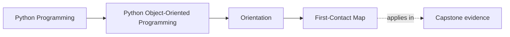
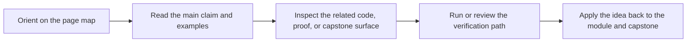

# First-Contact Map

<!-- page-maps:start -->
## Page Maps

<!-- page-maps:end -->

Read the first diagram as a placement map: this page is one concept inside its parent module, not a detached essay, and the capstone is the pressure test for whether the idea holds. Read the second diagram as the working rhythm for the page: name the problem, study the example, identify the boundary, then carry one review question forward.

Use this map when you are starting the course or refreshing the foundations. These
modules define the vocabulary and design rules the rest of the course assumes.

## Module 1 – Python’s Object Model, Identity, and the Data Model

**Theme:** Understand what Python objects really are: identity, layout, equality,
collections, and the data model.

- **Core 01 – Object Identity, State, Behaviour (Python’s Real Model)**
- **Core 02 – Attribute Layout: `__dict__`, Class vs Instance, Descriptors in the Chain**
- **Core 03 – Construction Discipline: `__init__`, Required State, and Half-Baked Objects**
- **Core 04 – Encapsulation and Public Surface: Representations, Debuggability, and Leaks**
- **Core 05 – Equality, Ordering, and Hashing: Contracts with Containers**
- **Core 06 – Collections Hazards: Aliasing, Mutable Keys, and Shared State**
- **Core 07 – Copying and Cloning: Shallow, Deep, and Custom Semantics**
- **Core 08 – Python Data Model as Design Surface (Iteration, Containers, Context, Numeric)**
- **Core 09 – When OOP Is the Wrong Tool in Python**
- **Core 10 – Refactor 0: Script → Object Model with Correct Identity/Data-Model Semantics**

## Module 2 – Responsibilities, Interfaces, Inheritance, and Layering

**Theme:** Move from individual objects to collaborating roles: composition first,
inheritance when justified, explicit interfaces, and layered design.

- **Core 11 – Responsibilities, Cohesion, and Object Smells**
- **Core 12 – Composition over Inheritance as Default**
- **Core 13 – Value Objects vs Entities: Identity and Lifecycle**
- **Core 14 – Avoiding Primitive Obsession: Semantic Types, Not Raw Str/Int**
- **Core 15 – Service Objects and Operations vs Stateful Entities**
- **Core 16 – Layering: Domain, Application, Infrastructure in a Python Codebase**
- **Core 17 – Inheritance: Legit Use Cases and the Fragile Base Class Problem**
- **Core 18 – Template Method and Tiny Hierarchies without a Framework Zoo**
- **Core 19 – Interfaces in Python: Duck Typing, ABCs, Protocols (Prescriptive Choices)**
- **Core 20 – Refactor 1: Thin Layered Architecture with Explicit Roles and Small Hierarchies**

## Module 3 – State, Dataclasses, Validation, Nulls, and Typestate

**Theme:** Treat state as a designed object: dataclasses, immutability, validation,
null pressure, lifecycles, typestate, and property-based tests.

- **Core 21 – Properties and Computed Attributes: Clarity vs Hidden Work**
- **Core 22 – Descriptors Mental Model (Without Writing Your Own)**
- **Core 23 – Dataclasses, the Good: Concise Value and Entity Definitions**
- **Core 24 – Dataclasses, the Ugly: Inheritance, Defaults, Slots, Frozen Pitfalls**
- **Core 25 – Post-Init Validation and Invalid States Unrepresentable**
- **Core 26 – Boundary Validation Libraries: Where Pydantic and Friends Belong**
- **Core 27 – Nulls, Optionals, and Partial Objects: Designing Instead of Hoping**
- **Core 28 – Lifecycle and Typestate: Draft → Active → Retired Objects**
- **Core 29 – Enforcing Typestate in Python APIs (Without Fancy Type Systems)**
- **Core 30 – Refactor 2: Configs and Rules → Dataclasses, Null-Safe APIs, Typestate, and Hypothesis**
