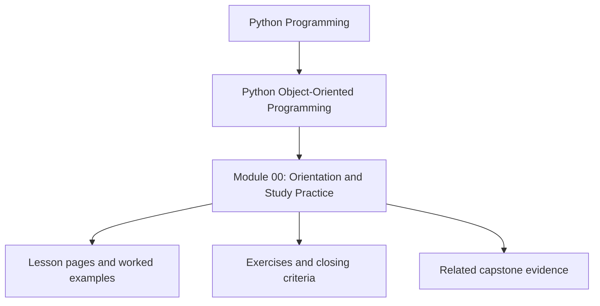
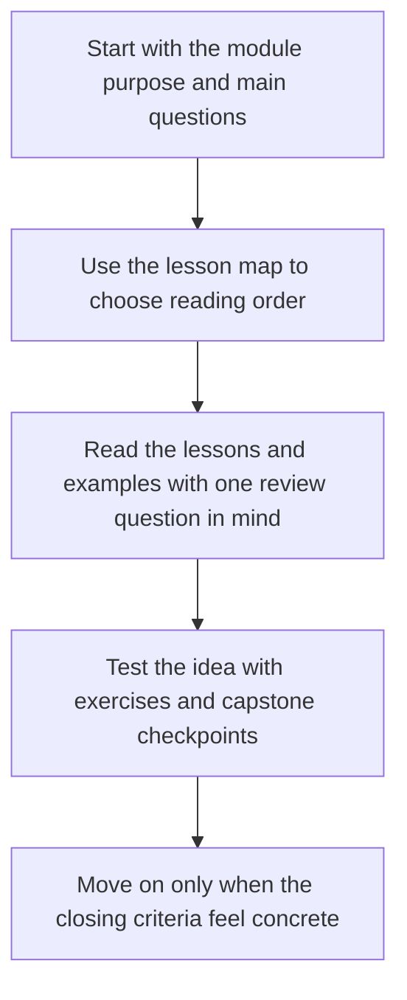

# Module 00: Orientation and Study Practice

<!-- page-maps:start -->
## Module Position

<!-- page-maps:end -->

Read the first diagram as a placement map: this page sits between the course promise, the lesson pages listed below, and the capstone surfaces that pressure-test the module. Read the second diagram as the study route for this page, so the diagrams point you toward the `Lesson map`, `Exercises`, and `Closing criteria` instead of acting like decoration.

Python gives you enough flexibility to model almost anything. That flexibility is
useful only if you can explain what your objects mean, what they are allowed to do,
and where the boundaries of responsibility actually live.

This course is a structured deep dive into those boundaries.

Keep one question in view while reading the whole book:

> Which object should own this decision, and what makes that ownership boundary the least surprising place for it to live?

That question is the thread connecting the whole course. Semantics come first because
later architecture, persistence, and operational choices only make sense when ownership
already means something precise.

## Learning outcomes

- explain the central ownership question that unifies the full course
- identify the prerequisite Python skills that need to feel routine before later modules become productive
- choose the right orientation, checkpoint, and capstone guides before starting Module 01
- describe how the capstone gains semantic, architectural, and operational meaning across Modules 01 to 10

## What this course is not

- It is not a beginner introduction to `class`, `self`, or inheritance syntax.
- It is not a catalog of patterns detached from Python's actual runtime model.
- It is not a defense of using classes everywhere.

## What this course is

- A semantics-first guide to Python objects and the data model
- A design guide for responsibilities, collaboration, and layering
- A state-modeling guide for validation, typestate, and lifecycle transitions
- A systems guide for aggregates, repositories, events, projections, and runtime boundaries
- A verification and governance guide for public APIs, extension seams, and long-lived change
- An operational hardening guide for performance, observability, security, and production review

## Recommended prerequisites

- Comfortable Python fluency: functions, classes, exceptions, modules, and tests
- Prior exposure to `dataclasses`, type hints, and common container behavior
- Willingness to treat design choices as contracts that must survive change

## Readiness check

You are ready for this course if you can already do most of the following without
looking up syntax:

- define a class with a meaningful constructor and instance methods
- explain the difference between a class attribute and an instance attribute
- write a small pytest test for object behavior
- use `dataclass` for a simple value type
- explain why mutating shared state can produce non-local bugs

If some of those feel shaky, you can still continue, but you will need to slow down
and verify the runtime behavior of the examples rather than relying on intuition.

## Key terms used throughout the course

- **value object**: an object defined primarily by its content rather than identity
- **entity**: an object whose continuity and lifecycle matter over time
- **aggregate**: a consistency boundary that centralizes cross-object invariants
- **projection**: a downstream read model derived from authoritative events or state
- **policy**: a replaceable object that captures a decision rule
- **adapter**: an object that translates between the domain and an external system
- **typestate**: a modeling approach where legal operations depend on lifecycle state

## Start here

- Read the full [Course Map](course-map.md).
- Read [Module Promise Map](../guides/module-promise-map.md) to understand the ten-module contract.
- Read [Module Checkpoints](../guides/module-checkpoints.md) so the exit bar stays visible from the beginning.
- Then continue into [Module 01](../module-01-object-semantics-data-model/index.md).

## Capstone roadmap

The monitoring-system capstone matures with the course:

- Module 01 gives you the object semantics needed to trust its value types and entity boundaries.
- Module 02 explains why the code splits into domain objects, policies, runtime orchestration, adapters, and one visible composition root.
- Module 03 explains its lifecycle states, validation boundaries, and null-avoidance choices.
- Module 04 explains its aggregate root, domain events, projections, and collaboration surfaces.
- Module 05 explains its unit of work, cleanup obligations, recovery contracts, and compatibility pressure under change.
- Module 06 shows how repositories, codecs, sessions, and schema upgrades can be added without flattening the model.
- Module 07 shows how clocks, queues, schedulers, and async adapters stay outside aggregate ownership.
- Module 08 turns the capstone tests into a contract-driven verification story instead of a loose example set.
- Module 09 explains how the capstone could expose a stable facade and governed extension seams.
- Module 10 reviews the full design for performance, observability, trust boundaries, and operational readiness.

## Exercises

- Write a short ownership rule for this course in your own words, then name one kind of design mistake that rule should prevent.
- Identify the prerequisite that feels least automatic for you, then name the first module where that weakness would create review confusion.
- Open [Course Map](course-map.md), [Module Promise Map](../guides/module-promise-map.md), and [Module Checkpoints](../guides/module-checkpoints.md), then decide which guide you will revisit for first contact and which guide you will revisit for proof.

## Closing criteria

- You can explain what this course treats as object-oriented design discipline rather than syntax familiarity.
- You know which guide to revisit when you need the course map, the module promise map, or the checkpoint bar.
- You can describe how the capstone grows from semantic example to operational review surface across the ten modules.

## Directory glossary

Use [Glossary](glossary.md) when you want the recurring language in this module kept stable while you move between lessons, exercises, and capstone checkpoints.
