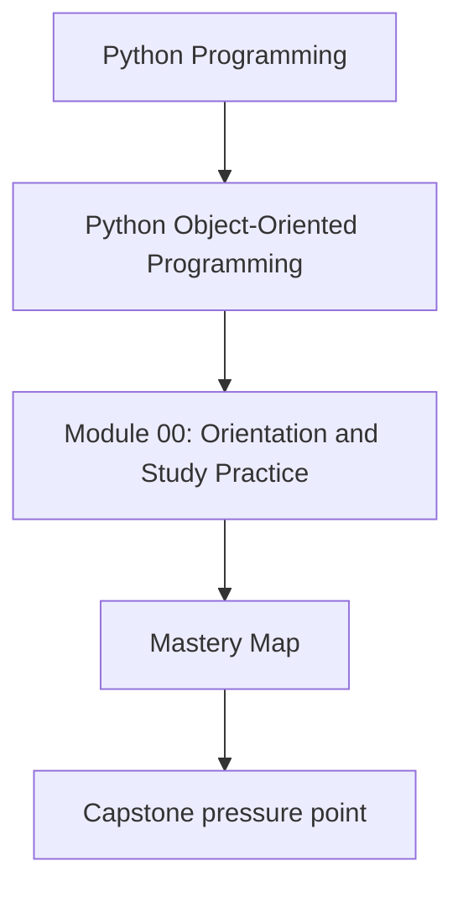
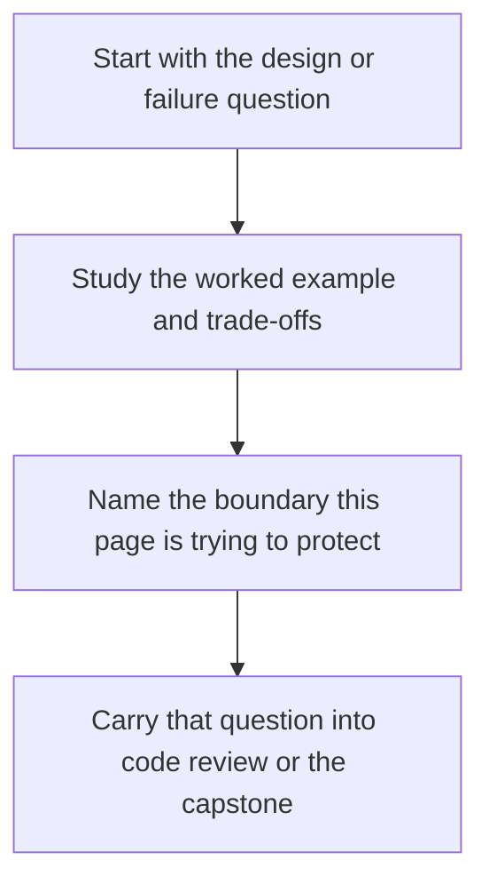

# Mastery Map

<!-- page-maps:start -->
## Concept Position

<!-- page-maps:end -->

Read the first diagram as a placement map: this page is one concept inside its parent module, not a detached essay, and the capstone is the pressure test for whether the idea holds. Read the second diagram as the working rhythm for the page: name the problem, study the example, identify the boundary, then carry one review question forward.

Use this map when you are reviewing the capstone, planning extensions, or judging
whether the design is ready for production pressure.

## Module 8 – Testing, Verification, Contracts, and Confidence

**Theme:** Turn verification into an architectural discipline: behavior-first tests,
lifecycle coverage, property checks, and confidence layers.

- **Core 71 – Behavior-First Tests for Domain Objects**
- **Core 72 – Stateful Testing and Transition Coverage**
- **Core 73 – Contract Tests for Repositories and Adapters**
- **Core 74 – Property-Based Testing for Object Models**
- **Core 75 – Fixtures, Builders, and Test Data Ownership**
- **Core 76 – Fakes, Stubs, Spies, and When Mocks Hurt**
- **Core 77 – Runtime Contracts, Assertions, and Defensive Checks**
- **Core 78 – Golden Files, Snapshots, and Approval Boundaries**
- **Core 79 – Integration Suites and Confidence Ladders**
- **Core 80 – Refactor 7: Tests toward Contract-Driven Confidence**

## Module 9 – Public APIs, Extension Points, Plugins, and Governance

**Theme:** Decide what is public, how customization happens, and which governance
rules keep extension seams safe over time.

- **Core 81 – Facades, Entrypoints, and Public Surface Area**
- **Core 82 – Capability Protocols and Stable Extension Points**
- **Core 83 – Plugin Discovery, Registration, and Sandboxing**
- **Core 84 – Deprecation, Versioning, and Removal Policy**
- **Core 85 – Documentation, Examples, and Executable API Promises**
- **Core 86 – Import Boundaries and Layer Enforcement**
- **Core 87 – Architectural Decision Records and Change Control**
- **Core 88 – Review Checklists for Extension Safety**
- **Core 89 – Third-Party Integration Contracts and Compatibility Suites**
- **Core 90 – Refactor 8: Public API for Safe Customization**

## Module 10 – Performance, Observability, Security, and Capstone Mastery

**Theme:** Review and harden the whole system under production pressure: measure
first, observe meaningfully, defend trust boundaries, and operate with discipline.

- **Core 91 – Measuring Allocation Costs and Object Hot Paths**
- **Core 92 – Profiling before Optimization**
- **Core 93 – Caching, Batching, and Lazy Work**
- **Core 94 – Observability Signals for Object Systems**
- **Core 95 – Safe Serialization, Secrets, and Trust Boundaries**
- **Core 96 – Input Hardening and Secure Defaults**
- **Core 97 – Operational Readiness, Runbooks, and Failure Drills**
- **Core 98 – Capstone Architecture Review**
- **Core 99 – Capstone Hardening and Extension Strategy**
- **Core 100 – Final Mastery Checkpoint**
