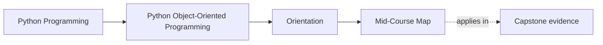

# Mid-Course Map

<!-- page-maps:start -->
## Page Maps

<!-- page-maps:end -->

Read the first diagram as a placement map: this page is one concept inside its parent module, not a detached essay, and the capstone is the pressure test for whether the idea holds. Read the second diagram as the working rhythm for the page: name the problem, study the example, identify the boundary, then carry one review question forward.

Use this map once the object model and state model are clear. These modules turn the
course from object design into system design.

## Module 4 – Aggregates, Domain Events, Object Graphs, and Collaboration Patterns

**Theme:** Move from isolated objects to coherent domains: aggregates, events,
patterns, and debuggable object graphs.

- **Core 31 – Aggregates and Consistency Boundaries in a Python Service**
- **Core 32 – Cross-Object Invariants and Aggregate-Level Validation**
- **Core 33 – Aggregate Lifecycle and Failure Semantics**
- **Core 34 – Domain Events for Decoupling (Without Full Event Sourcing)**
- **Core 35 – In-Process Event Dispatch: Tiny Observer and Event Bus**
- **Core 36 – Projections, Read Models, and Object-Graph Debug Views**
- **Core 37 – Strategy and Policy Objects for Rule Evaluation and Decisions**
- **Core 38 – Adapter and Bridge: Wrapping External Systems and Storage**
- **Core 39 – Designing Collaboration Surfaces: How Objects Talk Without Tangle**
- **Core 40 – Refactor 3: Monolithic Logic → Aggregates + Events + Strategies + Debuggable Graph**

## Module 5 – Resources, Failures, Smells, Boundaries, and Evolution

**Theme:** Make object systems survive: resources, failure handling, smell repair,
copying semantics, and compatibility discipline.

- **Core 41 – Resources and Context Managers: Objects That Own Things**
- **Core 42 – Unit-of-Work: Grouping Changes and Handling Failures**
- **Core 43 – Deterministic Cleanup and Leak Prevention in Pure Python**
- **Core 44 – Idempotent Operations and Safe Retries (Sync-Only Context)**
- **Core 45 – Logging and Error Propagation as Part of Object Contracts**
- **Core 46 – Public vs Internal Modules and Facades for OOP Codebases**
- **Core 47 – Design Smells and Refactoring Patterns in OOP Python**
- **Core 48 – Copying and Versioning of Objects and Aggregates Over Time**
- **Core 49 – Evolution Basics and Compatibility Contracts**
- **Core 50 – Refactor 4: Introduce New Feature, Preserve Old Behaviour, Document Smell Fixes**

## Module 6 – Persistence, Repositories, Serialization, and Schema Evolution

**Theme:** Keep rich object models intact when they cross storage and wire
boundaries: repositories, codecs, conflicts, migrations, and compatibility.

- **Core 51 – Repository Contracts and Aggregate Rehydration**
- **Core 52 – Mapping Domain Objects to Storage Models**
- **Core 53 – Serialization Boundaries and Explicit Codecs**
- **Core 54 – Snapshots, Events, and Rebuild Trade-Offs**
- **Core 55 – Schema Versioning and Upcasters**
- **Core 56 – Optimistic Concurrency and Conflict Detection**
- **Core 57 – Transactional Boundaries and Outbox Thinking**
- **Core 58 – Persistence Tests and Backend Swappability**
- **Core 59 – Migrating Stored Data without Domain Corruption**
- **Core 60 – Refactor 5: Repositories, Codecs, and Schema Evolution**

## Module 7 – Time, Scheduling, Concurrency, and Async Boundaries

**Theme:** Model clocks, worker coordination, and async integration explicitly so
concurrency pressure sharpens design instead of dissolving it.

- **Core 61 – Clocks, Timezones, and Monotonic Time**
- **Core 62 – Deadlines, Timeouts, and Expiration Policies**
- **Core 63 – Schedulers, Timers, and Coordination Objects**
- **Core 64 – Threads, Locks, and Owned Mutation**
- **Core 65 – Queues, Workers, and Backpressure Boundaries**
- **Core 66 – `asyncio` Tasks and Sync-Async Bridges**
- **Core 67 – Cancellation, Retries, and Resumable Operations**
- **Core 68 – Concurrency-Safe Caches and Memoization**
- **Core 69 – Designing Thread-Aware and Async-Aware APIs**
- **Core 70 – Refactor 6: Runtime around Time and Concurrency Boundaries**
