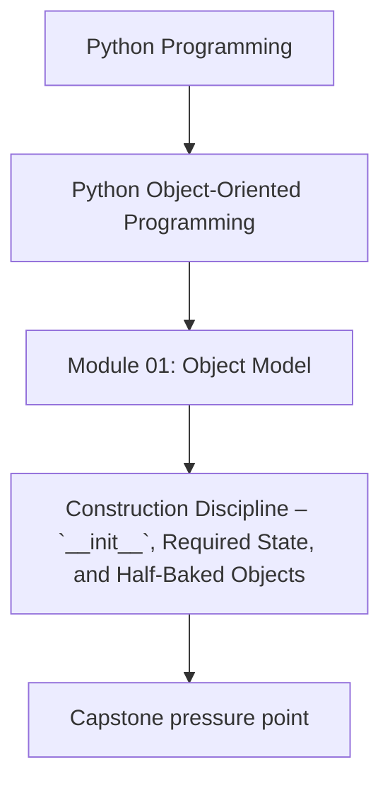
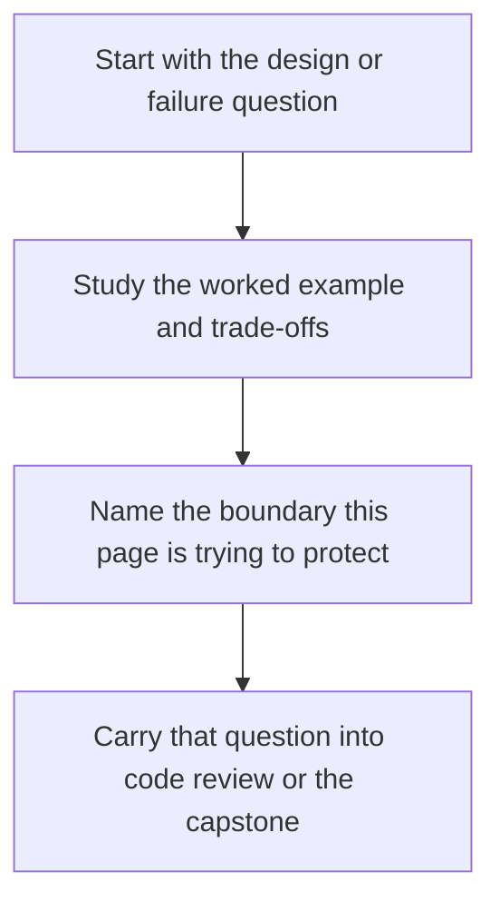

# Construction Discipline – `__init__`, Required State, and Half-Baked Objects


<!-- page-maps:start -->
## Concept Position




<!-- page-maps:end -->

Read the first diagram as a placement map: this page is one concept inside its parent module, not a detached essay, and the capstone is the pressure test for whether the idea holds. Read the second diagram as the working rhythm for the page: name the problem, study the example, identify the boundary, then carry one review question forward.

## Introduction

This core examines the discipline required for object construction in Python, emphasizing the creation of valid instances from inception. Extending the state and attribute models from M01C01 and M01C02, we explore the lifecycle of instantiation—via `__new__` and `__init__`—and strategies to enforce invariants at construction time. The focus is on distinguishing required from optional state through signature design, ensuring no "half-baked" objects escape with invalid configurations, and eschewing post-initialization setters that erode encapsulation. We address critical hazards, including leakage paths and subclassing pitfalls, to produce types that resist misuse.

The layered structure persists: language-level semantics provide guarantees, CPython notes reveal optimizations, design semantics guide modeling choices, and practical guidelines offer actionable principles. This approach fosters robust types that resist misuse while aligning with Python's flexible object creation.

Cross-references link to foundations: state invariants from M01C01; attribute assignment in M01C02; validation extensions in M03C25. Proficiency here empowers the design of constructors that serve as single points of truth, minimizing runtime errors and enhancing maintainability.

## 1. Language-Level Model

Python's object creation follows a two-phase protocol: allocation via `__new__` and initialization via `__init__`. This decouples identity establishment from state setup, allowing for immutable types or custom allocation. For normal instantiation via `MyClass(...)`, instances emerge fully formed or an exception is raised—though leakage risks exist in certain patterns.

### The Creation Protocol: `__new__` and `__init__`

**Guarantees**:
- `__new__(cls, *args, **kwargs)` (static method on the class) allocates and typically returns an instance of `cls` or a subclass thereof. It receives constructor arguments; returning an unrelated type skips `__init__` and returns the object directly. Primary uses: custom allocation for immutables, singletons/flyweights, or subclassing built-ins like `tuple`.
- If `__new__` returns an instance of `cls`, `__init__(self, *args, **kwargs)` initializes the instance's state. Failure in `__init__` leaves a "half-baked" object: allocated but uninitialized. There is no automatic rollback of side effects or external registrations, and the object may leak if references are established prematurely (e.g., via global registration or subclass chaining). `__del__`, if defined, may run on a partially initialized object; do not assume full invariants hold within it.
- Default `__new__` (from `object`) uses `type.__call__` orchestration; overrides enable factories.
- Constructors are not required: if neither the class nor its MRO bases define a meaningful `__init__`, you effectively get `object.__init__` (a no-op), so no additional per-instance state is set by Python itself.
- Bypasses: Direct calls to `__new__`, unpickling (via `pickle`), and `copy`/`deepcopy` may invoke `__new__` without `__init__`, potentially yielding uninitialized instances.

Example (portable, demonstrating phases and bypass):

```python
class ValidatedPoint:
    def __new__(cls, x, y):  # Allocation only; no validation here
        return super().__new__(cls)

    def __init__(self, x, y):
        if not (isinstance(x, (int, float)) and isinstance(y, (int, float))):
            raise ValueError("Coordinates must be numeric")
        self.x = x
        self.y = y
        if x < 0 or y < 0:
            raise ValueError("Coordinates must be non-negative")

p = ValidatedPoint(1, 2)  # Succeeds; fully valid
# ValidatedPoint(-1, 2)  # Raises in __init__; half-baked object allocated but leaked if referenced early

# Bypass example
raw = ValidatedPoint.__new__(ValidatedPoint, 1, 2)  # Allocates; no __init__
# raw.x is undefined; use cautiously
```

Half-baked objects persist until garbage-collected; premature references (e.g., appending to a registry before validation) cause leaks, as exceptions do not retroactively deallocate.

### Required vs Optional State and Invariants

**Guarantees**:
- Signatures encode intent: lack of defaults signals required parameters; defaults enable optionality. Positional-only (`/`) and keyword-only (`*`) parameters guide call styles but do not inherently denote requiredness (e.g., `def __init__(self, /, *, required_no_default): ...` requires `required_no_default` via keyword).
- Invariants (e.g., `self.x >= 0`) must hold post-`__init__`; violations raise exceptions, preventing invalid instances.
- No automatic validation: `__init__` is user-defined, but the protocol ensures atomicity for normal instantiation—either full initialization or failure. Subclassing requires cooperative argument forwarding via `super()` to satisfy the MRO.

This model supports immutable designs: `__init__` sets final state, with no public mutation paths.

## 2. Implementation Notes (CPython, non-normative)

CPython executes creation via `type.__call__`, which invokes `__new__` then `__init__` if the result is an instance of the class.

- **Allocation Efficiency**: `__new__` leverages `PyObject_Malloc` for heap allocation; types with `__slots__` optimize with fixed layouts for memory efficiency.
- **Exception Handling**: Raises in `__init__` trigger `Py_DECREF(obj)`; if the reference count reaches zero, deallocation—including `__del__` if defined—occurs immediately. GC handles cycles.
- **Signature Inspection**: Argument parsing uses `PyArg_ParseTupleAndKeywords`.
- **Bypass Realization**: Unpickling and `copy` may use `__getnewargs__` or similar hooks, skipping `__init__`.
- **Performance Nuances**: Constructor calls incur overhead from protocol dispatch.

These details aid low-level tuning but are irrelevant for most designs: focus on semantic guarantees.

## 3. Design Semantics

In the value/entity framework (M01C01), constructors for value-like objects enforce strict, immutable state (e.g., all fields required, validated immediately); entity-like ones allow optional fields for lifecycle evolution, but still guard core invariants. After construction, mutations must not violate documented invariants.

- **Invariant-Encoding Signatures**: Use lack of defaults for required parameters; positional-only (`/`) for call-style enforcement. Centralize validation in `__init__` to fail-fast—for plain mutable user-defined classes; for immutable or builtin-like types, validation may need to occur in `__new__` to ensure no invalid instance is ever exposed.
- **No Half-Baked Objects**: Never mutate external state (e.g., registries) or pass `self` to callbacks before invariants hold. In subclassing, call `super().__init__(*args, **kwargs)` early to establish base invariants, then subclass ones; each `__init__` must accept `*args, **kwargs`, consume what it needs, and forward the rest to honor MRO contracts.
- **Avoid Setters Post-Init**: Treat `__init__` as the sole mutation point; subsequent changes via methods that return new instances or raise if invalid. Never call overridable methods from `__init__` to avoid virtual dispatch on uninitialized state.
- **Factory Alternatives**: For branching logic, prefer class methods (`@classmethod from_dict(cls, data)`) over complex `__init__`; they encapsulate without bloating the primary constructor.

**Choosing Discipline**: For domain types, query: Does state evolve post-creation (entity: flexible init with guarded mutation) or is it fixed (value: exhaustive validation)? This aligns with attribute resolution (M01C02) by pre-populating `__dict__` safely.

Interaction with Storage: Required state populates instance attributes atomically; optional defaults avoid mutable class state pitfalls.

## 4. Practical Guidelines

- **Fail-Fast Construction**: Validate all inputs in `__init__`; use `typing` annotations for static checks. Raise specific exceptions (e.g., `ValueError`) over generics.
- **Signature Clarity**: Minimize `*args, **kwargs` to explicit parameters where possible, but include them for cooperative MI; document invariants and MRO compatibility in docstrings.
- **Immutability Enforcement**: For value-like objects, disable post-init mutation via `__setattr__` override as a last resort—prefer frozen dataclasses (M03C23) to avoid descriptor and subclassing conflicts.
- **Bypass Awareness**: Document handling for `__new__`-only paths (e.g., pickling via `__getnewargs__`); test unpickling preserves invariants.
- **Testing Invariants**: Assert post-`__init__` state in unit tests; use property-based testing for edge cases (M03C30). Verify no overridable method calls or external `self` passes in constructors.

**Impacts on Design and Reliability**:
- **Design**: Strict constructors reduce API surface, preventing "zombie" objects; factories maintain flexibility without anemic models.
- **Reliability**: Early validation catches errors at boundaries; cooperative subclassing ensures MRO safety, but premature mutations leak half-baked instances.

## Exercises for Mastery

1. Refactor a basic `Point` class to enforce non-negative coordinates via `__init__` validation; test invalid inputs raise `ValueError` and demonstrate half-baked leakage in a registry anti-pattern.
2. Design a `Config` entity with required (`host: str`) and optional (`port: int = 80`) fields using explicit signatures; verify cooperative subclassing forwards arguments correctly.
3. Implement a `@classmethod` factory for a `User` from dict, ensuring invariants without `__init__` bloat; contrast with an overridable method call in `__init__` and show the dispatch bug.

This core establishes construction as an invariant gatekeeper, essential for trustworthy objects. Next, M01C04 explores encapsulation and representations.
