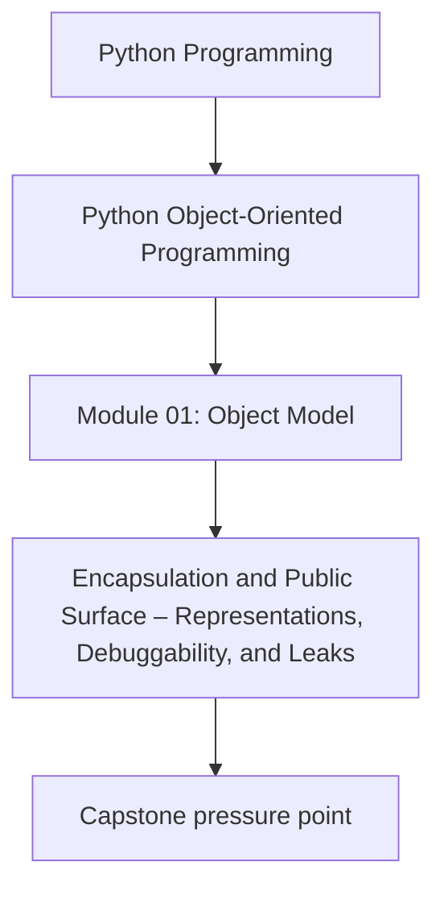
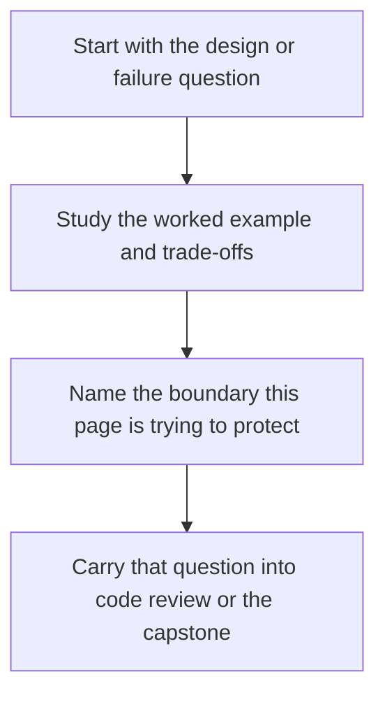

# Encapsulation and Public Surface – Representations, Debuggability, and Leaks


<!-- page-maps:start -->
## Concept Position




<!-- page-maps:end -->

Read the first diagram as a placement map: this page is one concept inside its parent module, not a detached essay, and the capstone is the pressure test for whether the idea holds. Read the second diagram as the working rhythm for the page: name the problem, study the example, identify the boundary, then carry one review question forward.

## Introduction

This core addresses the principles of encapsulation in Python objects, focusing on delineating public interfaces from internal state while ensuring debuggability through controlled representations. Building upon the attribute resolution from M01C02 and construction invariants from M01C03, we examine the design of public versus internal attributes, the judicious use of properties for exposing computed values, and the implementation of `__repr__` and `__str__` to facilitate introspection without compromising security or invariants. Effective encapsulation minimizes coupling and information leakage, promoting maintainable and secure types.

The layered structure persists: language-level semantics delineate guarantees, CPython notes illuminate optimizations, design semantics inform modeling decisions, and practical guidelines provide prescriptive rules. This framework ensures a portable understanding of encapsulation, adaptable to diverse implementations.

Cross-references connect to essentials: state protection from M01C01; descriptor-based access in M01C02; invariant enforcement in M01C03; dataclass representations in M03C23. Mastery enables the crafting of objects with crisp boundaries, where public surfaces reveal intent without exposing fragility.

## 1. Language-Level Model

Python's data model supports encapsulation through attribute naming conventions, descriptors, and representation protocols, but provides no runtime enforcement—relying on discipline to distinguish public from private elements.

### Public vs Internal Attributes and Properties

**Guarantees**:
- Naming conventions signal intent: attributes prefixed with `_` (single underscore) indicate internal use, while double underscore (`__`) triggers name mangling (`_Class__attr`) to avoid accidental name collisions in inheritance chains. These are conventions, not barriers—access remains possible via explicit lookup.
- Properties, via `@property` descriptors (M01C02), expose computed attributes as if they were direct fields, invoking methods on access without altering the public API surface.
- No inherent privacy: All attributes are accessible via `getattr()`, but disciplined design assumes users respect conventions.

Example (portable, illustrating conventions):

```python
class SecureCounter:
    def __init__(self):
        self._count = 0  # Internal: users may access but should not
        self.__secret = 42  # Mangled: _SecureCounter__secret

    @property
    def count(self):  # Public computed view
        return self._count

    def increment(self):
        self._count += 1

c = SecureCounter()
print(c.count)  # 0 (via property)
# print(c._count)  # 0 (internal, but accessible)
# print(c._SecureCounter__secret)  # 42 (mangled, still accessible)
```

Properties preserve the attribute-based API surface while enabling controlled computation, but overexposure risks invariant breaches.

### Representations: `__repr__` and `__str__`

**Guarantees**:
- `__str__(self)` is used by `str(obj)` and `print(obj)` to produce a human-readable string, falling back to `__repr__` if `__str__` is not defined.
- `__repr__(self)` is used by `repr(obj)` and, by convention, is a developer-oriented string intended to be unambiguous.
- Both must return a string or raise an exception; the default implementations on `object` produce strings of the form `<ClassName object at 0x...>`.


Example:

```python
class Point:
    def __init__(self, x, y):
        self.x = x
        self.y = y

    def __repr__(self):
        return f"Point({self.x}, {self.y})"

    def __str__(self):
        return f"({self.x}, {self.y})"

p = Point(1, 2)
print(repr(p))  # Point(1, 2)
print(str(p))   # (1, 2)
```

These protocols enable debuggability without mandating full state exposure.

## 2. Implementation Notes (CPython, non-normative)

CPython resolves representations via descriptor lookup during `str()` and `repr()` builtins, falling back to `object.__str__`/`__repr__`.

- **Name Mangling**: `__attr` becomes `_ClassName__attr` at compile time, stored in `__dict__`; aids subclass isolation but does not obscure from introspection.
- **Property Dispatch**: `@property` uses a `getter` descriptor, caching no state by default—each access recomputes.
- **String Efficiency**: `__repr__`/`__str__` calls are lightweight C dispatches; heavy computations (e.g., recursion) risk stack overflows, with built-in guards like `Py_ReprEnter`.
- **Fallback Behavior**: Defaults invoke `PyObject_Repr`/`Str`, appending the memory address from `id(obj)`.

These optimize common cases but underscore that encapsulation is conventional, not enforced.

## 3. Design Semantics

Encapsulation aligns with the value/entity lens (M01C01): value-like objects expose minimal, computed surfaces (e.g., properties for derived state); entity-like ones guard mutable internals behind methods, using representations for safe introspection.

- **Public vs Internal Design**: Prefix internals with `_` for readability; use `__` mangling sparingly for name collision avoidance in hierarchies. Expose via properties only if computation is cheap and invariant-safe—avoid for I/O or heavy work.
- **Property Exposure**: Use for read-only views of invariants (e.g., `@property def magnitude(self): return (self.x**2 + self.y**2)**0.5`); deprecate if it hides complexity better suited to methods.

**Representations Without Leaks**: `__repr__` should aim for unambiguity and, if feasible for simple types, evaluability via `eval(repr(obj))`—though this is a convention and often impractical for complex or resource-bound objects; omit secrets (e.g., passwords) and internals (e.g., caches). `__str__` prioritizes brevity over completeness, eliding sensitive data for user-facing contexts.

**Choosing Surfaces**: Query: Does exposure aid usage without risking misuse (public) or implementation details (internal)? Align with construction (M01C03) by representing only validated state.

Interaction with Resolution: Properties leverage descriptors (M01C02) for controlled access, mediating internal mutation through explicit logic.

## 4. Practical Guidelines

- **Attribute Conventions**: Declare public attributes without prefix; internals with `_`; mangled `__` for collision protection. Document exposure rationale in `__doc__`.
- **Property Discipline**: Limit to lightweight getters; raise `AttributeError` on invalid states. Migrate heavy logic to explicit methods.
- **Representation Safety**: In `__repr__`, use `f"{type(self).__name__}({self.x}, ...)"`; redact secrets (e.g., `password="***"`). Ensure `__str__` is concise and non-leaking, suitable for logging or user output.
- **Leak Prevention**: Audit representations for invariants (e.g., no partial state); test with `pdb` or `reprlib` for truncation and recursion limits.
- **Debuggability Balance**: Favor informative `__repr__` for REPL use; integrate with logging via safe stringification, mindful that `__repr__` aids developers while `__str__` serves users.

**Impacts on Design and Debuggability**:
- **Design**: Crisp surfaces reduce coupling; properties abstract without bloating APIs.
- **Debuggability**: Controlled representations enable tracing without exposure; leaks erode trust in complex systems.

## Exercises for Mastery

1. Enhance a `SecureConfig` class with public properties for validated fields and internal `_secrets`; verify mangling avoids collisions but does not prevent access.
2. Implement `__repr__` and `__str__` for a `User` entity, redacting passwords in both; test evaluability for `__repr__` via `eval()` where feasible.
3. Refactor a `Cache` with a heavy `@property` for stats to an explicit method; profile access overhead and demonstrate invariant safety.

This core fortifies object boundaries for robust introspection. Next, M01C05 details equality and hashing contracts.
