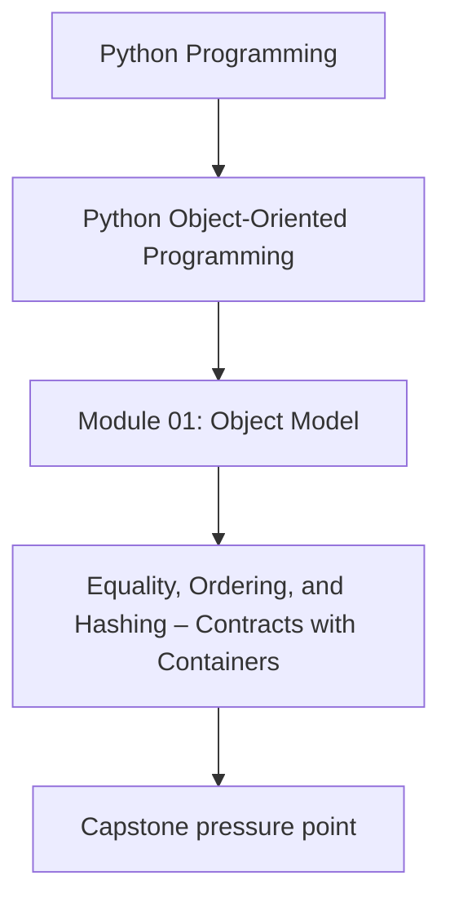
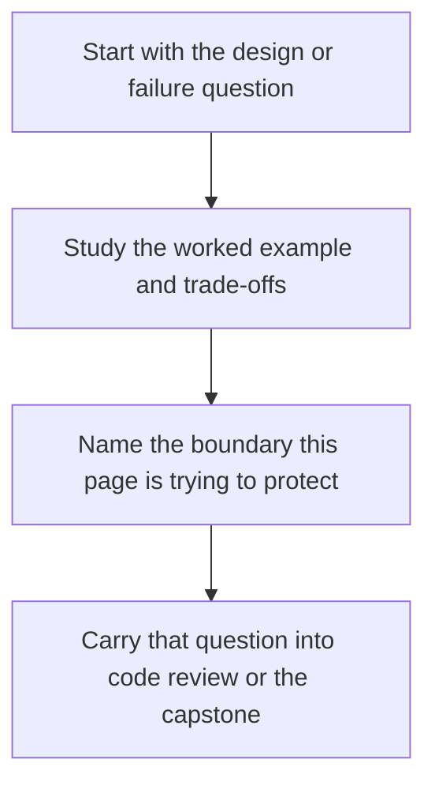

# Equality, Ordering, and Hashing – Contracts with Containers


<!-- page-maps:start -->
## Concept Position




<!-- page-maps:end -->

Read the first diagram as a placement map: this page is one concept inside its parent module, not a detached essay, and the capstone is the pressure test for whether the idea holds. Read the second diagram as the working rhythm for the page: name the problem, study the example, identify the boundary, then carry one review question forward.

## Introduction

This core elucidates the design of equality (`__eq__`), ordering (`__lt__` et al.), and hashing (`__hash__`) in Python objects, emphasizing their interplay with container types such as dictionaries and sets. Extending the identity and state foundations from M01C01 and attribute resolution from M01C02, we delineate value-based versus identity-based equality, the invariants governing hashable objects, and criteria for implementing—or abstaining from—ordering protocols. Correct implementation ensures seamless integration with collections while preserving semantic consistency.

The layered structure persists: language-level semantics outline guarantees, CPython notes detail optimizations, design semantics guide modeling choices, and practical guidelines furnish prescriptive rules. This framework yields a portable model for equality and hashing, resilient across implementations.

Cross-references link to prerequisites: identity contracts from M01C01; mutable key hazards in M01C06; dataclass defaults in M03C23. Proficiency here fortifies types against container misuse, enabling reliable value semantics without compromising performance.

## 1. Language-Level Model

Python's data model defines equality and hashing as protocols invoked by operators and built-ins, with ordering supporting rich comparisons. These form binding contracts with containers; violating them does not crash the interpreter, but leads to semantically ill-defined container behavior (e.g., keys that cannot be found or duplicate equal keys that both appear to be present).

### Equality: `__eq__` Protocol and `__ne__`

**Guarantees**:
- `a == b` invokes `a.__eq__(b)` if defined on `type(a)`; if that returns `NotImplemented`, the interpreter may consult `b.__eq__(a)` according to the usual rich comparison rules (e.g., giving preference to methods on a strict subclass).
- Default (`object.__eq__`) is identity-based: `a == b` if `a is b`.
- For user-defined classes overriding `__eq__` without `__hash__`, Python automatically sets `__hash__ = None`, rendering instances unhashable.
- No reflexivity or symmetry guarantee: User overrides must enforce these for correctness.
- If `__ne__` is not defined, Python derives it from `__eq__` by logical negation; overriding `__ne__` independently can easily break consistency and is rarely necessary.

Example (portable, contrasting defaults):

```python
class Point:
    def __init__(self, x, y):
        self.x = x
        self.y = y

    def __eq__(self, other):
        if not isinstance(other, Point):
            return NotImplemented
        return self.x == other.x and self.y == other.y

p1 = Point(1, 2)
p2 = Point(1, 2)
print(p1 == p2)  # True (value equality)
print(p1 is p2)  # False (distinct identity)
```

Equality overrides enable value semantics but demand paired hashing adjustments.

### Hashing: `__hash__` Protocol

**Guarantees**:
- `hash(obj)` invokes `obj.__hash__()`. The hash is an integer and is stable for the object's lifetime.
- Core invariant (a requirement on your implementation): if `a == b` and both are hashable, then `hash(a) == hash(b)` must hold for the lifetime of both objects. In particular, for any object used as a dict/set key, both its equality and its hash must be effectively immutable for as long as it remains in the container.
- Unhashable objects (e.g., `__hash__ = None`) raise `TypeError` in containers.
- Hash values are integers; collisions are permitted and resolved by equality checks, provided the equality/hash contract is respected.

### Ordering: Rich Comparison Protocols

**Guarantees**:
- Operators (`<`, `<=`, `>`, `>=`) invoke `__lt__`, `__le__`, `__gt__`, `__ge__`; returning `NotImplemented` delegates to reflected counterparts.
- For user-defined classes that simply inherit from `object` and do not override rich comparison methods, there is effectively no ordering: comparisons defer to `object` and return `NotImplemented`, raising `TypeError` in contexts like `sorted()`. Many built-in types (numbers, strings, tuples) *do* provide a total order within their own type.
- No totality guarantee: User implementations define partial or total orders.

These protocols underpin container operations: dict/set keys rely on `(hash, equality)` pairs; sorting uses ordering.

## 2. Implementation Notes (CPython, non-normative)

CPython dispatches equality and hashing via C slots (`tp_richcompare`, `tp_hash`).

- **Equality Dispatch**: `__eq__` is implemented via the rich comparison slot (`tp_richcompare`); returning `NotImplemented` triggers the reflected comparison on the other operand where applicable.
- **Hashing**: The default hash for user-defined objects is derived from identity (typically the object's address); dict/set use open addressing with perturbations for better distribution.
- **Ordering**: Rich comparisons chain via `PyObject_RichCompare`; unresolved pairs raise `TypeError`.
- **Performance Nuances**: Hash computations should be O(1); cached hashes (e.g., tuples) amortize costs. If a key's fields that participate in equality and hashing are mutated while it is stored in a dict or set, future lookups may fail even though the container itself remains internally consistent.

These optimize container lookups but expose no privacy—equality probes state directly.

## 3. Design Semantics

Equality and hashing integrate with the value/entity lens (M01C01): value-like objects implement value equality and consistent hashing for interchangeability; entity-like ones retain identity defaults to prioritize uniqueness.

- **Value vs Identity Equality**: Override `__eq__` for state comparison in values (e.g., `Point` coordinates); keep default for entities (e.g., `Session` ID). Always check `isinstance` or use `type(self)` to avoid unintended coercion.
- **Hashing Invariants**: For custom `__eq__`, compute `__hash__` from equality-relevant fields (e.g., `hash((self.x, self.y))`); disable for mutables to prevent key errors.
- **Ordering Restraint**: Implement rich comparisons only for natural total orders (e.g., timestamps); abstain for partial or cyclic relations to avoid `TypeError` surprises.

**Choosing Protocols**: Query: Does the type's semantics favor interchangeability (value: full protocols) or uniqueness (entity: minimal)? Align with encapsulation (M01C04): expose only hashable invariants.

Interaction with Containers: Value equality enables safe keying; mutable hashing risks lost entries (M01C06).

## 4. Practical Guidelines

- **Equality Implementation**: Return `NotImplemented` for incompatible types; test reflexivity, symmetry, and transitivity. For entities, document identity reliance.
- **Hashing Discipline**: Override `__hash__` only when you also define `__eq__`; compute the hash from exactly the fields that participate in equality (e.g., `return hash((self.x, self.y))`); set `__hash__ = None` for mutables whose equality depends on mutable state.
- **Ordering Caution**: Provide a coherent total order only when the type has a natural one (e.g., timestamps); in practice, implement `__lt__` (and `__eq__`) and, if you need all comparison operators, consider `functools.total_ordering`. Abstain entirely if no natural total order exists.
- **Container Contracts**: Verify post-mutation containment; use `frozenset` for immutable keys. Profile hash distributions for uniformity.
- **Testing Rigor**: Assert `a == b` implies `hash(a) == hash(b)`; fuzz with unequal-but-hash-equal pairs; test unhashable raises appropriately.

**Impacts on Design and Containers**:
- **Design**: Value protocols decouple from identity; inconsistent hashing erodes trust.
- **Containers**: Robust contracts ensure predictable lookups; violations yield silent data loss.

## Exercises for Mastery

1. Implement value equality and hashing for a `Vector` class; test dict keying with equal-but-distinct instances and verify contract holds.
2. Design an entity-like `Transaction` with identity equality; demonstrate unhashability prevents mutable key misuse.
3. Add total ordering to `Point` via rich comparisons; verify `sorted()` stability and antisymmetry; contrast with a partial-order class that abstains.

This core secures equality for container fidelity. Next, M01C06 exposes collection hazards.
