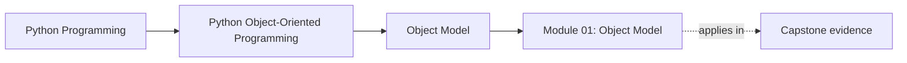
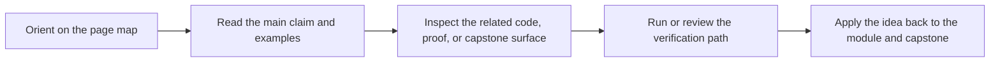

# Module 01: Object Model

<!-- page-maps:start -->
## Page Maps

<!-- page-maps:end -->

This module builds the semantic floor for the rest of the course. Before talking
about architecture, inheritance, or aggregates, you need a precise mental model of
what Python objects are and how they behave.

Keep one question in view while reading:

> What contract does this object actually expose through identity, state, equality, and mutation?

If that contract is vague, later design work becomes naming theater instead of engineering.

## Preflight

- You should already be comfortable defining small classes, reading `dataclass` declarations, and writing basic pytest assertions.
- If identity, equality, or mutable aliasing still feel fuzzy, slow down here before moving into architecture modules.
- Keep a REPL or scratch test open while reading so you can verify attribute lookup and mutation behavior directly.

## Learning outcomes

- explain identity, value semantics, equality, hashing, and mutation as explicit object contracts
- inspect attribute lookup behavior without reducing it to folklore about "fields"
- identify when a class clarifies meaning and when a plain value or function is the better abstraction
- review copying, aliasing, and representation choices for hidden coupling risks

## Why this module matters

Most long-lived OOP mistakes are already visible at the object-model level:

- confusing identity with value
- mutating state that was assumed to be isolated
- relying on accidental attribute lookup behavior
- treating equality and hashing as convenience instead of container contracts
- choosing classes where plain values or functions would be clearer

If these semantics are fuzzy, later architecture decisions become style debates
instead of engineering decisions.

## Main questions

- What is identity, and when should it matter?
- What makes state safe or dangerous to share?
- How do equality and hashing interact with containers?
- Where does attribute lookup really happen?
- When is a class the wrong abstraction entirely?

## Reading path

1. Start with object identity and attribute layout.
2. Move into construction, representation, and equality contracts.
3. Then study aliasing, copying, and the broader data model.
4. Finish with the "when classes are the wrong tool" chapter and the module refactor.

## Common failure modes

- using mutable objects as keys without respecting hash semantics
- leaking shared state through default values, aliasing, or shallow copying
- exposing too much representation detail in the public surface of an object
- assuming attribute access is a simple field lookup when descriptors and class state are involved

## Exercises

- Take one object from the capstone and explain whether it is identity-bearing, value-oriented, or an accidental mix of both.
- Write a small example that distinguishes aliasing from copying, then state which bug that distinction prevents in production code.
- Review one class and explain whether its equality and hashing behavior is a real contract or an accident of defaults.

## Capstone connection

The capstone's `MetricName`, `Severity`, `MetricSample`, and `ThresholdRule` types only
work because their value semantics are explicit. The `MonitoringPolicy` aggregate also
depends on a precise boundary between identity-bearing entities and value-oriented rule
definitions. Read this module as the semantic justification for those choices.

## Closing criteria

You should finish this module able to inspect a class or instance and explain its
data-model contract without appealing to folklore or implementation accidents.
