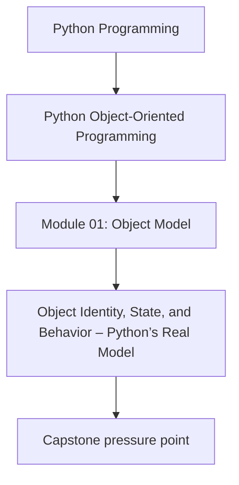
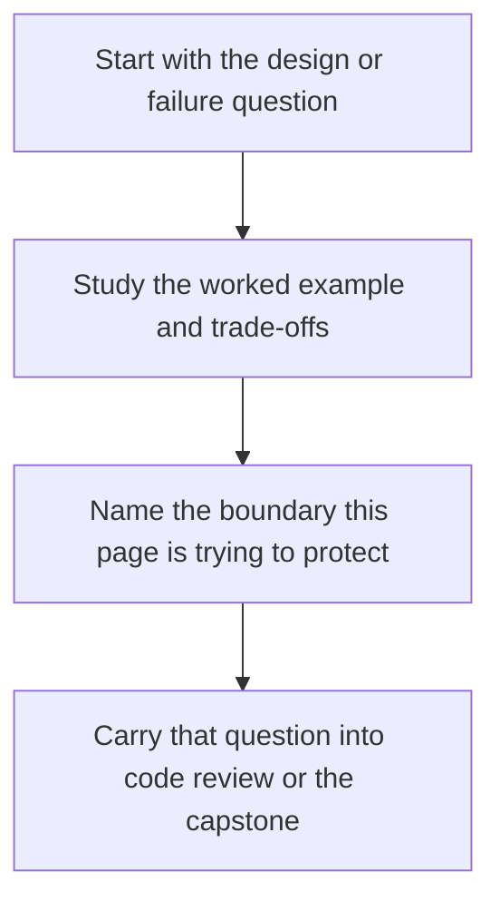

# Object Identity, State, and Behavior – Python’s Real Model


<!-- page-maps:start -->
## Concept Position




<!-- page-maps:end -->

Read the first diagram as a placement map: this page is one concept inside its parent module, not a detached essay, and the capstone is the pressure test for whether the idea holds. Read the second diagram as the working rhythm for the page: name the problem, study the example, identify the boundary, then carry one review question forward.

## Introduction

This core establishes a rigorous mental model for Python objects, grounded in the Python language reference and data model documentation while distinguishing implementation details and design recommendations. Python's object system is elegant in its uniformity: every value is an object, with identity, state, and behavior emerging from a small set of foundational semantics. We delineate these elements to provide clarity for modeling robust types, avoiding common pitfalls in equality, mutability, and performance.

The model proceeds in layers: first, the portable language-level semantics (guaranteed across compliant implementations); second, notes on common implementations like CPython; third, design semantics for distinguishing types in your codebases; and finally, practical guidelines. This separation ensures portability and precision—readers can discern what *must* hold, what *typically* does, and what *should* guide practice.

Cross-references signal forward connections: attribute resolution appears in M01C02, equality and hashing contracts in M01C05, and dataclass patterns in Module 3. By mastering this, you will evaluate any Python type—built-in or custom—through a lens that aligns with the language's contracts, enabling designs that are correct, efficient, and evolvable.

## 1. Language-Level Model

In Python, all values are objects: runtime entities that can be referenced, inspected, and operated upon via protocols. There is no distinction in the language between "primitives" and "objects"—integers, strings, functions, and custom instances all conform to the same foundational rules.

### Identity: The Stable Handle

Every object has an *identity*, an opaque, implementation-defined value that uniquely identifies it during its lifetime. The `is` operator tests identity (whether two references denote the same object). The built-in `id(obj)` returns an integer that is unique for each live object and constant over its lifetime. As a consequence, while two objects are alive, `a is b` if and only if `id(a) == id(b)`. After deallocation, `id()` values may be reused for new objects.

**Guarantees**:
- Identities are unique and constant for the object's lifetime: once allocated, an object's identity does not change until it is garbage-collected.
- Any two live objects are guaranteed to have distinct identities.
- Identities may be reused after garbage collection; do not store `id()` values long-term to reference specific objects, as reuse can occur.

**Distinguished Singletons**: Python provides canonical singleton objects with fixed identities: `None`, `True`, `False`, `Ellipsis` (`...`), and `NotImplemented`. These are identity-significant: prefer `x is None` over `x == None` for efficiency and clarity, as it avoids method dispatch. This pattern exemplifies identity semantics for sentinels representing absence or special conditions.

Example (portable and guaranteed):

```python
def is_missing(value):
    return value is None  # Identity check for the canonical sentinel

missing = object()  # Custom sentinel with distinct identity

def is_custom_missing(value):
    return value is missing  # Explicit identity check
```

Identity underpins reference semantics: assignment (`a = b`) copies the reference, not the object. Thus, `a is b` tests whether they denote the *same* object in memory.

### State: Data and Mutability

An object's *state* comprises its data, accessible via attributes (e.g., `obj.x`). State can be mutable (changeable post-creation) or immutable (fixed after creation). We will treat a type as immutable if its public operations never mutate instances in place.

**Guarantees**:
- Mutability is a property of a type’s operations (e.g., `list.append` mutates the list). An object may expose both mutating and non-mutating operations, and you can treat specific instances as effectively immutable by convention, but the language semantics are type-driven, not per-object.
- Immutable state forbids changes; "mutations" yield new objects (e.g., `s1 + s2` for strings returns a new string).
- Every object has a type (`type(obj)` or `obj.__class__`), which is itself an object with its own identity and contributes to behavioral identity: the type determines available attributes and methods.

### Behavior: Protocols and Dispatch

*Behavior* arises from the methods and operators an object supports, defined by the data model (dunder methods like `__len__`). Behavior is polymorphic: resolved dynamically based on the object's type.

**Guarantees**:
- Attribute access follows the data model; we’ll cover the resolution algorithm in M01C02.
- Operators invoke protocols (e.g., `+` calls `__add__`); returning `NotImplemented` delegates to the other operand.
- Every object supports basic introspection: `dir(obj)`, `hasattr(obj, 'attr')`, and `getattr(obj, 'attr')`.

Types as objects enable metaprogramming: `type(obj)` returns the class object, and classes can be subclassed or instantiated dynamically.

### Equality, Hashing, and Core Contracts

Equality (`==`) and hashing (`hash(obj)`) interact with identity to form contracts with containers (dicts, sets). For user-defined classes that do not define `__eq__` or `__hash__`, the defaults inherited from `object` implement identity-based equality (`a == b` behaves like `a is b`) and an identity-derived hash.

**Guarantees**:
- If `__eq__` is overridden for value equality (e.g., comparing state), `__hash__` *must* be overridden to match (or set to `None` to disable hashing). For user-defined classes in Python 3+, defining `__eq__` without defining `__hash__` causes Python to set `__hash__ = None`, making instances unhashable. This is the language’s way of enforcing the contract by default.
- Design-wise, if you override `__eq__` you should also explicitly decide `__hash__`: either provide a consistent implementation or set it to `None` to make the type unhashable.
- The core invariant is: for any objects `a` and `b`, if `a == b` then `hash(a) == hash(b)` must hold whenever both are hashable.

These form the "real model" foundation: identity ensures uniqueness, while optional overrides enable value-based semantics.

## 2. Implementation Notes (CPython, non-normative)

CPython, the historical reference implementation, realizes these semantics on the heap via a `PyObject` struct hierarchy. All objects inherit from `PyObject`, which includes fields for reference count, type pointer, and size.

- **Lifetime Management**: Deterministic via reference counting (increments/decrements on reference acquisition/release) augmented by a generational garbage collector for cycles. Objects are deallocated when the count reaches zero or cycles are broken. In CPython, reference counts are updated whenever references are created or destroyed; this underlies the object lifetime behavior you observe.
- **Identity Realization**: `id(obj)` returns the object's memory address (as an integer), explaining why small values sometimes share identities via interning.
- **Interning Optimizations**: CPython typically interns some small integers (commonly in the range -5 to 256) and certain string literals (e.g., identifiers) to reduce allocations. This is *not guaranteed* by the spec and varies by version/optimization:
  
  ```python
  # CPython example (do not rely on this behavior)
  x = 42
  y = 42
  print(x is y)  # Often True due to interning, but not portable
  ```
  
  Explicit interning via `sys.intern(s)` forces sharing for strings, useful for dict keys in performance-critical code.

These details aid debugging (e.g., via `ctypes` to inspect addresses) but must not inform design: assume only spec guarantees for portability across PyPy, GraalPython, etc.

## 3. Design Semantics

While Python provides only objects, effective modeling distinguishes *value-like objects* (immutable, equality-focused) from *entity-like objects* (identity-focused, potentially mutable). Python’s object model does not distinguish value vs entity; this is purely a design lens we will use in this course to guide type choices. In this course we treat ‘mutable and equality depends on mutable state’ as a hard prohibition for dict/set keys.

- **Value-Like Objects**: Emphasize interchangeability via state equality (override `__eq__` and `__hash__`). Use for comparable data without lifecycle (e.g., a `Point` with fixed coordinates). Immutability ensures safe sharing and hashability.
- **Entity-Like Objects**: Rely on identity for uniqueness (e.g., a `Session` with mutable state). As a rule of thumb, do not use mutable, entity-like objects as dict/set keys at all.

**Choosing Semantics**: For domain concepts, ask: Does uniqueness matter beyond state (entity) or is equivalence sufficient (value)? Mutability amplifies aliasing risks in entities; prefer immutability for values to enable container use.

Interaction with Containers: Value-like objects serve as dict/set keys reliably; entity-like ones risk undefined lookup semantics if mutated post-insertion, potentially losing access to entries or creating unreachable data (M01C06 details hazards).

## 4. Practical Guidelines

- **Use `is` Sparingly**: Reserve for singletons (`x is None`) or explicit identity checks (e.g., caches). Default to `==` for values.
- **Favor Immutability**: For hashable types, and to simplify reasoning about correctness and thread-safety… In custom classes, enforce via `__setattr__` overrides or tools like `dataclasses` with `frozen=True` (pitfalls covered in M03C23–M03C24).
- **Dict/Set Contracts**: If your objects are mutable and equality depends on their mutable fields, they must not be used as dict/set keys. Do not implement `__hash__` for them. If you implement value-based `__eq__` on an immutable type, implement a corresponding `__hash__` and add tests that verify: equal objects have equal hashes, dict/set behavior is stable.
- **Performance Notes**: For hot paths, consider `__slots__` to reduce per-instance overhead (M01C02), but weigh trade-offs like inheritance limits. Reserve C extensions for extrema.

**Where "Everything Is an Object" Serves—and Limits**:
- **Serves**: Uniform protocols enable seamless extension (e.g., custom iterables) and metaprogramming.
- **Limits**: Overuse for simple data invites boilerplate; prefer functions or tuples for pure values. Alias shared mutables cautiously to avoid "spooky action" (M01C06).

## Exercises for Mastery

1. Implement a value-like `Color` (immutable, equality/hashable) and entity-like `Widget` (identity-based); verify dict containment behaves as expected: Color works as a key, Widget either uses identity semantics or is deliberately not hashable.
2. Explore how your interpreter interns some values; observe that this is implementation-specific and must not be relied upon.
3. Benchmark default vs custom equality on 10k instances; implement a deliberately incorrect `__eq__`/`__hash__` pair and observe how dict and set behavior breaks (e.g., keys that cannot be found, duplicate-equal keys, etc.).

This model provides a portable foundation, extensible to deeper topics. Next, M01C02 unpacks attribute resolution.
