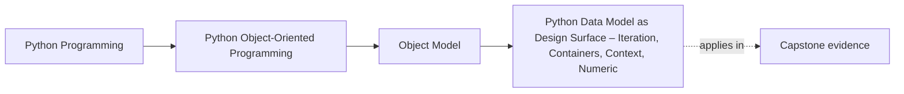

# Python Data Model as Design Surface – Iteration, Containers, Context, Numeric

<!-- page-maps:start -->
## Page Maps

<!-- page-maps:end -->

## Introduction

This core surveys the Python data model as a deliberate design interface, focusing on intentional implementation of dunder methods for iteration (`__iter__`), container traits (`__len__`, `__getitem__`, `__contains__`), context management (`__enter__`, `__exit__`), and numeric operations (`__add__` et al.). Extending encapsulation from M01C04 and equality protocols from M01C05, we delineate when to render types "container-like" for ecosystem interoperability versus maintaining opacity to preserve domain semantics. Selective adoption enhances usability without bloating interfaces, aligning objects with expectations while guarding invariants.

The layered structure persists: language-level semantics outline guarantees, CPython notes detail optimizations, design semantics guide modeling choices, and practical guidelines furnish prescriptive rules. This framework yields a portable model for protocol extension, resilient across implementations.

Cross-references link to prerequisites: attribute interception in M01C02; value/entity opacity in M01C01. Proficiency here enables objects that integrate gracefully, choosing protocols that amplify intent without overexposure.

## 1. Language-Level Model

Python's data model exposes protocols as optional hooks for operator and builtin overloads, enabling polymorphic behavior without inheritance. Implementation is explicit: undefined methods raise `TypeError` when invoked.

### Iteration Protocol

**Guarantees**:
- `__iter__(self)` returns an iterator (object with `__next__`); invoked by `for obj in iterable` or `iter(obj)`.
- `__next__(self)` yields next item or raises `StopIteration`.
- Fallback: If `__iter__` missing, `iter(obj)` attempts the old sequence protocol: repeated `__getitem__(i)` from 0 until `IndexError`.

### Container Protocols: Sequence and Mapping Traits

**Guarantees**:
- `__len__(self)` returns non-negative integer for `len(obj)`.
- `__getitem__(self, key)` supports indexing/sllicing for `obj[key]`; raises `IndexError`/`KeyError`.
- `__contains__(self, item)` returns boolean for `item in obj`; falls back to `__iter__` + `__next__` for iterables.
- Sequence-like: `__getitem__` with integer keys in a contiguous range starting at 0;
   optional `__setitem__`, `__delitem__`, `__reversed__`.   
- Mapping-like: `__getitem__` with arbitrary keys; optional `__setitem__`, `__delitem__`.
- Implementing sequence/mapping traits does not give you element-wise `==` automatically:
   if you want list-/dict-like equality semantics for your own type, you must define `__eq__`.

### Context Management Protocol

**Guarantees**:
- `__enter__(self)` returns resource (often `self`) for `with obj as alias:`.
- `__exit__(self, exc_type, exc_val, exc_tb)` handles cleanup; returns `True` to suppress exceptions.
- Supports nesting; invoked explicitly via `with`.

### Numeric Protocols

**Guarantees**:
- Binary operators (`+`, `*`) invoke `__add__` etc.; unary (`-`) via `__neg__`.
- Return `NotImplemented` for delegation: Left operand first, then reflected (e.g., `b.__radd__(a)`). No algebraic assumptions enforced.
- Optional: `__bool__` for truthiness (`if obj:`; defaults to `bool(len(obj))` if `__len__` defined); `__index__` for integer coercion (e.g., slices).

These protocols integrate with builtins/operators; omission raises `TypeError`.

## 2. Implementation Notes (CPython, non-normative)

CPython dispatches protocols via C slots (e.g., `tp_iter`, `mp_length`).

- **Iteration**: `__iter__` yields `PyObject*`; fallback sequence uses incremental `__getitem__` until `IndexError`.
- **Containers**: `__getitem__` via `sq_item`/`mp_subscript`; `__contains__` iterates if no direct slot.
- **Context**: `with` uses `PyContextManager`; `__exit__` receives tuple `(exc_type, exc_val, exc_tb)`.
- **Numeric/Truthiness**: Operator slots dispatch; `__bool__` prefers explicit, else `__len__`; `__index__` coerces to `PyLong`.
- **Performance Nuances**: O(1) dispatch; `__getitem__` enables fast slicing; `__bool__` short-circuits.

These optimize ecosystem hooks but expose no privacy—protocols probe state.

## 3. Design Semantics

Protocols extend the value/entity lens (M01C01): value-like objects adopt container/numeric traits for interoperability (e.g., iterable tuples); entity-like ones remain opaque to encapsulate lifecycle (e.g., no `__len__` for sessions). Intentional choice avoids "protocol bloat," where over-implementation dilutes focus.

- **Iteration/Container Choice**: Implement `__iter__` + `__getitem__` for sequence-like values (e.g., bounded history); use mapping traits (`__getitem__` with keys) for dict-like. If reusable, `__iter__` returns fresh iterator—returning `self` defines an iterator, not a collection. Omit if iteration ambiguous/expensive—prefer explicit methods (e.g., `.pages()`).
- **When Not to Implement**: `__len__` if unbounded/meaningless (e.g., streams); `__bool__` if truthiness ambiguous (`__len__` default misleads for connections); `__index__` only for numeric coercion.
- **Context for Resources**: Use for RAII entities (e.g., `__enter__` acquires lock); abstain for stateless—`with` implies ownership. Anti-pattern: cosmetic `with` without cleanup.
- **Numeric Restraint**: Implement only well-defined ops (e.g., `__add__` for vectors); explicit with reflection for asymmetry. No avoidance for non-commutative—commit to semantics.

**Do/Don't Examples** (Monitoring Domain):
- Do: `MetricWindow` as sequence (`__getitem__(i)` for timestamp access, `__iter__` yields metrics)—fluent for `for m in window:`.
- Don't: `DBSession` as iterable (`__iter__` over queries)—hides I/O; use `.query()` instead.
- Do: `ThresholdRule` numeric (`__lt__(other)` for comparison)—domain-natural.
- Don't: `Alert` with `__bool__` defaulting to `__len__(violations)`—empty alerts aren't "false."

**Choosing Protocols**: Query: Does fluency aid (container-like) or mislead (opaque)? For `MetricSeries`: sequence by time? Mapping by label? Explicit `.values()`?

Interaction with Equality: Container `__eq__` explicit; iterable equality element-wise if implemented.

## 4. Practical Guidelines

- **Intentional Adoption**: Implement only needed (e.g., `__iter__` + `__getitem__` for sequences); test (e.g., `list(obj)`, `obj[key]`).
- **Container Discipline**: `__len__` + `__getitem__` for O(1); `__contains__` fast. `__reversed__` for bidirectional.
- **Context Safety**: `__exit__` all paths (`KeyboardInterrupt`); return `False` unless suppressing. Nesting-safe.
- **Truthiness/Numeric Hygiene**: `__bool__` explicit over `__len__`; `__index__` for slice/range. Reflect numeric; document precedence.
- **Opacity Principle**: Omit if misleading (e.g., no `__iter__` for remote streams); explicit methods over protocols.

**Impacts on Design and Interoperability**:
- **Design**: Selective enhances fluency; over-adoption invites misuse (e.g., `len(session)` implies fixed).
- **Interoperability**: Traits integrate; opacity preserves abstraction.

## Exercises for Mastery

1. Implement `__iter__` + `__getitem__` for `MetricWindow` (bounded sequence); test `list(window)` and slicing.
2. Add mapping traits to `LabelSet` (`__getitem__` by key, `__contains__`); verify `labelset['cpu']` and `'cpu' in labelset`.
3. Design `DBSession` context manager (`__enter__`/`__exit__` acquire/release); override `__bool__` for "active".

This core leverages the data model for elegant extension. Next, M01C09 critiques OOP applicability.
