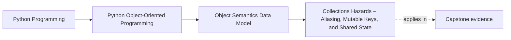

# Collections Hazards – Aliasing, Mutable Keys, and Shared State


<!-- page-maps:start -->
## Page Maps




<!-- page-maps:end -->

Read the first diagram as a placement map: this page is one concept inside its parent module, not a detached essay, and the capstone is the pressure test for whether the idea holds. Read the second diagram as the working rhythm for the page: name the problem, study the example, identify the boundary, then carry one review question forward.

## Introduction

This core dissects the perils inherent in Python's reference semantics when interacting with collections, spotlighting aliasing, mutable keys, and shared mutable state. Extending equality and hashing contracts from M01C05 and the value/entity lens from M01C01, we catalog real failure modes—such as lost dict entries from mutated keys and "spooky action at a distance" via aliases—and prescribe neutralization strategies including immutability, defensive copying, and design discipline. These hazards underscore Python's power and pitfalls: references enable efficiency but demand vigilance to avert subtle corruptions.

The layered structure persists: language-level semantics delineate guarantees, CPython notes detail optimizations, design semantics guide modeling choices, and practical guidelines furnish prescriptive rules. This framework yields a portable model for hazard avoidance, resilient across implementations.

Cross-references link to prerequisites: identity sharing from M01C01; hashing invariants in M01C05; copying alternatives in M01C07. Proficiency here safeguards collections from insidious errors, ensuring predictable behavior in shared state scenarios.

## 1. Language-Level Model

Python's reference model—where assignment copies references, not objects—facilitates aliasing, while collections enforce contracts via equality and hashing. Violating those contracts does not crash the interpreter, but produces surprising and often misleading container behaviour (e.g. keys that appear to “vanish”).

### Aliasing and Shared State

**Guarantees**:
- Assignment (`a = b`) and container insertion share references: mutations via one alias affect all.
- No automatic deep sharing detection: Aliases are opaque; "spooky action" arises when distant code mutates shared mutables unexpectedly.
- Function defaults are evaluated once: Mutable defaults (e.g., `def f(lst=[]):`) share across calls, amplifying aliasing in closures or classes.

Example (portable, illustrating aliasing):

```python
def buggy_default(lst=[]):  # Evaluated once; shared mutable
    lst.append(len(lst) + 1)
    return lst

print(buggy_default())  # [1]
print(buggy_default())  # [1, 2] — spooky: shared across invocations

# Classic nested-alias example:
row = [0] * 3
grid = [row] * 3    # All rows alias the same list
grid[0][0] = 1
print(grid)         # [[1, 0, 0], [1, 0, 0], [1, 0, 0]]
```

Shared mutable class attributes (e.g., `class C: shared = []`) alias across instances, risking global corruption.

### Mutable Keys in Containers

**Guarantees**:
- Dict/set lookups use (hash, equality) pairs for keys. For correct behavior, both the hash and the equality of a key must be effectively immutable while it is stored in a container.
- Python protects you from many obvious mistakes: built-in mutable types like list, dict, and set are unhashable and cannot be used as keys.
- The real hazard appears with user-defined mutable types that define both `__eq__` and `__hash__` based on mutable fields: mutating those fields after insertion can make keys “disappear”.

Example (logical key drift via an immutable proxy):

```python
d = {}
key = [1]
d[tuple(key)] = "value"  # The actual key is the immutable tuple (1,)
key.append(2)
print(tuple(key) in d)  # False — the logical key changed, the dict key did not
```

Example (bad: mutable, hashable key whose hash depends on mutable state):

```python
class BadKey:
    def __init__(self, value):
        self.value = value

    def __eq__(self, other):
        return isinstance(other, BadKey) and self.value == other.value

    def __hash__(self):
        return hash(self.value)  # depends on mutable field

k = BadKey(1)
d = {k: "value"}
k.value = 2  # Mutate equality/hash-relevant field
print(k in d)  # False — key is present but cannot be found reliably
```

These behaviors stem from Python's reference semantics: objects are shared by reference, so mutating a shared, hashable object can silently change how containers “see” it, enabling efficiency but exposing hazards.

## 2. Implementation Notes (CPython, non-normative)

CPython's containers (`PyDictObject`, `PySetObject`) use hash tables with open addressing.

- **Aliasing Realization**: References are `PyObject*`; reference counting tracks lifetimes, but there is no mechanism that revalidates equality/hash when objects are mutated.
- **Default Evaluation**: Function defaults computed at def time, stored as shared objects; mutables persist across calls.
- **Key Storage**: Each dict entry stores the key object and the hash that was computed at insertion time; mutating a key object does not update this cached hash or its position in the table.
- **Performance Nuances**: Aliasing amortizes costs (no copies). The main risk with mutable, hashable keys is not performance but silent lookup failure when their hash/equality changes after insertion.

These optimize sharing but amplify hazards when equality or hashing depend on mutable state.

## 3. Design Semantics

Hazards intersect the value/entity lens (M01C01): value-like objects mitigate via immutability (no mutation possible); entity-like ones risk aliasing through mutable state, demanding defensive patterns.

- **Aliasing Neutralization**: Favor immutability for shared data; use `copy.deepcopy` for true independence (M01C07). Avoid mutable defaults by using `None` sentinels with internal initialization.
- **Mutable Key Avoidance**: Disable hashing for mutables (`__hash__ = None`); use immutable proxies (e.g., `frozenset`) as keys. Document alias risks in shared entities.
- **Spooky Action Mitigation**: Encapsulate mutables behind methods; audit shared references in graphs (e.g., via `sys.getrefcount` for debugging).

**Choosing Defenses**: Query: Is the object shared (immutability/copy) or isolated (defensive checks)? Align with equality (M01C05): hashable implies stable.

Interaction with Containers: Defensive design prevents ill-defined semantics; unchecked aliasing cascades to lost data.

## 4. Practical Guidelines

- **Immutability First**: Design shared objects as immutable (e.g., `frozen=True` dataclasses, M03C23); use tuples over lists for keys.
- **Defensive Defaults**: Replace mutable defaults with `None` and create a new object inside: `def __init__(self, lst=None): self.lst = [] if lst is None else list(lst)`.
- **Copy Strategically**: Shallow-copy aliases (`copy.copy`); deep for nests (`copy.deepcopy`); custom `__copy__` for semantics (M01C07).
- **Key Stability**: Never mutate any field that participates in `__eq__`/`__hash__` while the object is used as a dict/set key. If such a field must change, remove the key from the container first, mutate, then reinsert.
- **Audit Tools**: Use `gc.get_referrers(obj)` for alias tracing; profile with `cProfile` for shared mutation hotspots.

**Impacts on Design and Reliability**:
- **Design**: Immutability decouples sharing from hazards; defensives add boilerplate but preserve flexibility.
- **Reliability**: Neutralized patterns avert silent failures; unchecked aliasing erodes trust in collections.

## Exercises for Mastery

1. Demonstrate shared mutable default breakage (either via a function default or a class-level mutable attribute like `class C: items = []`); refactor with a `None` sentinel and per-instance copies; test isolation between calls/instances.
2. Reproduce the `BadKey` failure mode: use a mutable, hashable custom key whose `__hash__` and `__eq__` depend on a mutable field; mutate it after insertion and show that lookups fail. Then neutralize by making the type unhashable or by using an immutable proxy (e.g. a tuple).
3. Trace aliasing in a graph of shared objects via `gc.get_referrers`; apply deep copy where appropriate and verify independence.

This core exposes collection pitfalls for resilient designs. Next, M01C07 examines copying semantics.
