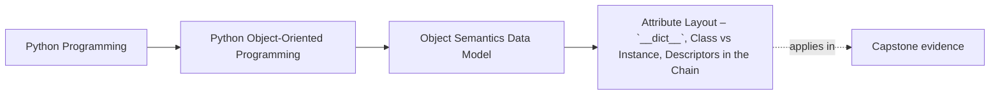

# Attribute Layout – `__dict__`, Class vs Instance, Descriptors in the Chain


<!-- page-maps:start -->
## Page Maps




<!-- page-maps:end -->

Read the first diagram as a placement map: this page is one concept inside its parent module, not a detached essay, and the capstone is the pressure test for whether the idea holds. Read the second diagram as the working rhythm for the page: name the problem, study the example, identify the boundary, then carry one review question forward.

## Introduction

This core dissects Python's attribute resolution mechanism, revealing how attributes are stored, located, and retrieved. Building on M01C01's foundational model of identity, state, and behavior, we examine the storage of state in instance and class dictionaries, the role of the method resolution order (MRO) in inheritance hierarchies, and the pivotal influence of descriptors on access dynamics. Understanding "attribute access" as a multi-step protocol—far beyond simple dictionary lookup—enables precise control over encapsulation, polymorphism, and performance in object designs.

The exposition maintains our layered approach: language-level semantics first, followed by CPython implementation notes, design semantics for informed modeling, and practical guidelines. This separation ensures a portable mental model while highlighting opportunities for optimization and pitfalls in real-world codebases.

Cross-references connect to prior and subsequent material: identity and state from M01C01; equality impacts in M01C05; dataclass field interactions in M03C23–M03C24. Mastery here equips you to debug subtle resolution failures, select storage strategies for efficiency, and design attributes that respect invariants without unnecessary overhead.

## 1. Language-Level Model

Python's data model defines attributes as named values associated with objects, resolved dynamically during access (`obj.attr`). This process integrates instance state, class definitions, inheritance, and special protocols, ensuring flexibility while upholding encapsulation. The specification (language reference, section on the data model) guarantees a consistent resolution algorithm across implementations, abstracting storage details.

### Storage: Instance, Class, and Shared State

Attributes are stored in two primary scopes: per-instance (unique to each object) and per-class (shared across instances of a type).

**Guarantees**:
- **Instance Attributes**: Stored in the instance's `__dict__` (a mutable mapping) or, if `__slots__` is declared on the class without including `'__dict__'`, in a fixed set of named slots. Assignment to an undeclared instance attribute creates it dynamically in `__dict__` (unless `__slots__` prohibits this).
- **Class Attributes**: Stored in the class's `__dict__` (also a mutable mapping). These are shared among instances and serve as defaults or shared state (e.g., class constants).
- For the default lookup behavior (`object.__getattribute__`), instance attributes shadow class-level attributes, except where data descriptors (detailed below) take precedence.

Example (portable, illustrating scope precedence):

```python
class Counter:
    total = 0  # Class attribute: shared

    def __init__(self):
        self.count = 1  # Instance attribute: per-object

c1 = Counter()
c2 = Counter()
c1.count = 5  # Assignment modifies instance only
print(c2.count)  # 1 (from __init__, not shared)
Counter.total += 1  # Modifies class attribute
print(c1.total)  # 1 (shared)
```

Class attributes can be mutable (e.g., lists), but mutating shared containers risks aliasing across instances—a design concern deferred to M01C06.

### Resolution Chain: MRO and Lookup Order

The method resolution order (MRO) defines the sequence in which class attributes are searched during inheritance. Computed via the C3 linearization algorithm for cooperative multiple inheritance, the MRO lists bases from most specific (the class itself) to least (e.g., `object`).

**Guarantees**:
- MRO is deterministic: A class's `__mro__` attribute exposes the sequence; `issubclass(A, B)` respects it.
- No cycles: Diamond inheritance resolves without duplication via C3.

Example:

```python
class A: pass
class B(A): x = 1
class C(A): x = 2
class D(B, C): pass  # MRO: [D, B, C, A, object]

d = D()
print(d.x)  # 1 (B before C in MRO)
print(D.__mro__)  # (<class '__main__.D'>, <class '__main__.B'>, <class '__main__.C'>, <class '__main__.A'>, <class 'object'>)
```

MRO governs class-level search but is one component of the full attribute access algorithm, which also involves instance storage and descriptors (detailed below). Access on classes themselves follows a similar path but uses the metaclass's resolution (typically `type.__getattribute__`).

This ensures substitutability: subclasses inherit predictably, but overrides must preserve contracts.

### Descriptors: Protocol-Driven Access

Descriptors are objects implementing `__get__`, `__set__`, and/or `__delete__` protocols, stored as class attributes. They intercept access, enabling computed attributes, validation, or delegation. *Data descriptors* (with `__set__`) take precedence over instance `__dict__`; *non-data descriptors* (e.g., functions) do not and behave like plain class attributes in precedence.

**Guarantees**:
- Descriptors are consulted during the resolution chain: data descriptors before instance `__dict__`; non-data after.
- `@property` creates a data descriptor that invokes the underlying getter on each access (no built-in caching).
- Bound methods arise from non-data descriptors: functions in class `__dict__` return bound instances (`<bound method>`) when accessed via `obj.method`, binding `self` automatically.

The protocol is optional: plain attributes are simple dict values.

### The Full Access Protocol

Attribute access for an object `obj` is implemented by calling `type(obj).__getattribute__(obj, name)`. The default implementation (from `object`) follows this algorithm:

1. Check for a data descriptor in the MRO of `type(obj)`: if found, invoke `__get__`.
2. If no data descriptor, retrieve from `obj.__dict__` if present.
3. If missing, check for a non-data descriptor or plain attribute in the MRO: invoke `__get__` if descriptor, else return the value.
4. If unresolved and `__getattr__` is defined on `type(obj)`, call `type(obj).__getattr__(obj, name)` as a fallback. If that also fails (e.g., raises `AttributeError`), the `AttributeError` propagates.

Assignment (`obj.name = value`) and deletion follow analogous paths, using `__set__`/`__delete__` for descriptors or updating `__dict__`.

**Guarantees**:
- Transparency: Users see seamless delegation unless overridden.
- Overridability: Custom `__getattribute__` can alter the process, but must avoid recursion (e.g., by delegating to `object.__getattribute__`).

This protocol abstracts storage, enabling behaviors like lazy loading without exposing machinery. Note: even `obj.__dict__` access is mediated by this protocol.

## 2. Implementation Notes (CPython, non-normative)

CPython implements resolution via efficient dictionary lookups and a per-class `tp_dict` slot in `PyTypeObject`. The MRO is precomputed as a tuple in `tp_mro`.

- **Storage Realization**: `__dict__` is a `PyDictObject`; `__slots__` uses descriptor objects plus a per-instance compact layout, yielding significant per-instance memory savings (often 2–5x in simple cases) but sacrificing dynamic addition.
- **Descriptor Dispatch**: Data descriptors are flagged for early checking before dict lookup, ensuring O(1) precedence.
- **MRO Computation**: C3 runs at class creation; errors raise `TypeError` for non-cooperative hierarchies.
- **Performance Nuances**: Dict lookups average O(1); slots are O(1) array access. Inheritance depth impacts traversal cost linearly.

Example (observing internals, non-portable):

```python
# CPython introspection (for illustration; avoid in production)
import inspect
class E: pass
print(inspect.getmro(E))  # Mirrors __mro__
```

These inform profiling (e.g., via `sys.getsizeof(obj.__dict__)`), but designs must assume only spec behavior.

## 3. Design Semantics

Attribute layout influences state encapsulation and polymorphism. In our value/entity lens (from M01C01), value-like objects favor explicit, immutable attributes (e.g., via data descriptors for validation); entity-like ones permit dynamic instance attributes for evolving state.

- **Class vs Instance Choice**: Use class attributes for immutable shared data (e.g., `Point.origin = (0, 0)`); instance for per-object variance. Avoid mutable class attributes unless intentional (e.g., caches with synchronization).
- **Descriptors as Abstraction**: Data descriptors with `__set__` raising errors enable read-only attributes; non-data descriptors returning new objects per access support computed values without full freezing.
- **MRO Discipline**: Design shallow hierarchies; document override expectations to avoid fragile bases (detailed in M01C17).

**Choosing Layout**: For performance-critical types, weigh `__slots__` against flexibility; for domain models, prioritize readability over micro-optimizations.

Interaction with Protocols: Descriptors enable value-like immutability (e.g., read-only via `__set__` raising errors) without full freezing.

## 4. Practical Guidelines

- **Prefer Explicit Storage**: Declare instance attributes in `__init__` to signal intent; use type hints for static analysis.
- **Descriptor Hygiene**: Implement only necessary methods (`__get__` for read-only); avoid side effects in getters unless documented.
- **MRO Verification**: Use `super()` judiciously; test subclass compatibility early.
- **Performance Trade-offs**: Employ `__slots__` for value-like objects in hot loops (e.g., reducing GC pressure); profile before applying, as it complicates inheritance.
- **Overriding Hooks**: Do not override `__getattribute__` in ordinary application code; if necessary, delegate carefully to `object.__getattribute__` and keep logic minimal. Use `__getattr__` for lazy fallbacks sparingly.
- **Debugging Aids**: Log resolutions in custom `__getattribute__` for troubleshooting, but isolate to development.

**Impacts on Design and Performance**:
- **Design**: Resolution enforces loose coupling—subclasses override without knowing caller types—but mutable descriptors can leak state.
- **Performance**: Deep MROs or descriptor-heavy chains add overhead; slots yield significant memory savings for simple classes.

## Exercises for Mastery

1. Define a hierarchy with diamond inheritance; verify MRO order and attribute shadowing via `dir()` and access tests.
2. Implement a read-only data descriptor for a validated attribute (e.g., positive integer); integrate into a value-like class and observe precedence over `__dict__`.
3. Benchmark attribute access: Compare `__dict__` vs `__slots__` in a 10k-instance loop; quantify differences under inheritance.

This core illuminates the machinery behind state access, foundational for encapsulation. Next, M01C03 addresses construction discipline.
