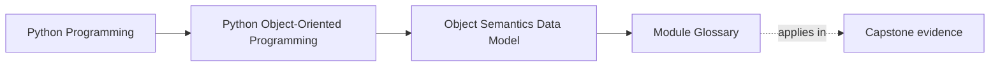
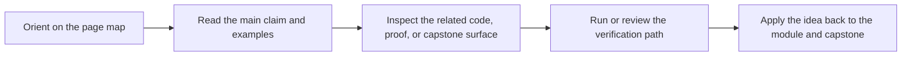

# Module Glossary

<!-- page-maps:start -->
## Page Maps

<!-- page-maps:end -->

This glossary belongs to **Module 01: Object Semantics and the Python Data Model** in **Python Object-Oriented Programming**. It keeps the language of this directory stable so the same ideas keep the same names across reading, practice, review, and capstone proof.

## How to use this glossary

Read the directory index first, then return here whenever a page, command, or review discussion starts to feel more vague than the course intends. The goal is stable language, not extra theory.

## Terms in this directory

| Term | Meaning in this directory |
| --- | --- |
| Attribute Layout – `__dict__`, Class vs Instance, Descriptors in the Chain | the module's treatment of attribute layout – `__dict__`, class vs instance, descriptors in the chain, used to make the module's main design claim concrete in design work, refactoring, and capstone evidence. |
| Collections Hazards – Aliasing, Mutable Keys, and Shared State | the module's treatment of collections hazards – aliasing, mutable keys, and shared state, used to make the module's main design claim concrete in design work, refactoring, and capstone evidence. |
| Construction Discipline – `__init__`, Required State, and Half-Baked Objects | the module's treatment of construction discipline – `__init__`, required state, and half-baked objects, used to make the module's main design claim concrete in design work, refactoring, and capstone evidence. |
| Copying and Cloning – Shallow, Deep, and Custom Semantics | the module's treatment of copying and cloning – shallow, deep, and custom semantics, used to make the module's main design claim concrete in design work, refactoring, and capstone evidence. |
| Encapsulation and Public Surface – Representations, Debuggability, and Leaks | the module's treatment of encapsulation and public surface – representations, debuggability, and leaks, used to make the module's main design claim concrete in design work, refactoring, and capstone evidence. |
| Equality, Ordering, and Hashing – Contracts with Containers | the module's treatment of equality, ordering, and hashing – contracts with containers, used to make the module's main design claim concrete in design work, refactoring, and capstone evidence. |
| Object Identity, State, and Behavior – Python’s Real Model | the module's treatment of object identity, state, and behavior – python’s real model, used to make the module's main design claim concrete in design work, refactoring, and capstone evidence. |
| Python Data Model as Design Surface – Iteration, Containers, Context, Numeric | the module's treatment of python data model as design surface – iteration, containers, context, numeric, used to make the module's main design claim concrete in design work, refactoring, and capstone evidence. |
| Refactor 0 – Script → Object Model with Correct Identity/Data-Model Semantics | the module's treatment of refactor 0 – script → object model with correct identity/data-model semantics, used to make the module's main design claim concrete in design work, refactoring, and capstone evidence. |
| When OOP Is the Wrong Tool in Python | the module's treatment of when oop is the wrong tool in python, used to make the module's main design claim concrete in design work, refactoring, and capstone evidence. |
