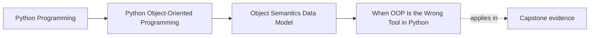
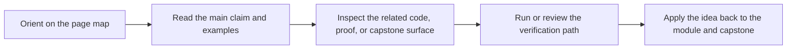

# When OOP Is the Wrong Tool in Python


<!-- page-maps:start -->
## Page Maps




<!-- page-maps:end -->

Read the first diagram as a placement map: this page is one concept inside its parent module, not a detached essay, and the capstone is the pressure test for whether the idea holds. Read the second diagram as the working rhythm for the page: name the problem, study the example, identify the boundary, then carry one review question forward.

## Introduction

This core interrogates the boundaries of object-oriented programming in Python, identifying domains where functional constructs, modules, or data-pipe paradigms surpass classes in clarity and efficiency. Extending the value/entity lens from M01C01 and protocol adoption from M01C08, we catalog scenarios—pure data transformations, small scripts, one-off tools—where OOP introduces unnecessary abstraction overhead, and prescribe recognition of anti-OOP smells to favor procedural or composable alternatives. Disciplined restraint prevents over-engineering, preserving Python's multiparadigm strengths for pragmatic design.

The layered structure persists: language-level semantics outline guarantees, CPython notes detail optimizations, design semantics guide modeling choices, and practical guidelines furnish prescriptive rules. This framework yields a portable model for paradigm selection, resilient across implementations.

Cross-references link to prerequisites: protocol bloat in M01C08; composition preference in M02C12. Proficiency here cultivates discernment, deploying OOP judiciously to avoid ceremonial complexity.

## 1. Language-Level Model

Python is multiparadigm: classes, functions, and modules are all first-class citizens. There is no requirement to use classes—idiomatic Python code can be purely functional, module-oriented, object-oriented, or a mix, and the language does not privilege one style at the semantic level.

### Facts You Can Rely On

- Functions are first-class objects: you can pass them around, store them, and compose them.
- Modules are just namespaces with functions and data; no inheritance, no ceremony.
- Generators and comprehensions let you express “data-pipe” style flows without building classes.
- There is no class mandate: if you don’t need identity or collaboration, plain functions and data structures are enough.

Example (portable, contrasting styles):

```python
# OOP: Class for metric aggregation (stateful collaboration)
class MetricAggregator:
    def __init__(self):
        self.metrics = []

    def add(self, m):
        self.metrics.append(m)

    def average(self):
        return sum(m.value for m in self.metrics) / len(self.metrics) if self.metrics else 0

# Functional: Pure transform (no state)
from statistics import fmean

def aggregate_metrics(metrics):
    values = [m.value for m in metrics]  # Materialise on purpose for reuse
    return fmean(values) if values else 0.0

# Usage: Equivalent for linear flow
metrics = list(original_metrics)  # Reusable sequence
agg = MetricAggregator()
for m in metrics:
    agg.add(m)
print(agg.average())  # OOP

print(aggregate_metrics(metrics))  # Functional
```

OOP shines for stateful collaboration; procedural for transforms.

## 2. Implementation Notes (CPython, non-normative)

CPython does not “prefer” OOP or non-OOP code: functions, methods, and module-level code all compile to bytecode and run through the same interpreter loop. The dominant practical difference is that creating lots of tiny heap-allocated objects (including instances) has overhead; plain functions operating on built-in types (lists, dicts, tuples) are often cheaper and simpler when you don’t need identity or rich behaviour, so a pointless layer of classes/instances does show up in allocations and GC pressure.

## 3. Design Semantics

Non-OOP excels in stateless, one-pass data transforms versus collaborative entities (M01C01). Smells: classes for stateless ops (e.g., `Parser` wrapping functions); hierarchies for one-offs (inheritance bloat).

- **Pure data pipelines** (ETL, analysis): prefer plain functions that take data in, return data out. Classes usually add no value unless you need to maintain cross-call state or hide invariants.
- **Small scripts / CLIs / one-offs**: keep everything at module level—parse args, call a couple of functions, exit. Introducing classes here is usually ceremony.
- **Typical “OOP where it hurts” smells**:
  - **Stateless utility classes**: a class with only `@staticmethod` or functions that never touch `self`—should usually be a module.
  - **One-shot script classes**: `class ScriptRunner: ...` used only once under `if __name__ == "__main__":`—replace with functions.
  - **Anemic wrappers around a single dict/list** with no invariants—you only made lookups more verbose.
  - **Tiny fake hierarchies** where each subclass has one method and there is no real polymorphic call site—a `dict` from “kind” to function is often better.
  - **Config classes** that are just attribute bags where a dict or dataclass suffices—no invariants or behavior added.

In contrast, a long-lived `Alert` that changes state over time, holds an ID, and collaborates with `Rule` and `NotificationChannel`—with operations that must preserve invariants across those collaborators—is a good candidate for a class: there is identity, lifecycle, and collaboration.

**Decision Test**: If you cannot describe a meaningful identity or lifecycle for something, and there is no ongoing collaboration between multiple instances, you almost certainly do not want a class at all—you want plain functions and data structures.

Interaction with Protocols: Functional traits (e.g., `map`) compose without classes; smells emerge when protocols bloat stateless code (M01C08).

## 4. Practical Guidelines

- **Favor Functions/Modules**: Use for transforms (e.g., `def alert_filter(rules, metrics): return [r for r in rules if r.eval(metrics)]`); classes only for mutation and collaboration / invariant-keeping.
- **Pipe Discipline**: Leverage generators and comprehensions for data flow; don’t wrap a simple sequence of transforms in a class when a few functions and `for`-loops are enough.
- **Smell Recognition**: Refactor classes to functions when:
  - the class has no meaningful instance state, or
  - its methods never touch `self`, or
  - it is just a thin wrapper around another object without adding invariants or behaviour.
  Also audit for "anemic" classes (data-only) that could just be a dataclass or a plain dict.
- **Hybrid Balance**: Modules orchestrate OOP (e.g., `from .alert import Alert; def main(): ...`); let `main()` be a function, not a method on a `Runner` class.
- **Testing Simplicity**: Unit-test functions directly; mocks unnecessary without state.

**Impacts on Design and Pragmatism**:
- **Design**: Procedural reduces ceremony; smells signal refactor to multiparadigm.
- **Pragmatism**: Scripts/tools ship faster; over-OOP delays iteration.

## Exercises for Mastery

1. Refactor a `DataTransformer` class to functional pipe; test equivalence and measure instantiation overhead.
2. Identify smells in a hypothetical `ScriptProcessor` class (one-off tool); rewrite as module with functions and comprehensions.
3. Hybrid: Orchestrate OOP `Alert` via functional `main()` in a monitoring script; assert no unnecessary classes.

This core tempers OOP zeal for multiparadigm mastery. Next, M01C10 refactors a script to object model.
