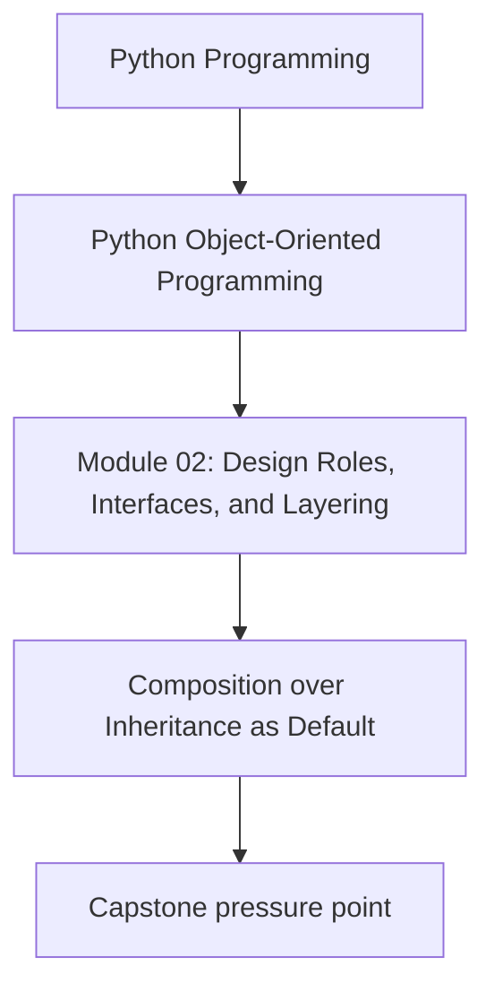
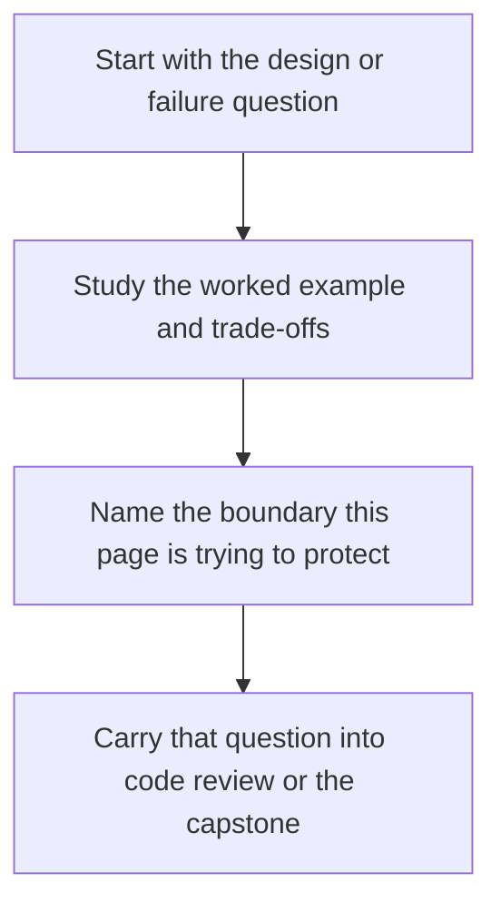

# Composition over Inheritance as Default


<!-- page-maps:start -->
## Concept Position




<!-- page-maps:end -->

Read the first diagram as a placement map: this page is one concept inside its parent module, not a detached essay, and the capstone is the pressure test for whether the idea holds. Read the second diagram as the working rhythm for the page: name the problem, study the example, identify the boundary, then carry one review question forward.

## Purpose

This core establishes composition as the default structural mechanism in Module 2, favoring "has-a" relationships over "is-a" inheritance to promote flexibility and low coupling. Explore delegation (forwarding calls to components), forwarding (explicit method passthrough), and façades (unified interfaces over collaborators) through hands-on refactoring. Demonstrate when composition strictly outperforms inheritance—such as in pluggable behaviors or layered concerns—via reduced coupling (fewer inter-class dependencies) and increased flexibility (easier behavior swaps). Extending M02C11's responsibilities, apply this to the monitoring domain: compose rule evaluators via delegates rather than subclassing, enabling runtime swaps without hierarchy fragility.

## 1. Baseline: Inheritance Temptation in the Monitoring Orchestrator

Extend M02C11's `MonitoringOrchestrator` with multiple rule types (threshold and rate-based). A naïve approach subclasses `RuleEvaluator` for each, introducing inheritance smells: tight coupling (subclass changes break base), fragility (base modifications ripple), and poor flexibility (adding rules requires code changes, not configuration). Coupling is high (subclasses depend on base internals); flexibility is low (no runtime swaps without subclassing).

```python
# inheritance_baseline.py
from __future__ import annotations
from typing import List
from disciplined_model import MetricFetcher, PersistenceService, ReportAggregator  # From M02C11
from refactored_model import Metric  # From M01C10
from disciplined_model import Alert  # Simplified from M02C11

class RuleEvaluator:
    """Base: Partial evaluation algorithm; subclasses override _filter_high."""

    def __init__(self, threshold: float = 0.85):
        if not 0 <= threshold <= 1:
            raise ValueError("Threshold must be between 0 and 1")
        self.threshold = threshold

    def evaluate(self, metrics: List[Metric]) -> List[Alert]:
        # Template: Base normalizes metrics (fragile shared step)
        normalized = self._normalize_metrics(metrics)
        filtered = self._filter_high(normalized)
        return [Alert("threshold", m) for m in filtered]  # Base label (hardcoded smell)

    def _normalize_metrics(self, metrics: List[Metric]) -> List[Metric]:
        # Base: Preserves input order (implicit contract, not documented)
        return metrics

    def _filter_high(self, metrics: List[Metric]) -> List[Metric]:
        # Base implementation: Filters > threshold
        return [m for m in metrics if m.value > self.threshold]

class RateRuleEvaluator(RuleEvaluator):
    """Subclass: Rate-based; overrides _filter_high (brittle reliance on base normalize)."""

    def __init__(self, rate_threshold: float = 0.1):
        super().__init__(0.0)  # Base threshold ignored
        self.rate_threshold = rate_threshold

    def _filter_high(self, metrics: List[Metric]) -> List[Metric]:
        # Brittle: Relies on base _normalize_metrics preserving order for deltas
        if len(metrics) < 2:
            return []
        rates = [metrics[i].value - metrics[i-1].value for i in range(1, len(metrics))]
        high_rate_indices = [i for i, rate in enumerate(rates, start=1) if rate > self.rate_threshold]
        return [metrics[i] for i in high_rate_indices]

class MonitoringOrchestrator:
    """Uses inheritance: Hardcodes evaluator type; low flex."""

    def __init__(self, evaluator_type: str = "threshold"):
        self.fetcher = MetricFetcher()
        self.evaluator = self._create_evaluator(evaluator_type)
        self.persister = PersistenceService()
        self.aggregator = ReportAggregator()

    def _create_evaluator(self, evaluator_type: str):
        if evaluator_type == "threshold":
            return RuleEvaluator(0.85)
        elif evaluator_type == "rate":
            return RateRuleEvaluator(0.1)
        raise ValueError(f"Unknown evaluator: {evaluator_type}")

    def run_cycle(self) -> str:
        raw_metrics = self.fetcher.fetch()
        metrics: List[Metric] = [Metric(r["timestamp"], r["name"], r["value"]) for r in raw_metrics]
        alerts = self.evaluator.evaluate(metrics)
        self.persister.persist(alerts)
        return self.aggregator.summarize(metrics, alerts)

if __name__ == "__main__":
    orch = MonitoringOrchestrator("rate")
    print(orch.run_cycle())
```

For this core, we use slightly adjusted metric values to demonstrate deltas > 0.1: timestamps 1 (cpu: 0.8), 2 (cpu: 0.95), 3 (mem: 0.7), and duplicate 2 (cpu: 0.95).

**Output** (for rate evaluator):  
Persisted: Alert(rule='threshold', metric=Metric(ts=2, name='cpu', value=0.95))  
Persisted: Alert(rule='threshold', metric=Metric(ts=2, name='cpu', value=0.95))  
Avg load: 0.85, Alerts: 2

Note the domain error: In rate mode, alerts are mislabeled as `rule='threshold'` from the base `evaluate` method—a silent bug encouraged by over-reusing the base without full specialization.

**Inheritance Smells Exposed**:
- **Hardcoded Label**: The base hardcodes `rule='threshold'` in `Alert` creation. Subclasses like `RateRuleEvaluator` override only `_filter_high` but inherit the flawed `evaluate`, propagating incorrect domain semantics (e.g., rate alerts tagged as threshold). This is a subtle error that inheritance facilitates by promoting partial overrides.
- **Tight Coupling/Fragility**: Subclass relies on base `_normalize_metrics` preserving input order for delta calculations; order preservation is an implicit, undocumented contract. Coupling: Subclasses depend on base internals (normalize → filter).
- **Low Flex**: Adding rules requires new subclasses and factory cases; no runtime swaps. 

**Demonstrating Fragility (Concrete Example)**:  
The base `_normalize_metrics` preserves order, but suppose we evolve it for consistency (e.g., to handle out-of-order inputs from upstream sources):  

**v1 (Original)**:  
```python
def _normalize_metrics(self, metrics: List[Metric]) -> List[Metric]:
    # Preserves input order
    return metrics
```

**v2 (Evolved: Adds Sorting)**:  
```python
def _normalize_metrics(self, metrics: List[Metric]) -> List[Metric]:
    # Sort by timestamp (new: for temporal consistency)
    return sorted(metrics, key=lambda m: m.timestamp)
```

Now test with out-of-order input: `[Metric(2, "cpu", 0.8), Metric(1, "cpu", 0.95)]`.  
- **v1 Behavior**: Order preserved → rates = [0.95 - 0.8 = 0.15] > 0.1 → 1 alert (on second metric).  
- **v2 Behavior**: Sorted to `[1:0.95, 2:0.8]` → rates = [0.8 - 0.95 = -0.15] < 0.1 → 0 alerts.  

The subclass behavior changes unexpectedly without modification—classic fragile base class, as the evolution (sorting for a valid reason) violates the hidden order assumption.

These smells hinder evolution; swapping evaluators at runtime demands reconfiguration.

## 2. Composition as Default: "Has-A" Relationships and Delegation

Favor composition: Objects "have" collaborators, delegating via forwarding (passthrough methods) or façades (unified interfaces over collaborators). This yields loose coupling (components independent) and high flexibility (swap via injection). Here, dependencies refer to concrete collaborator classes directly instantiated or tightly coupled to; composition typically reduces these while increasing injectable surfaces.

### 2.1 Principles

- **Delegation**: Forward calls to a "has-a" component (e.g., evaluator delegates to strategy).
- **Forwarding**: Explicit passthrough (e.g., `def evaluate(self, *args): return self._strategy.evaluate(*args)`).
- **Façade**: Unified interface over multiple components (e.g., evaluator façade coordinates strategies).
- **Superiority**: Composition reduces dependencies (e.g., evaluator depends only on strategy interface) and boosts flexibility (strategies swappable without hierarchy changes); inheritance often increases dependencies via shared state.

### 2.2 Refactored Model: Delegating Evaluators

Refactor to composition: Define strategy shape (duck-typed: any object with `evaluate(self, metrics) -> List[Alert]`) composed into `RuleEvaluator`. Strategies (threshold, rate) are independent and swappable; façade handles forwarding. Reuse `Metric` from M01C10. To illustrate duck typing, strategies need not inherit from a base—they can be ad-hoc objects.

```python
# composition_model.py
from __future__ import annotations
from typing import List
from refactored_model import Metric  # Reuse from M01C10
from disciplined_model import Alert  # Simplified from M02C11

# Strategy shape: Duck-typed (any object with evaluate(self, metrics) -> List[Alert])

class ThresholdStrategy:
    """Composition component: Threshold evaluation."""

    def __init__(self, threshold: float = 0.85):
        if not 0 <= threshold <= 1:
            raise ValueError("Threshold must be between 0 and 1")
        self.threshold = threshold

    def evaluate(self, metrics: List[Metric]) -> List[Alert]:
        high_metrics = [m for m in metrics if m.value > self.threshold]
        return [Alert("threshold", m) for m in high_metrics]

class RateStrategy:
    """Composition component: Rate evaluation (delta-based). Assumes metrics in sequential fetch order."""

    def __init__(self, rate_threshold: float = 0.1):
        self.rate_threshold = rate_threshold

    def evaluate(self, metrics: List[Metric]) -> List[Alert]:
        if len(metrics) < 2:
            return []
        rates = [metrics[i].value - metrics[i-1].value for i in range(1, len(metrics))]
        high_rate_indices = [i for i, rate in enumerate(rates, start=1) if rate > self.rate_threshold]
        return [Alert("rate", metrics[i]) for i in high_rate_indices]

class RuleEvaluator:
    """Façade: Composes strategies; delegates via forwarding."""

    def __init__(self, strategy):
        self.strategy = strategy  # Has-a; injectable (duck-typed)

    def evaluate(self, metrics: List[Metric]) -> List[Alert]:
        # Forwarding: Delegates to component
        return self.strategy.evaluate(metrics)

class MetricFetcher:
    """Unchanged from M02C11: Fetch raw metrics (adjusted values for delta > 0.1)."""

    def fetch(self) -> List[dict[str, object]]:
        return [
            {"timestamp": 1, "name": "cpu", "value": 0.8},
            {"timestamp": 2, "name": "cpu", "value": 0.95},
            {"timestamp": 3, "name": "mem", "value": 0.7},
            {"timestamp": 2, "name": "cpu", "value": 0.95},  # Duplicate
        ]

class PersistenceService:
    """Unchanged from M02C11: Persist alerts."""

    def persist(self, alerts: List[Alert]) -> None:
        for alert in alerts:
            print(f"Persisted: {alert}")

class ReportAggregator:
    """Logically unchanged from M02C11 (minor formatting adjustment): Aggregate reports."""

    @staticmethod
    def summarize(metrics: List[Metric], alerts: List[Alert]) -> str:
        avg_load = sum(m.value for m in metrics) / len(metrics) if metrics else 0.0
        count = len(alerts)
        return f"Avg load: {avg_load:.2f}, Alerts: {count}"
```

**Rationale**:
- **Has-A via Delegation**: `RuleEvaluator` holds `strategy`; forwards `evaluate`—loose coupling (strategy evolves independently; evaluator depends only on the duck-typed `evaluate` method).
- **Façade Role**: Evaluator provides unified interface; internals swappable without affecting clients.
- **Duck Typing in Action**: Strategies are plain classes, but any object with `evaluate` works (e.g., a closure-wrapped lambda: `def lambda_evaluate(self, metrics): return [Alert("test", metrics[0])] if metrics else []; LambdaStrat = type('LambdaStrat', (), {'evaluate': lambda_evaluate}); strategy = LambdaStrat()`).
- **Superiority**: Dependencies low (evaluator: 1 abstract strategy); flexibility high (inject any compatible strategy). Vs. inheritance: No base fragility; add `TrendStrategy` by defining it and injecting—no subclassing or factory updates needed in the evaluator itself.

## 3. Orchestrating Responsibilities: The Application Flow

Update `MonitoringOrchestrator` to compose evaluators via injection; swap strategies at init for flexibility. Use a centralized registry for strategies (easy to extend by adding entries; external config could further decouple).

```python
# composition_monitor.py
from __future__ import annotations
from typing import List, Dict, Any
from composition_model import (
    MetricFetcher, RuleEvaluator, PersistenceService, ReportAggregator,
    ThresholdStrategy, RateStrategy
)
from refactored_model import Metric

# Centralized registry: Map name to strategy class (easy extension point)
STRATEGY_MAP: Dict[str, type] = {
    "threshold": ThresholdStrategy,
    "rate": RateStrategy,
}

class MonitoringOrchestrator:
    """Composes evaluators: Inject strategy for flex."""

    def __init__(self, strategy_name: str = "threshold", strategy_config: Dict[str, Any] | None = None):
        self.fetcher = MetricFetcher()
        strategy_cls = STRATEGY_MAP.get(strategy_name)
        if not strategy_cls:
            raise ValueError(f"Unknown strategy: {strategy_name}")
        strategy_kwargs = strategy_config or {}
        strategy = strategy_cls(**strategy_kwargs)
        self.evaluator = RuleEvaluator(strategy)  # Has-a delegation
        self.persister = PersistenceService()
        self.aggregator = ReportAggregator()

    def run_cycle(self) -> str:
        raw_metrics = self.fetcher.fetch()
        metrics: List[Metric] = [Metric(r["timestamp"], r["name"], r["value"]) for r in raw_metrics]
        alerts = self.evaluator.evaluate(metrics)  # Delegates to strategy
        self.persister.persist(alerts)
        return self.aggregator.summarize(metrics, alerts)

if __name__ == "__main__":
    # Runtime flex: Config drives swap
    config = {"rate_threshold": 0.1}
    orch = MonitoringOrchestrator("rate", config)
    print(orch.run_cycle())
```

**Output** (for rate strategy):  
Persisted: Alert(rule='rate', metric=Metric(ts=2, name='cpu', value=0.95))  
Persisted: Alert(rule='rate', metric=Metric(ts=2, name='cpu', value=0.95))  
Avg load: 0.85, Alerts: 2

**Benefits Demonstrated**:
- **Flex**: Swap via injection (`strategy_name`, `strategy_config`); extend by adding to `STRATEGY_MAP` (centralized, low-touch).
- **Coupling/Flex**: 

| Component          | Baseline Dependencies                          | Composition Dependencies                     |
|--------------------|------------------------------------------------|----------------------------------------------|
| Orchestrator      | fetcher, specific evaluator subclass, persister, aggregator (tight to hierarchy) | fetcher, evaluator façade, persister, aggregator (strategy injected) |
| Evaluator         | base methods (shared state, fragile)           | 1 strategy (duck-typed interface)            |

Orchestrator dependencies: 4 collaborators (low); flexibility: multiple strategies injectable without core changes (vs. baseline's subclass proliferation).

## 4. Tests: Verifying Composition and Metrics

Assert delegation, swap flexibility, and low coupling via mocks/injection. Tests import `Alert` directly from `disciplined_model` for clean boundaries.

```python
# test_composition_model.py
import unittest
from unittest.mock import Mock
from composition_model import (
    MetricFetcher, RuleEvaluator, PersistenceService, ReportAggregator,
    ThresholdStrategy, RateStrategy
)
from composition_monitor import MonitoringOrchestrator
from refactored_model import Metric
from disciplined_model import Alert

class TestComposition(unittest.TestCase):
    def setUp(self):
        self.fetcher = MetricFetcher()
        self.persister = Mock(spec=PersistenceService)
        self.aggregator = ReportAggregator()

    def test_delegation_forwarding(self):
        # Façade forwards to strategy (duck-typed)
        class MockStrategy:
            def evaluate(self, metrics):
                return [Alert("test", Metric(1, "cpu", 0.9))]
        strategy = MockStrategy()
        evaluator = RuleEvaluator(strategy)
        metrics = [Metric(1, "cpu", 0.95)]
        alerts = evaluator.evaluate(metrics)
        self.assertEqual(len(alerts), 1)

    def test_strategy_flex(self):
        # High flex: Swap behaviors at runtime (duck typing allows ad-hoc)
        def lambda_evaluate(self, metrics):
            return [Alert("lambda", metrics[0])] if metrics else []
        LambdaStrat = type('LambdaStrat', (), {'evaluate': lambda_evaluate})
        lambda_strategy = LambdaStrat()
        
        threshold_evaluator = RuleEvaluator(ThresholdStrategy(0.85))
        rate_evaluator = RuleEvaluator(RateStrategy(0.1))
        lambda_evaluator = RuleEvaluator(lambda_strategy)
        metrics = [Metric(1, "cpu", 0.8), Metric(2, "cpu", 0.95)]  # Rate delta=0.15 >0.1
        threshold_alerts = threshold_evaluator.evaluate(metrics)
        rate_alerts = rate_evaluator.evaluate(metrics)
        lambda_alerts = lambda_evaluator.evaluate(metrics)
        self.assertEqual(len(threshold_alerts), 1)  # Only second >0.85
        self.assertEqual(len(rate_alerts), 1)  # Rate triggers on second
        self.assertEqual(len(lambda_alerts), 1)  # Ad-hoc triggers
        self.assertEqual(threshold_alerts[0].rule, "threshold")
        self.assertEqual(rate_alerts[0].rule, "rate")
        self.assertEqual(lambda_alerts[0].rule, "lambda")

    def test_low_coupling(self):
        # Composition: Evaluator deps minimal (1 duck-typed strategy)
        strategy = ThresholdStrategy()
        evaluator = RuleEvaluator(strategy)
        # No external I/O; testable in isolation
        metrics = [Metric(1, "cpu", 0.95)]
        alerts = evaluator.evaluate(metrics)
        self.assertEqual(len(alerts), 1)

    def test_orchestrator_composition(self):
        # Injects strategy; delegates without tight coupling
        class MockOrchestrator(MonitoringOrchestrator):
            def __init__(self):
                super().__init__("threshold")
                self.fetcher.fetch = Mock(return_value=[{"timestamp": 1, "name": "cpu", "value": 0.95}])
                self.persister = Mock(spec=PersistenceService)
        orch = MockOrchestrator()
        result = orch.run_cycle()
        self.assertIn("Alerts: 1", result)
        orch.persister.persist.assert_called_once()

    def test_inheritance_contrast(self):
        # Baseline fragility: Base change breaks subclass (order assumption)
        from inheritance_baseline import RuleEvaluator as BaseEvaluator, RateRuleEvaluator
        metrics_break = [Metric(2, "cpu", 0.8), Metric(1, "cpu", 0.95)]  # Out-of-order; input delta=0.15 >0.1
        rate_evaluator = RateRuleEvaluator(0.1)
        
        # v1: Original normalize (preserves order)
        alerts_break_before = rate_evaluator.evaluate(metrics_break)
        self.assertEqual(len(alerts_break_before), 1)  # Triggers on preserved order
        
        # v2: Patch to sort (simulates evolution)
        orig_normalize = BaseEvaluator._normalize_metrics
        def sorting_normalize(self, metrics):
            return sorted(metrics, key=lambda m: m.timestamp)
        BaseEvaluator._normalize_metrics = sorting_normalize
        alerts_break_after = rate_evaluator.evaluate(metrics_break)
        self.assertEqual(len(alerts_break_after), 0)  # After sort: delta=-0.15 <0.1, no trigger
        
        # Restore
        BaseEvaluator._normalize_metrics = orig_normalize
```

**Execution**: `python -m unittest test_composition_model.py` passes; confirms delegation, duck-typed flexibility, low coupling, and baseline fragility.

## Practical Guidelines

- **Prefer Has-A**: Default to composition for behaviors (e.g., strategy delegation); reserve inheritance for true subtypes (e.g., Animal → Dog).
- **Coupling/Flexibility**: Composition reduces concrete dependencies (e.g., via duck typing) and increases injectable points (e.g., strategies); audit by counting direct collaborator ties and swappable interfaces.
- **Delegation Patterns**: Use forwarding for passthrough; façades for coordination. Inject via constructors for testability.
- **Refactor to Composition**: Spot inheritance smells (e.g., hidden contracts like order preservation); extract to strategies; assert flexibility via injection tests.
- **Domain Fit**: In monitoring, compose strategies for rules; avoids hierarchy for pluggable thresholds/rates.

**Impacts on Design**:
- **Flexibility**: Runtime swaps via injection.
- **Maintainability**: Isolated changes; no ripple effects.

## Exercises for Mastery

1. **Delegation CRC**: Extend CRC for `RuleEvaluator` with a new `TrendStrategy`; trace collaborations in a "spike detection" scenario.
2. **Coupling Audit**: Count dependencies in baseline vs. refactored `MonitoringOrchestrator`; inject a failing strategy and assert isolation.
3. **Façade Refactor**: Wrap multiple strategies in a `CompositeEvaluator` façade; test unified interface with mixed injections.

This core solidifies composition as Module 2's structural default, enabling flexible collaborations. Core 13 sharpens value vs. entity distinctions.
