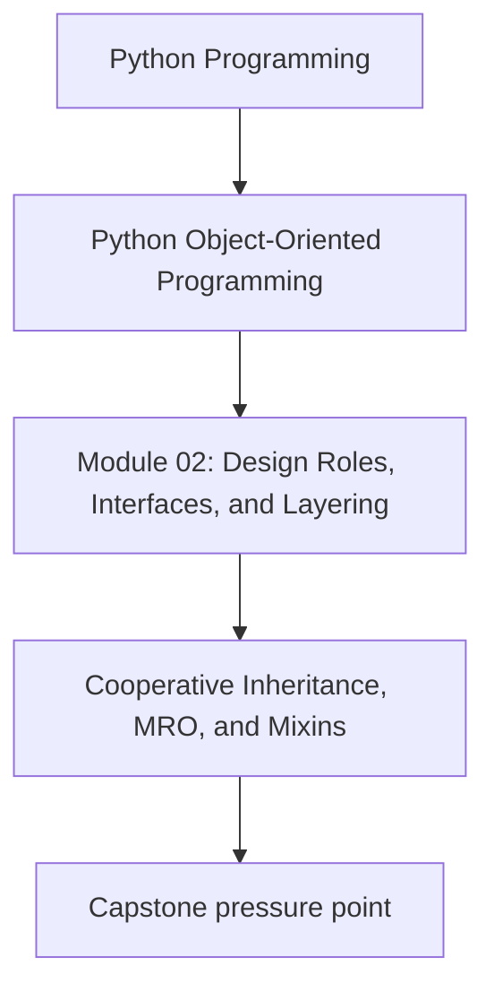
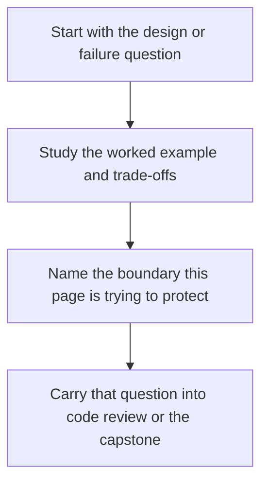

# Cooperative Inheritance, MRO, and Mixins

<!-- page-maps:start -->
## Concept Position

<!-- page-maps:end -->

Read the first diagram as a placement map: this page is one concept inside its parent module, not a detached essay, and the capstone is the pressure test for whether the idea holds. Read the second diagram as the working rhythm for the page: name the problem, study the example, identify the boundary, then carry one review question forward.

## Purpose

Inheritance is already risky when the hierarchy is shallow. It becomes much worse when
multiple bases, mixins, and `super()` calls are involved and nobody can explain the
method resolution order. This page gives the missing runtime model and the design rules
that keep cooperative inheritance from turning into folklore.

## Why this topic matters

Many Python courses say “prefer composition over inheritance” and stop there. That is
not enough for real codebases. You will still encounter:

- framework base classes
- mixins for opt-in behavior
- cooperative `super()` chains
- bugs caused by one base class silently skipping another

If you do not understand MRO and cooperative method design, you cannot review or repair
these systems honestly.

## The runtime model you must know

Python resolves methods using the method resolution order, or MRO. For a class with
multiple bases, Python computes one linear order that preserves local base ordering and
monotonicity. When you call `super()`, you are not calling “the parent.” You are asking
Python for the next implementation in that linear order.

That means two things:

- `super()` is about cooperation across the whole chain, not direct ancestry
- one class that does not participate correctly can break the whole chain

## A small mental model

Think of a cooperative hierarchy as a pipeline:

1. each class receives the call
2. it does its local work
3. it forwards the call with `super()`

If a class consumes arguments incorrectly, fails to call `super()`, or assumes a
particular parent layout, the pipeline stops being trustworthy.

## What mixins are for

A mixin should contribute one narrow behavior without pretending to be the center of the
domain model. Good mixins are:

- small
- role-specific
- light on state
- explicit about required attributes or hooks

Bad mixins quietly require deep knowledge of instance layout, constructor order, or
hidden lifecycle guarantees.

## Rules for cooperative `super()`

- Use `super()` consistently across the whole cooperative chain.
- Accept keyword arguments in constructors when multiple bases may participate.
- Keep constructor side effects small and explicit.
- Do not hard-code one direct parent name when the class is meant to cooperate in a chain.
- Design methods so each class adds local behavior and forwards responsibility.

If one class uses explicit base calls while the others use `super()`, the chain becomes
fragile fast.

## Example pressure

Suppose you have:

- one base class for repository-backed loading
- one mixin for caching
- one mixin for audit logging
- one concrete subclass for the specific service

The question is not only “does this run?” The real question is:

> Can another maintainer explain the call order and the constructor contract without reading the whole hierarchy twice?

If not, the inheritance design is already too expensive.

## When mixins are a good fit

Mixins can be appropriate when:

- the added behavior is orthogonal, such as formatting, lightweight caching, or audit hooks
- the receiving class already has a stable responsibility
- the mixin does not need to own authoritative domain state

They are a poor fit when the added behavior:

- changes who owns the invariant
- needs lots of internal state
- depends on exact constructor timing
- hides critical side effects

In those cases, composition is usually the clearer choice.

## Review questions

- Can you write the MRO down and explain why it is safe?
- Does every participating method use `super()` coherently?
- Is each mixin small enough that removing it would be easy to reason about?
- Would composition make the ownership boundary clearer?

## Practical guidelines

- Use shallow inheritance for stable abstraction, not for “free reuse.”
- Keep mixins narrow and name them for the one behavior they add.
- Treat cooperative constructors as an explicit contract, not as magic.
- Prefer composition when behavior needs rich state, domain authority, or high review cost.

## Exercises for mastery

1. Take a multiple-inheritance example and write out its MRO before running it.
2. Refactor one explicit base-class call chain into a consistent cooperative `super()` chain.
3. Replace one large mixin with a composed collaborator and compare the review cost.
