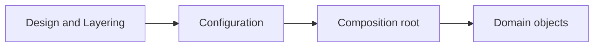

# Factories, Dependency Injection, and Composition Roots

<!-- page-maps:start -->
## Page Maps

<!-- page-maps:end -->

## Purpose

Well-layered systems still become clumsy if nobody decides where object construction
belongs. Factories, dependency injection, and composition roots are the missing part of
the story: they let you assemble collaborators deliberately without turning the domain
model into a bag of configuration details.

## Why this topic matters

Many Python systems start with clean domain objects and then decay because:

- constructors start reading environment variables
- domain classes decide which repository or adapter to instantiate
- tests require patching hidden global state
- configuration spreads through many modules instead of one assembly boundary

That is not just a style problem. It makes ownership harder to review.

## Three different things that people blur together

### Factory

A factory creates a domain object or collaborator from a smaller, clearer input shape.
Factories are useful when construction is non-trivial or when invariants need a named
creation step.

### Dependency injection

Dependency injection means collaborators are supplied from outside instead of being
created ad hoc inside the object that uses them. The key idea is not a framework. The
key idea is that construction stays separate from behavior.

### Composition root

The composition root is the outer place where the application wires the object graph:

- choose implementations
- read configuration
- create adapters
- assemble use cases and facades

The composition root is where “which concrete thing do we use?” belongs.

## What should stay out of the domain

Domain objects should not:

- open network clients
- read process environment directly
- decide which repository implementation to use
- parse configuration files
- hide service location behind class methods

If they do, the object stops being about domain behavior and becomes partly about boot
logic and deployment shape.

## A sane construction rule

Use this split:

- domain constructors and factories enforce domain invariants
- application services accept already-built collaborators
- the composition root chooses infrastructure implementations

That keeps creation logic close to meaning, while keeping infrastructure choice at the
edge of the system.

## Service locator is not the same thing

A hidden registry that objects reach into at runtime is not honest dependency injection.
It hides the true constructor contract and makes tests and review harder because the real
dependencies are no longer visible at the boundary.

If an object needs a collaborator, let that requirement appear in the constructor or in a
named factory. Hidden lookup makes the codebase feel smaller while actually making it
harder to understand.

## Review questions

- Which objects are true domain objects, and which are assembly helpers?
- Can I see required collaborators from the boundary of the class or use case?
- Where is configuration interpreted and transformed into concrete implementations?
- Is the composition root small enough that one maintainer can explain it clearly?

## Practical guidelines

- Use named factories when object creation needs semantic meaning.
- Inject collaborators instead of instantiating adapters deep inside domain code.
- Keep configuration parsing and implementation choice at the outer edge.
- Prefer one visible composition root per executable entrypoint.

## Exercises for mastery

1. Identify one hidden service locator or import-time singleton and replace it with explicit injection.
2. Move one concrete adapter choice out of domain code and into a composition root.
3. Write one factory whose name explains a domain invariant better than raw constructor arguments do.
