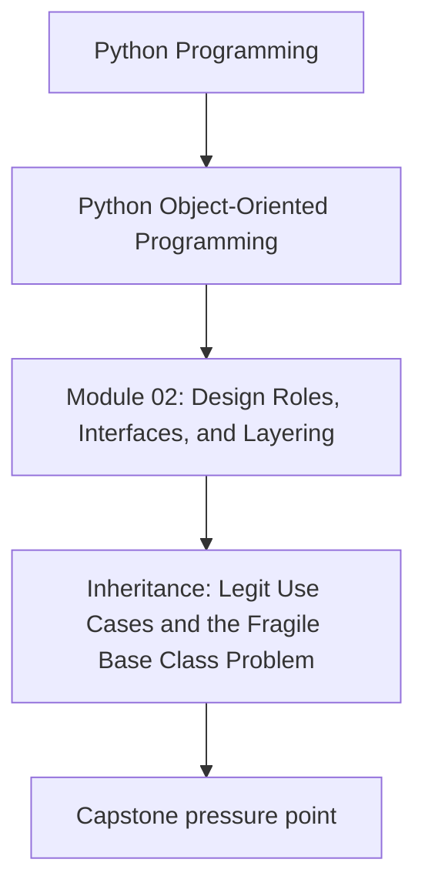
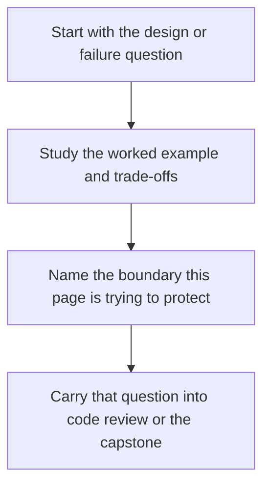

# Inheritance: Legit Use Cases and the Fragile Base Class Problem


<!-- page-maps:start -->
## Concept Position




<!-- page-maps:end -->

Read the first diagram as a placement map: this page is one concept inside its parent module, not a detached essay, and the capstone is the pressure test for whether the idea holds. Read the second diagram as the working rhythm for the page: name the problem, study the example, identify the boundary, then carry one review question forward.

## Purpose

This core examines inheritance as a structural tool in Python, highlighting legitimate applications—such as defining substitutable subtypes, constructing small hierarchies, and implementing template base classes—while exposing its inherent risks, including the fragile base class problem. In the monitoring domain, inheritance proves useful for a modest hierarchy of rule evaluators (for example, `ThresholdRule` and `RateRule` extending a common `BaseRule` for shared evaluation logic), but only when changes to the base do not unpredictably disrupt subclasses. Demonstrate failure modes through concrete examples: base modifications breaking subclass behavior (via regression tests) and brittle test suites. Extending M02C16's layered architecture, integrate a small, justified inheritance hierarchy into the domain layer, enforcing substitutability via explicit contracts and avoiding over-reliance on composition where inheritance suffices for polymorphic templates. Note: Inheritance remains subordinate to composition (from M02C12); apply it sparingly, with runtime assertions and static type checks to mitigate fragility. This hierarchy simplifies shared normalization and conversion over the M02C16 strategy pattern by centralizing template orchestration in a single base, reducing duplicate code in callers that would otherwise repeat these steps across strategies—though the marginal benefit here is modest, illustrating that inheritance's value must be weighed against increased coupling.

## 1. Baseline: Inheritance Misuse and Fragile Hierarchies in the Monitoring Domain

Prior cores favor composition for rule evaluation (for example, strategies in `RuleEvaluator`), but a common temptation arises to subclass for rule variants, leading to fragile hierarchies. In the baseline, `BaseRuleEvaluator` provides shared normalization logic, with subclasses like `ThresholdRuleEvaluator` and `RateRuleEvaluator` overriding filtering. This introduces smells: undocumented contracts (subclasses assume base normalization preserves order), ripple effects from base changes (for example, adding sorting breaks rate calculations), and diamond patterns (multiple paths to shared base logic). Coupling escalates as subclasses expose base internals; test fragility emerges when base evolutions invalidate subclass assertions without explicit signals.

```python
# inheritance_baseline.py
from __future__ import annotations
from typing import List
from semantic_types_model import RuleEvaluation, RuleType, Threshold  # Semantics (from M02C14)
from semantic_types_model import Metric  # Consistent domain value

class BaseRuleEvaluator:
    """Baseline base: Shared logic; fragile contracts."""

    def __init__(self, threshold: Threshold):
        self._threshold = threshold

    def evaluate(self, metrics: List[Metric]) -> List[RuleEvaluation]:
        # Template: Normalize then filter (undocumented: preserves order for subclasses)
        normalized = self._normalize_metrics(metrics)
        filtered = self._filter_high(normalized)
        return self._to_evaluations(filtered)

    def _normalize_metrics(self, metrics: List[Metric]) -> List[Metric]:
        # Implicit contract: Preserves input order (fragile for rate subclass)
        return metrics[:]  # Shallow copy; order preserved

    def _filter_high(self, metrics: List[Metric]) -> List[Metric]:
        # Base default: > threshold (subclasses override)
        return [m for m in metrics if m.value > self._threshold.value]

    def _to_evaluations(self, metrics: List[Metric]) -> List[RuleEvaluation]:
        # Shared: Converts to semantic evaluations (rule hardcoded; smell)
        return [RuleEvaluation(rule=RuleType("threshold"), metric=m) for m in metrics]

class ThresholdRuleEvaluator(BaseRuleEvaluator):
    """Subclass: Threshold-specific; relies on base filter."""

    def __init__(self, threshold: Threshold):
        super().__init__(threshold)

    def _filter_high(self, metrics: List[Metric]) -> List[Metric]:
        # Overrides base; uses normalized input
        return [m for m in metrics if m.value >= self._threshold.value]

class RateRuleEvaluator(BaseRuleEvaluator):
    """Subclass: Rate-specific; fragile reliance on base normalize order."""

    def __init__(self, rate_threshold: float):
        super().__init__(Threshold(0.0))  # Base threshold ignored (LSP violation)
        self._rate_threshold = rate_threshold

    def _filter_high(self, metrics: List[Metric]) -> List[Metric]:
        # Brittle: Assumes _normalize_metrics preserves sequential order for deltas
        if len(metrics) < 2:
            return []
        rates = [metrics[i].value - metrics[i-1].value for i in range(1, len(metrics))]
        high_rate_indices = [i for i, rate in enumerate(rates, start=1) if rate > self._rate_threshold]
        return [metrics[i] for i in high_rate_indices]

    def _to_evaluations(self, metrics: List[Metric]) -> List[RuleEvaluation]:
        # Overrides for rule type (diamond risk if multiple bases)
        return [RuleEvaluation(rule=RuleType("rate"), metric=m) for m in metrics]

# Example: Hierarchy usage (fragility demo)
def evaluate_rules(metrics: List[Metric]) -> List[RuleEvaluation]:
    threshold_eval = ThresholdRuleEvaluator(Threshold(0.85))
    rate_eval = RateRuleEvaluator(0.1)
    all_evals = threshold_eval.evaluate(metrics) + rate_eval.evaluate(metrics)
    return all_evals

if __name__ == "__main__":
    # Sample metrics: Sequential for rate (cpu: 0.8 → 0.95 delta=0.15 >0.1)
    metrics = [
        Metric(1, "cpu", 0.8),
        Metric(2, "cpu", 0.95),
        Metric(3, "mem", 0.7),
    ]
    evals = evaluate_rules(metrics)
    print(f"Evaluations: {len(evals)}")  # 2 (one threshold, one rate)
```

**Demonstrating Fragility (Concrete Example)**:  
Evolve `_normalize_metrics` to sort by timestamp for temporal consistency—a valid change:  

**v1 (Original)**:  
```python
def _normalize_metrics(self, metrics: List[Metric]) -> List[Metric]:
    return metrics[:]  # Preserves order
```  
- Rate behavior: Deltas computed on input order → triggers on delta 0.15.  

**v2 (Evolved)**:  
```python
def _normalize_metrics(self, metrics: List[Metric]) -> List[Metric]:
    return sorted(metrics, key=lambda m: m.timestamp, reverse=True)  # New: Sorts descending for recency
```  
- Rate behavior: Reversed order → delta -0.15 → no trigger. Subclass breaks silently.  

**Baseline Smells Exposed**:
- **Fragile Base Class**: Subclasses depend on undocumented base behavior (order preservation); evolutions ripple unexpectedly.
- **Tight Coupling**: Subclasses override selectively but inherit flawed templates (for example, hardcoded rule in `_to_evaluations`).
- **Diamond Risk**: If `RateRuleEvaluator` inherits from another base with `_to_evaluations`, MRO ambiguities arise.
- **Test Brittleness**: Subclass tests pass in v1 but fail in v2 without base changes.
- **Low Substitutability**: Base assumes threshold rules; rate subclass violates Liskov by ignoring base threshold.

These erode reliability: hierarchies amplify changes; composition (M02C12) avoids this but inheritance suits shared templates judiciously.

## 2. Inheritance Principles: Legitimate Cases and Safeguards

Inheritance excels for substitutable subtypes (Liskov compliance), small hierarchies (<3 levels), and template methods (skeleton with hooks). Risks: Fragility from base changes, multiple inheritance diamonds, and override brittleness. Principles: Explicit contracts (abstract methods, docs), small scopes, runtime assertions; prefer composition unless polymorphism demands subtypes.

### 2.1 Principles

- **Legitimate Uses**: Substitutable subtypes (for example, `Bird` → `Eagle` with shared `fly`); small hierarchies for domain variants; template methods (base orchestrates, subclasses hook steps).
- **Safeguards**: Abstract base classes (ABCs) for contracts; explicit MRO docs; test base in isolation; avoid deep overrides.
- **Failure Modes**: Fragile bases (hidden contracts); diamonds (ambiguous resolution); brittle tests (subclass-specific evolutions).
- **Trade-offs**: Inheritance boosts polymorphism but increases coupling; limit to <5 subclasses per base. Use ABCs for runtime checks; `typing.Protocol` (M02C19) for static.
- **Testing Differences**: Base: Contract enforcement; subclasses: Substitutability (plug into base users); evolutions: Regression suites.

### 2.2 Refactored Model: Justified Hierarchy with Safeguards

Refactor to a small domain hierarchy: `BaseRule` as ABC template (abstract `filter_high`, concrete `_normalize_metrics` with explicit contract). Subclasses implement hooks; assertions guard shape invariants (length and subsequence order). Integrate into M02C16 domain layer; yield `RuleEvaluation` for layering. Versus M02C16 strategies, this centralizes template steps in the base, avoiding per-strategy duplication of normalization and conversion. Contracts protect structural invariants; behavioral fragility (for example, order-dependent logic) is caught by regression tests. The factory uses string-based dispatch as a convenience smell, highlighting the need for semantic alternatives in production.

```python
# inheritance_model.py (domain/rules.py extension)
from __future__ import annotations
from abc import ABC, abstractmethod
from typing import List
from semantic_types_model import RuleType, Threshold, RuleEvaluation, Metric  # Semantics and consistent Metric

def _is_subsequence(xs: List[Metric], ys: List[Metric]) -> bool:
    """Helper: Check if xs is a subsequence of ys preserving order."""
    if not xs:
        return True
    it = iter(ys)
    for x in xs:
        for y in it:
            if x == y:
                break
        else:
            return False
    return True

class BaseRule(ABC):
    """Template base: Orchestrates evaluation; explicit contract: _normalize preserves order and count."""

    def evaluate(self, metrics: List[Metric]) -> List[RuleEvaluation]:
        # Template method: Fixed steps with abstract hook
        normalized = self._normalize_metrics(metrics)
        filtered = self._filter_high(normalized)
        # Safeguard: Ensure filtering preserves order (subsequence check)
        assert _is_subsequence(filtered, normalized), "Filtering must preserve order of kept items"
        return self._to_evaluations(filtered)

    def _normalize_metrics(self, metrics: List[Metric]) -> List[Metric]:
        """Contract: Returns copy preserving input order and count."""
        normalized = metrics[:]
        assert len(normalized) == len(metrics), "Normalization must preserve count"
        return normalized

    @abstractmethod
    def _filter_high(self, metrics: List[Metric]) -> List[Metric]:
        """Abstract hook: Subclasses implement filtering."""
        pass

    def _to_evaluations(self, metrics: List[Metric]) -> List[RuleEvaluation]:
        """Concrete: Shared conversion; subclasses override for rule type."""
        return [RuleEvaluation(rule=self.rule_type, metric=m) for m in metrics]

    @property
    @abstractmethod
    def rule_type(self) -> RuleType:
        """Contract: Subclasses provide type."""
        pass

class ThresholdRule(BaseRule):
    """Substitutable subtype: Threshold filtering."""

    def __init__(self, threshold: Threshold):
        self._threshold = threshold

    @property
    def rule_type(self) -> RuleType:
        return RuleType("threshold")

    def _filter_high(self, metrics: List[Metric]) -> List[Metric]:
        return [m for m in metrics if m.value >= self._threshold.value]

class RateRule(BaseRule):
    """Substitutable subtype: Rate filtering (relies on explicit order contract)."""

    def __init__(self, rate_threshold: float):
        self._rate_threshold = Threshold(rate_threshold)  # Distinct semantic use
        if not 0 <= rate_threshold <= 1:
            raise ValueError("Rate threshold must be 0-1")

    @property
    def rule_type(self) -> RuleType:
        return RuleType("rate")

    def _filter_high(self, metrics: List[Metric]) -> List[Metric]:
        if len(metrics) < 2:
            return []
        # Relies on documented order preservation
        rates = [metrics[i].value - metrics[i-1].value for i in range(1, len(metrics))]
        high_rate_indices = [i for i, rate in enumerate(rates, start=1) if rate > self._rate_threshold.value]
        return [metrics[i] for i in high_rate_indices]

    def _to_evaluations(self, metrics: List[Metric]) -> List[RuleEvaluation]:
        # Override for rate-specific (no diamond here)
        return [RuleEvaluation(rule=self.rule_type, metric=m) for m in metrics]

# Hierarchy factory (avoids diamond; small scope; distinct params for clarity; noted smell for string dispatch)
def create_rule_evaluator(rule_type: str, threshold: float, rate_threshold: float | None = None) -> BaseRule:
    if rule_type == "threshold":
        return ThresholdRule(Threshold(threshold))
    elif rule_type == "rate":
        if rate_threshold is None:
            raise ValueError("Rate rule requires rate_threshold")
        return RateRule(rate_threshold)
    raise ValueError(f"Unknown rule: {rule_type}")

# Diamond Demo: Conceptual illustration (MRO linearizes but call chains can surprise)
# Example: D( B, C ) with both overriding _to_evaluations: super() from B calls C, both execute; no skip but order non-obvious.
# Risk: Expect C to run first; MRO enforces B then C. Test with logging to verify.
```

**Rationale**:
- **Template Method**: `evaluate` orchestrates fixed steps with abstract `_filter_high` hook; subclasses specialize without reimplementing shared logic.
- **Substitutability**: Subclasses conform to base contract (Liskov); `BaseRule` users accept any subtype. Threshold used distinctly in subclasses (no base state overload).
- **Safeguards**: ABC enforces abstracts; assertions verify shape invariants (count and subsequence order via helper). Behavioral fragility caught by regression tests.
- **Superiority**: Polymorphism via `BaseRule` list; fragility mitigated (explicit asserts catch evolutions). Vs. baseline: Documented contracts; no silent breaks. For larger variants, revert to composition (M02C12). Factory string dispatch is a convenience smell; prefer semantic enums in production. Diamond discussed conceptually to focus on core risks.

## 3. Integrating into Responsibilities: Orchestrator Flow

Integrate hierarchy into M02C16's `MonitoringUseCase` (application layer): Inject `BaseRule` subtypes via factory; evaluate polymorphically. Domain remains pure; ports unchanged. This replaces the prior `RuleEvaluator` with the hierarchy for focused polymorphism, plugging into the evaluator slot (assuming M02C16 accepts an object with `evaluate(metrics)`).

The wiring in the composition root extends M02C16 as follows: create `RuleEvaluationUseCase` wrapping the polymorphic `BaseRule` list, then inject it as the evaluator. Config remains for semantics if needed, but the hierarchy handles rule-specific thresholds.

**Benefits Demonstrated**:
- **Polymorphism**: `evaluate` dispatches uniformly to subtypes; extensibility via factory.
- **Layer Integrity**: Hierarchy in domain; application coordinates without subclass knowledge.
- **Evolution Safety**: Base asserts prevent shape breaks; regression tests catch behavioral fragility. Integrates cleanly with M02C16 without redefining core use case.

## 4. Tests: Verifying Substitutability and Fragility Resistance

Assert contracts (abstract enforcement), substitutability (base users accept subtypes), and evolution resilience (mock base changes).

```python
# test_inheritance_model.py
import unittest
from unittest.mock import patch
from typing import List
from inheritance_model import BaseRule, ThresholdRule, RateRule, create_rule_evaluator, _is_subsequence
from semantic_types_model import RuleEvaluation, RuleType, Threshold, Metric

class TestInheritance(unittest.TestCase):

    def setUp(self):
        # Metrics that trigger rate on input order (increasing values for positive delta)
        self.metrics = [
            Metric(1, "cpu", 0.8),
            Metric(2, "cpu", 0.95),
            Metric(3, "mem", 0.7),
        ]

    def test_substitutability(self):
        # Base users accept subtypes
        threshold_rule: BaseRule = ThresholdRule(Threshold(0.85))
        rate_rule: BaseRule = RateRule(0.1)
        rules: List[BaseRule] = [threshold_rule, rate_rule]
        evals = [rule.evaluate(self.metrics) for rule in rules]
        self.assertEqual(len(evals[0]), 1)  # Threshold: one high (0.95)
        self.assertEqual(len(evals[1]), 1)  # Rate: one delta 0.15 >0.1
        self.assertEqual(evals[0][0].rule, RuleType("threshold"))
        self.assertEqual(evals[1][0].rule, RuleType("rate"))

    def test_abstract_contract(self):
        # ABC enforces abstracts
        with self.assertRaises(TypeError):
            BaseRule()  # Abstract methods unimplemented
        rule = create_rule_evaluator("threshold", 0.85)
        self.assertIsInstance(rule, BaseRule)
        self.assertEqual(rule.rule_type, RuleType("threshold"))

    def test_template_safeguard(self):
        # Asserts catch contract violations (subsequence check)
        class ViolatingRule(BaseRule):
            @property
            def rule_type(self) -> RuleType:
                return RuleType("test")

            def _filter_high(self, metrics: List[Metric]) -> List[Metric]:
                return [metrics[1], metrics[0]]  # Reorders; violates subsequence

        violating = ViolatingRule()
        with self.assertRaises(AssertionError):
            violating.evaluate([Metric(1, "test", 0.9), Metric(2, "test", 0.95)])

    def test_evolution_resilience(self):
        # Base change: Add ascending sort (changes order; delta becomes 0.15 >0.1, behavior changes)
        unsorted_metrics = [
            Metric(2, "cpu", 0.95),
            Metric(1, "cpu", 0.8),
            Metric(3, "mem", 0.7),
        ]
        # Pre-change: No trigger on unsorted deltas (-0.15, -0.25)
        rate_rule = RateRule(0.1)
        evals_pre = rate_rule.evaluate(unsorted_metrics)
        self.assertEqual(len(evals_pre), 0)
        # Post-change: Sort ascending, deltas 0.15, -0.25; trigger on first
        with patch('inheritance_model.BaseRule._normalize_metrics') as mock_normalize:
            mock_normalize.side_effect = lambda m: sorted(m, key=lambda x: x.timestamp)
            evals_post = rate_rule.evaluate(unsorted_metrics)
            self.assertEqual(len(evals_post), 1)  # Behavior change; regression test catches fragility

    def test_small_hierarchy_no_diamond(self):
        # No MRO issues in small scope
        threshold_rule = ThresholdRule(Threshold(0.85))
        self.assertEqual(len(threshold_rule._to_evaluations([self.metrics[0]])), 1)  # Shared
```

**Execution**: `python -m unittest test_inheritance_model.py` passes; confirms contracts, polymorphism, and resilience signals.

## Practical Guidelines

- **Justify Inheritance**: Use for polymorphism needs (subtypes, templates); default to composition otherwise. Limit hierarchies to <3 levels, <5 subclasses.
- **Contract Enforcement**: ABCs for abstracts; docs/asserts for shape invariants (for example, order subsequence); test substitutability explicitly. Behavioral fragility via regression tests.
- **Fragility Audit**: Evolve base (for example, add sorting); verify subclasses. Avoid deep overrides; prefer hooks.
- **Domain Fit**: Small rule hierarchies in monitoring domain; larger variants → strategies (M02C12).
- **Tooling**: Mypy for ABC compliance; pytest for MRO traces.

**Impacts on Design**:
- **Polymorphism**: Enables uniform dispatch; small hierarchies clarify variants.
- **Maintainability**: Explicit contracts reduce ripples; but monitor for fragility.

## Exercises for Mastery

1. **Contract CRC**: Extend `BaseRule` CRC with a `TrendRule` subtype; trace template flow and assert order contract.
2. **Fragility Simulation**: Evolve `_normalize_metrics` to sort; refactor `RateRule` to handle (for example, custom normalize) and test isolation.
3. **Diamond Refactor**: Introduce a mixin for logging; create diamond hierarchy and resolve via explicit MRO.

This core justifies inheritance within Module 2's collaborative framework. Core 18 refines template methods for tiny hierarchies.
