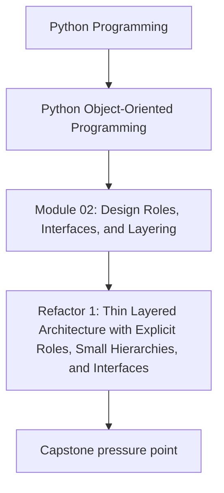
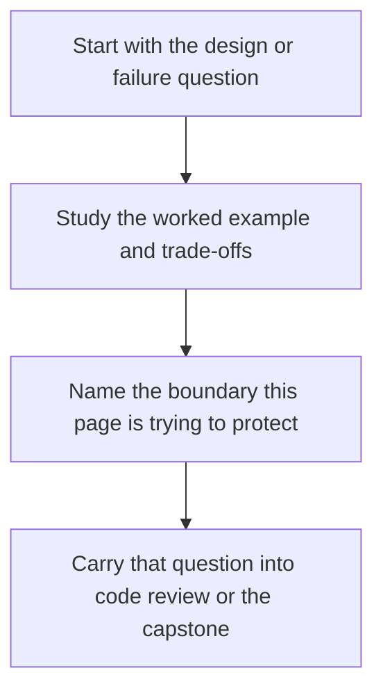

# Refactor 1: Thin Layered Architecture with Explicit Roles, Small Hierarchies, and Interfaces


<!-- page-maps:start -->
## Concept Position




<!-- page-maps:end -->

Read the first diagram as a placement map: this page is one concept inside its parent module, not a detached essay, and the capstone is the pressure test for whether the idea holds. Read the second diagram as the working rhythm for the page: name the problem, study the example, identify the boundary, then carry one review question forward.

## Purpose

This core applies Module 2's patterns to refactor the monitoring system into a thin layered architecture (domain for pure logic, application for use-case orchestration via ports, infrastructure for adapters), incorporating a single justified small inheritance hierarchy for rule evaluation (M02C18's template method with `ThresholdRule` and `RateRule` subtypes) and interfaces for role-specific contracts (M02C19: `RuleEvaluator` Protocol for static evaluation hints; `RulePlugin` ABC for runtime plugin enforcement). Building on priors like semantics (M02C14), entities/services (M02C13, M02C15), and composition (M02C12), it addresses M02C16's flat leaks and M02C17's fragility through ports, explicit asserts, and substitutability tests. The hierarchy is chosen over pure strategies for centralizing shared steps (normalize-filter-evaluate) while limiting to two subtypes to prevent bloat; plugins demonstrate minimal extensibility via ABC conformance (virtual subclassing for third-parties, e.g., `RulePlugin.register(ExternalClass)`). The result: isolated layers, polymorphic domain, and enforceable roles, with tests verifying contracts across implementations.

## 1. Baseline: Flat Monolith and Implicit Roles in the Monitoring Domain

The baseline consolidates logic in `MonitoringOrchestrator` (M02C15), blending domain evaluation, application coordination, and infrastructure persistence, with ad-hoc rule dispatch via concrete strategies or lambdas (M02C12). Absent layers reveal smells: direct infra invocation (`MetricFetcher`), implicit shapes (evaluator assumes filters without hints), and god orchestration (cycle owns all). No hierarchy duplicates normalization; interfaces lack, risking mismatches. Tests entangle layers; extensibility requires invasive edits. Cohesion erodes: domain bleeds infra, roles implicit (e.g., strategies lack contracts).

```python
# baseline_refactor.py (synthesized flat baseline from M02C15–19; illustrative only)
from __future__ import annotations
from typing import List
from semantic_types_model import Alert, RuleType, Metric, Threshold  # Semantics (M02C14)
from service_model import AlertService, InMemoryPersister, ConsoleNotifier  # Mixed (M02C15)
from composition_model import MetricFetcher, RuleEvaluator as LegacyEvaluator  # Flat concrete (M02C12)

# Flat god: Direct leaks; ad-hoc lambda (duplicates logic, poor clarity)
class MonitoringOrchestrator:
    """Baseline: No ports; implicit evaluator shapes; no invariants."""

    def __init__(self, threshold: float):
        self.fetcher = MetricFetcher()  # Infra leak
        self.legacy_evaluator = LegacyEvaluator(lambda metrics: [m for m in metrics if m.value > threshold])  # Ad-hoc
        self.alert_service = AlertService(InMemoryPersister(), ConsoleNotifier())  # Infra-mixed

    def run_cycle(self) -> List[Alert]:
        raw_metrics = self.fetcher.fetch()  # Direct infra
        metrics: List[Metric] = [Metric(r["timestamp"], r["name"], r["value"]) for r in raw_metrics]
        content = self.legacy_evaluator.evaluate(metrics)  # Implicit filter shape
        entity_alerts = [Alert(RuleType("threshold"), m) for m in content]
        self.alert_service.batch_acknowledge(entity_alerts)  # Mixed
        return entity_alerts  # No summary; illustrative leak omitted

if __name__ == "__main__":
    orch = MonitoringOrchestrator(0.85)
    alerts = orch.run_cycle()
    print(f"Processed {len(alerts)} alerts")  # 2 (threshold-only; no rate)
```

**Baseline Smells Exposed**:
- **Layer Leaks**: Infra calls in orchestration; no abstraction.
- **Implicit Contracts**: Evaluator guesses shapes; no hints/enforcement.
- **Duplicated Logic**: Lambdas repeat normalization; no shared skeleton.
- **God Flow**: Single class coordinates; full mocks for tests.
- **Extensibility Block**: Rules hardcoded; no plugin hook.

These impede isolation: infra ripples domainward.

## 2. Refactor Principles: Layering + Tiny Hierarchy + Interfaces per Role

Emphasize: Layers (M02C16) for boundaries; tiny hierarchy (M02C17–18) for templates; interfaces (M02C19) for roles. Composition defaults; priors assumed. Hierarchy justified: Consolidates preserve-order normalize + filter for variants, avoiding strategy boilerplate; limited to two subtypes. Ports invert; minimal ABC demonstrates plugin enforcement (virtual registration for third-parties via `RulePlugin.register`). Time-series ordering enforced at app boundary (sorted by timestamp) to align RateRule semantics without base fragility. Tests enforce: Inversion, polymorphism, invariants (order-preserving, non-expanding).

### 2.1 Principles

- **Thin Layers**: Domain: Pure invariants/hierarchy; Application: Ports/use cases/loader; Infrastructure: Legacy wrappers.
- **Explicit Roles**: CRC-focused (e.g., domain: template eval; app: extension coord).
- **Tiny Hierarchy**: `BaseRule` + subtypes; asserts for hooks.
- **Interfaces per Role**: Protocol (duck/static core); ABC (runtime extensions).
- **Trade-offs**: Hierarchy subtypes couple (test substitutability); layers ceremony (isolation payoff).
- **Enforcement**: Mypy Protocol; `isinstance` ABC; asserts invariants.

### 2.2 Refactored Model: Layered Structure with Hierarchy & Interfaces

Layout: `domain/` (rules); `application/` (ports/plugins/use_cases); `infrastructure/` (adapters). Domain imports priors only; app imports domain; infra imports app/domain. Legacy encapsulated as infra.

```python
# Domain layer: Pure (domain/rules.py) – Hierarchy satisfies Protocol
from __future__ import annotations
from abc import ABC, abstractmethod
from typing import Protocol, List, runtime_checkable
from semantic_types_model import RuleType, RuleEvaluation, Metric, Threshold  # Priors

@runtime_checkable
class RuleEvaluator(Protocol):
    """Core role: Static hints for evaluation (replaces legacy concrete)."""
    @property
    def rule_type(self) -> RuleType: ...
    def evaluate(self, metrics: List[Metric]) -> List[RuleEvaluation]: ...

class BaseRule(ABC):  # Template impl; satisfies Protocol
    """Tiny hierarchy: Shared skeleton; two subtypes; order-preserving contracts."""

    def _normalize_metrics(self, metrics: List[Metric]) -> List[Metric]:
        normalized = metrics[:]  # Preserve input order (assumes caller sorts)
        # Contract: Exact preservation (shallow copy)
        assert self._is_order_preserving_subsequence(metrics, normalized) and len(normalized) == len(metrics), "Normalize must preserve order exactly"
        return normalized

    def _to_evaluations(self, metrics: List[Metric]) -> List[RuleEvaluation]:
        return [RuleEvaluation(rule=self.rule_type, metric=m) for m in metrics]

    def evaluate(self, metrics: List[Metric]) -> List[RuleEvaluation]:
        normalized = self._normalize_metrics(metrics)
        filtered = self._filter_high(normalized)
        # Contract: Order-preserving subsequence, non-expanding
        assert self._is_order_preserving_subsequence(normalized, filtered), "Filter must preserve order"
        assert len(filtered) <= len(normalized), "Filter must not expand"
        return self._to_evaluations(filtered)

    @property
    @abstractmethod
    def rule_type(self) -> RuleType: ...
    @abstractmethod
    def _filter_high(self, metrics: List[Metric]) -> List[Metric]: ...

    @staticmethod
    def _is_order_preserving_subsequence(original: List[Metric], derived: List[Metric]) -> bool:
        """Derived is order-preserving subsequence of original."""
        i = 0
        for item in derived:
            while i < len(original) and original[i] != item:
                i += 1
            if i >= len(original):
                return False
            i += 1
        return True

class ThresholdRule(BaseRule):
    def __init__(self, threshold: Threshold):
        self._threshold = threshold

    @property
    def rule_type(self) -> RuleType:
        return RuleType("threshold")

    def _filter_high(self, metrics: List[Metric]) -> List[Metric]:
        return [m for m in metrics if m.value >= self._threshold.value]

class RateRule(BaseRule):
    def __init__(self, delta_threshold: Threshold):
        self._delta_threshold = delta_threshold

    @property
    def rule_type(self) -> RuleType:
        return RuleType("rate")

    def _filter_high(self, metrics: List[Metric]) -> List[Metric]:
        if len(metrics) < 2:
            return []
        rates = [metrics[i].value - metrics[i-1].value for i in range(1, len(metrics))]
        high_rate_indices = [i for i, rate in enumerate(rates, start=1) if rate > self._delta_threshold.value]
        return [metrics[i] for i in high_rate_indices]

def create_domain_rule(rule_type: str, threshold: Threshold) -> RuleEvaluator:
    if rule_type == "threshold":
        return ThresholdRule(threshold)
    elif rule_type == "rate":
        return RateRule(threshold)
    raise ValueError(f"Unknown: {rule_type}")

# Application layer: (application/ports.py)
from __future__ import annotations
from abc import ABC, abstractmethod
from typing import List
from semantic_types_model import Metric, Alert  # Domain priors

class MetricFetchPort(ABC):
    @abstractmethod
    def fetch(self) -> List[dict]: ...

class AlertPersistencePort(ABC):
    @abstractmethod
    def persist(self, alerts: List[Alert]) -> None: ...

class AlertNotifierPort(ABC):
    @abstractmethod
    def notify_batch(self, alerts: List[Alert]) -> None: ...

# (application/plugins.py)
from __future__ import annotations
from abc import ABC, abstractmethod
from domain.rules import RuleEvaluator

class RulePlugin(ABC):
    """Extension role: Runtime enforcement (e.g., RulePlugin.register(ExternalClass) for third-parties)."""
    @property
    @abstractmethod
    def plugin_name(self) -> str: ...
    @abstractmethod
    def get_evaluator(self) -> RuleEvaluator: ...

# (application/use_cases.py)
from __future__ import annotations
from typing import List
from application.ports import MetricFetchPort, AlertPersistencePort, AlertNotifierPort
from application.plugins import RulePlugin
from domain.rules import RuleEvaluator
from semantic_types_model import Metric, Alert, RuleEvaluation

class PluginLoader:
    """Role: Coordinates extensions via ABC."""
    def __init__(self):
        self._plugins: List[RulePlugin] = []

    def register(self, plugin: object) -> None:
        if not isinstance(plugin, RulePlugin):
            raise TypeError(f"Must satisfy RulePlugin: {type(plugin)}")
        self._plugins.append(plugin)

    def load_rules(self) -> List[RuleEvaluator]:
        return [p.get_evaluator() for p in self._plugins]

class RuleEvaluationUseCase:
    """Role: Polymorphic evaluation via hierarchy/plugins."""
    def __init__(self, rules: List[RuleEvaluator]):
        self._rules = rules

    def evaluate(self, metrics: List[Metric]) -> List[RuleEvaluation]:
        all_evals = []
        for rule in self._rules:
            all_evals.extend(rule.evaluate(metrics))
        return all_evals

class MonitoringUseCase:
    """Role: Orchestrates cycle via ports; enforces time-order for rules."""
    def __init__(self, fetch_port: MetricFetchPort, persistence_port: AlertPersistencePort,
                 notifier_port: AlertNotifierPort, evaluator: RuleEvaluationUseCase):
        self._fetch_port = fetch_port
        self._persistence_port = persistence_port
        self._notifier_port = notifier_port
        self._evaluator = evaluator

    def run_cycle(self) -> List[Alert]:
        raw_metrics = self._fetch_port.fetch()
        metrics: List[Metric] = sorted([Metric(r["timestamp"], r["name"], r["value"]) for r in raw_metrics], key=lambda m: m.timestamp)  # Enforce order
        evals = self._evaluator.evaluate(metrics)
        alerts = [Alert(e.rule, e.metric) for e in evals]
        self._persistence_port.persist(alerts)
        self._notifier_port.notify_batch(alerts)
        return alerts

# Infrastructure layer: (infrastructure/adapters.py)
from __future__ import annotations
from typing import List
from application.ports import MetricFetchPort, AlertPersistencePort, AlertNotifierPort
from semantic_types_model import Alert
from composition_model import MetricFetcher, PersistenceService  # Legacy encapsulated (M02C12 infra)

class HttpMetricAdapter(MetricFetchPort):
    """Transitional: Wraps legacy fetcher."""
    def fetch(self) -> List[dict]:
        return MetricFetcher().fetch()

class InMemoryAlertRepository(AlertPersistencePort):
    """Wraps legacy persister."""
    def persist(self, alerts: List[Alert]) -> None:
        PersistenceService().persist(alerts)

class ConsoleAlertNotifier(AlertNotifierPort):
    """Basic notifier."""
    def notify_batch(self, alerts: List[Alert]) -> None:
        for alert in alerts:
            print(f"Notified: {alert}")

# Composition root: (composition_root.py)
from __future__ import annotations
from application.use_cases import MonitoringUseCase, RuleEvaluationUseCase, PluginLoader
from application.ports import MetricFetchPort, AlertPersistencePort, AlertNotifierPort
from application.plugins import RulePlugin
from domain.rules import create_domain_rule, RuleEvaluator
from infrastructure.adapters import HttpMetricAdapter, InMemoryAlertRepository, ConsoleAlertNotifier
from semantic_types_model import Threshold

class SimpleRatePlugin(RulePlugin):  # Concrete ABC; third-party e.g. RulePlugin.register(External)
    def __init__(self, delta_threshold: Threshold, name: str = "simple_rate"):
        self._evaluator = create_domain_rule("rate", delta_threshold)
        self._name = name

    @property
    def plugin_name(self) -> str:
        return self._name

    def get_evaluator(self) -> RuleEvaluator:
        return self._evaluator

def create_orchestrator(threshold: Threshold) -> MonitoringUseCase:
    # Infra
    fetch_adapter: MetricFetchPort = HttpMetricAdapter()
    persistence_adapter: AlertPersistencePort = InMemoryAlertRepository()
    notifier_adapter: AlertNotifierPort = ConsoleAlertNotifier()
    # Domain core
    core_rules = [create_domain_rule("threshold", threshold)]
    # App extensions
    loader = PluginLoader()
    loader.register(SimpleRatePlugin(Threshold(0.1)))
    all_rules = core_rules + loader.load_rules()
    evaluator = RuleEvaluationUseCase(all_rules)
    return MonitoringUseCase(fetch_adapter, persistence_adapter, notifier_adapter, evaluator)
```

**Rationale**:
- **Layers**: Domain pure; app abstracts (loader imports domain); infra encapsulates legacy.
- **Roles**: CRC: `BaseRule` (template); `PluginLoader` (enforce ABC).
- **Hierarchy**: Shared preserve-order normalize; subtypes specialize filter.
- **Interfaces**: Protocol hints all; ABC rejects non-plugins.
- **Superiority**: Legacy isolated; extensions registered; invariants explicit. Vs. baseline: Decoupled, enforceable.

## 3. Integrating into Responsibilities: Orchestrator Flow

Entry delegates to root; app coordinates ports/hierarchy/plugins; boundary sorts for semantics.

```python
# layered_monitor.py
from __future__ import annotations
from typing import List
from composition_root import create_orchestrator
from semantic_types_model import Threshold, Alert

class LayeredMonitoringSystem:
    """Thin entry: Delegates to app."""

    def __init__(self, threshold: Threshold):
        self._use_case = create_orchestrator(threshold)

    def run_cycle(self) -> List[Alert]:
        return self._use_case.run_cycle()

if __name__ == "__main__":
    system = LayeredMonitoringSystem(Threshold(0.85))
    alerts = system.run_cycle()
    print(f"Processed {len(alerts)} alerts via layers")  # 2 (threshold + rate)
```

**Benefits Demonstrated**:
- **Inversion**: Ports shield infra.
- **Polymorphism**: Hierarchy/plugins uniform.
- **Extensibility**: ABC enables third-party register.

## 4. Tests: Verifying Layers, Hierarchy, Interfaces, and Contracts

Assert inversion (mocks), polymorphism, invariants (preservation/expansion), enforcement (ABC/Protocol).

```python
# test_refactored_model.py
import unittest
from unittest.mock import Mock
from typing import List
from application.use_cases import MonitoringUseCase, RuleEvaluationUseCase, PluginLoader
from application.ports import MetricFetchPort, AlertPersistencePort, AlertNotifierPort
from application.plugins import RulePlugin
from domain.rules import BaseRule, ThresholdRule, RateRule, create_domain_rule, RuleEvaluator
from infrastructure.adapters import HttpMetricAdapter
from semantic_types_model import RuleEvaluation, RuleType, Threshold, Metric, Alert
from composition_root import SimpleRatePlugin

class TestRefactor(unittest.TestCase):

    def setUp(self):
        self.metrics = [
            Metric(1, "cpu", 0.8),
            Metric(2, "cpu", 0.95),
            Metric(3, "mem", 0.7),
        ]
        self.threshold = Threshold(0.85)
        self.rate_threshold = Threshold(0.1)

    def test_layer_inversion_and_isolation(self):
        fetch_mock = Mock(spec=MetricFetchPort)
        fetch_mock.fetch.return_value = [{"timestamp": 1, "name": "cpu", "value": 0.95}]
        persistence_mock = Mock(spec=AlertPersistencePort)
        notifier_mock = Mock(spec=AlertNotifierPort)
        rules = [create_domain_rule("threshold", self.threshold)]
        evaluator = RuleEvaluationUseCase(rules)
        use_case = MonitoringUseCase(fetch_mock, persistence_mock, notifier_mock, evaluator)
        alerts = use_case.run_cycle()
        fetch_mock.fetch.assert_called_once()
        persistence_mock.persist.assert_called_once()
        self.assertEqual(len(alerts), 1)

    def test_hierarchy_substitutability_and_contracts(self):
        threshold_rule: BaseRule = ThresholdRule(self.threshold)
        rate_rule: BaseRule = RateRule(self.rate_threshold)
        rules: List[RuleEvaluator] = [threshold_rule, rate_rule]
        evals = [rule.evaluate(self.metrics) for rule in rules]
        self.assertEqual(len(evals[0]), 1)  # Threshold
        self.assertEqual(len(evals[1]), 1)  # Rate delta 0.15
        # Contracts: Preservation
        normalized = threshold_rule._normalize_metrics(self.metrics)
        self.assertTrue(threshold_rule._is_order_preserving_subsequence(self.metrics, normalized))
        filtered = threshold_rule._filter_high(normalized)
        self.assertTrue(threshold_rule._is_order_preserving_subsequence(normalized, filtered))

    def test_interface_enforcement_across_impls(self):
        rule = create_domain_rule("threshold", self.threshold)
        self.assertIsInstance(rule, RuleEvaluator)
        # ABC
        loader = PluginLoader()
        good_plugin = SimpleRatePlugin(self.rate_threshold)
        loader.register(good_plugin)
        self.assertEqual(len(loader.load_rules()), 1)
        bad_obj = object()
        with self.assertRaises(TypeError):
            loader.register(bad_obj)

    def test_plugin_extensibility(self):
        loader = PluginLoader()
        loader.register(SimpleRatePlugin(self.rate_threshold))
        plugin_rules = loader.load_rules()
        evaluator = RuleEvaluationUseCase(plugin_rules)
        evals = evaluator.evaluate(self.metrics)
        self.assertEqual(len(evals), 1)
        self.assertEqual(evals[0].rule, RuleType("rate"))

    def test_hierarchy_fragility_regression(self):
        class ReorderingFilter(BaseRule):
            @property
            def rule_type(self) -> RuleType:
                return RuleType("test")
            def _filter_high(self, metrics: List[Metric]) -> List[Metric]:
                return [metrics[1], metrics[0]]  # Reorders

        reordering = ReorderingFilter()
        with self.assertRaises(AssertionError):
            reordering.evaluate(self.metrics)  # Subsequence fail

        class ExpandingFilter(BaseRule):
            @property
            def rule_type(self) -> RuleType:
                return RuleType("test")
            def _filter_high(self, metrics: List[Metric]) -> List[Metric]:
                return [metrics[0], metrics[0]]  # Expands

        expanding = ExpandingFilter()
        with self.assertRaises(AssertionError):
            expanding.evaluate(self.metrics)  # Expansion fail

    def test_integration_layers_and_flow(self):
        fetch_mock = Mock(spec=MetricFetchPort)
        fetch_mock.fetch.return_value = [{"timestamp": 1, "name": "cpu", "value": 0.95}, {"timestamp": 2, "name": "cpu", "value": 0.8}]
        persistence_mock = Mock(spec=AlertPersistencePort)
        notifier_mock = Mock(spec=AlertNotifierPort)
        rules = [create_domain_rule("threshold", self.threshold)]
        evaluator = RuleEvaluationUseCase(rules)
        use_case = MonitoringUseCase(fetch_mock, persistence_mock, notifier_mock, evaluator)
        alerts = use_case.run_cycle()
        self.assertEqual(len(alerts), 1)  # First > threshold (sorted)
        persistence_mock.persist.assert_called_once_with(alerts)
        notifier_mock.notify_batch.assert_called_once_with(alerts)
```

**Execution**: `python -m unittest test_refactored_model.py` passes; confirms inversion, contracts, polymorphism.

## Practical Guidelines

- **Layer Boundaries**: Audit imports: Domain priors only; app domain/ports; infra app/domain.
- **Hierarchy Justification**: Shared steps > variants; assert hooks; cap subtypes.
- **Interface Enforcement**: Protocol mypy; ABC isinstance; test across.
- **Role CRC**: 3–5 resp/class; trace in tests.
- **Domain Fit**: Hierarchy templates; ABC extensions.

**Impacts on Design**:
- **Isolation**: Ports mock infra; hierarchy reuses.
- **Evolution**: Plugins register; contracts signal.

## Exercises for Mastery

1. **Layer CRC**: Trace cycle; verify no leaks.
2. **Contract Audit**: Evolve normalize; test subtypes.
3. **Extensibility**: Register third-party; assert dispatch.

This core integrates Module 2 into layered refactor. Module 3 explores state/dataclasses.
