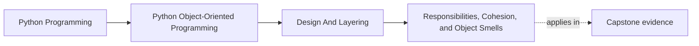

# Responsibilities, Cohesion, and Object Smells


<!-- page-maps:start -->
## Page Maps




<!-- page-maps:end -->

## Purpose

This core introduces responsibility-driven design (RDD) as the foundation for Module 2, shifting focus from isolated objects to their roles in collaboration. Employ CRC (Class-Responsibility-Collaboration) thinking to assign precise responsibilities, ensuring high cohesion within classes and low coupling between them. Identify common smells—God objects, feature envy, and low cohesion—and demonstrate refactoring techniques to split or merge classes based on functional responsibilities rather than superficial attributes. Building on Module 1's semantics, this establishes disciplined object collaboration in the monitoring domain, where `RuleEvaluator` focuses on pure evaluation without side effects, and `ReportAggregator` owns summary computations. Note: `Alert` is simplified here with a string rule label; full entity semantics (referencing a `Rule` instance) are restored in Module 3.

## 1. Baseline: Undisciplined Objects in the Monitoring Script

Consider an expanded naïve script where a single `Monitor` class handles fetching, evaluation, alerting, and persistence. It "works" but exhibits smells: the class assumes too many responsibilities (God object), borrows logic from metrics without ownership (feature envy), and scatters unrelated concerns (low cohesion), leading to brittle maintenance.

```python
# undisciplined_monitor.py

class Monitor:
    def __init__(self, threshold=0.85):
        self.threshold = threshold
        self.metrics = []  # Fetches and stores
        self.alerts = []   # Evaluates and stores

    def fetch_and_evaluate(self):
        # God object: fetches, filters, alerts, persists
        raw = [
            {"timestamp": 1, "name": "cpu", "value": 0.8},
            {"timestamp": 2, "name": "cpu", "value": 0.9},
            {"timestamp": 3, "name": "mem", "value": 0.7},
            {"timestamp": 2, "name": "cpu", "value": 0.9},  # Logical duplicate
        ]
        self.metrics = raw  # No validation or separation
        high = [m for m in self.metrics if m["value"] > self.threshold]
        for m in high:
            alert = {"rule": "high", "metric": m["name"], "value": m["value"]}
            self.alerts.append(alert)
            self.persist_alert(alert)  # Side effect in evaluation

    def persist_alert(self, alert):
        # Low cohesion: persistence mixed with domain logic
        print(f"Persisted: {alert}")  # Simulate DB write

    def report(self):
        # Feature envy: borrows from metrics/alerts without ownership
        total = sum(m["value"] for m in self.metrics)
        avg = total / len(self.metrics) if self.metrics else 0
        return f"Avg load: {avg}, Alerts: {len(self.alerts)}"

if __name__ == "__main__":
    mon = Monitor(threshold=0.85)
    mon.fetch_and_evaluate()
    print(mon.report())
```

**Output**:  
Persisted: {'rule': 'high', 'metric': 'cpu', 'value': 0.9}  
Persisted: {'rule': 'high', 'metric': 'cpu', 'value': 0.9}  
Avg load: 0.8, Alerts: 2

**Smells Exposed**:
- **God Object**: `Monitor` fetches data, evaluates rules, generates alerts, and persists—violating single responsibility; changing persistence breaks evaluation.
- **Feature Envy**: `report` accesses internal metric details (e.g., `m["value"]`) without encapsulating aggregation logic.
- **Low Cohesion**: Methods mix I/O (fetch/persist), computation (evaluate), and reporting, varying in abstraction level.

These erode testability and extensibility; a new alert type requires modifying `fetch_and_evaluate`.

## 2. Responsibility-Driven Design: CRC Thinking and Refactoring Smells

RDD views classes as agents with specific responsibilities, collaborations, and consequences. Use CRC cards mentally: for each class, list *what it does* (responsibility), *who it talks to* (collaboration), and *scenarios* (consequences). High cohesion means responsibilities cluster logically; low cohesion scatters them.

### 2.1 Definitions

- **Responsibility**: A cohesive task or role a class fulfills, such as "apply thresholds to metrics." Heuristic: If a responsibility spans multiple methods, consider extraction.
- **Cohesion**: Degree to which a class's elements relate to a single purpose. High cohesion: Methods share core invariants. Low cohesion: Methods vary in abstraction (e.g., I/O + computation). Heuristic: Methods touch overlapping fields; unrelated concerns signal split.
- **God Object**: A class assuming unrelated responsibilities (e.g., data + logic + I/O). Heuristic: High method/field count; excessive fan-out to others.
- **Feature Envy**: A method accesses more foreign attributes than its own class's. Heuristic: Foreign reads exceed local; move to the envied owner.

### 2.2 CRC Contrast: Baseline vs Refactored

| Aspect          | Baseline (`Monitor`) CRC                                                                 | Refactored CRC (e.g., `RuleEvaluator`) CRC                                      |
|-----------------|------------------------------------------------------------------------------------------|---------------------------------------------------------------------------------|
| **Responsibilities** | Fetch data, evaluate rules, generate alerts, persist, aggregate reports                  | Apply thresholds to metrics; produce alerts                                     |
| **Collaborations**  | External API, storage (implicit, tangled)                                                | `Metric` (input), `Alert` (output)                                              |
| **Scenarios**       | High load: fetches + evaluates + persists (fails if storage down)                        | High load: filters metrics, generates alerts (pure; no side effects)            |
| **Cohesion**        | Low: Mixes I/O, domain, reporting                                                        | High: Pure computation; focused on evaluation invariant                         |

**Refactoring Principles**:
- **Split God Objects**: Extract orthogonal responsibilities (e.g., evaluation from persistence).
- **Cure Feature Envy**: Move envied logic to the owner (e.g., aggregation to a dedicated aggregator).
- **Boost Cohesion**: Merge if responsibilities overlap meaningfully; split if they don't (e.g., separate fetch from evaluate).

### 2.3 Refactored Classes: Disciplined Responsibilities

Extract focused classes from `Monitor`. Reuse `Metric` from M01C10 (value semantics preserved; see that core for full implementation). For this core, use a simplified `Alert` with a string rule label (entity semantics with full `Rule` reference restored in Module 3). Each adheres to CRC: narrow responsibilities, explicit collaborations.

```python
# disciplined_model.py
from __future__ import annotations
from typing import List
from refactored_model import Metric  # Reuse from M01C10

class Alert:
    """Simplified entity: Represents a triggered alert (full entity in Module 3)."""

    def __init__(self, rule: str, metric: Metric) -> None:
        self.rule = rule
        self.metric = metric

    def __repr__(self):
        return f"Alert(rule='{self.rule}', metric={self.metric})"

class MetricFetcher:
    """Responsibility: Fetch raw metrics. Collaborates: External sources."""

    def fetch(self) -> List[dict[str, object]]:
        # Simulate API; in reality, wraps HTTP/DB
        return [
            {"timestamp": 1, "name": "cpu", "value": 0.8},
            {"timestamp": 2, "name": "cpu", "value": 0.9},
            {"timestamp": 3, "name": "mem", "value": 0.7},
            {"timestamp": 2, "name": "cpu", "value": 0.9},  # Duplicate
        ]

class RuleEvaluator:
    """Responsibility: Evaluate metrics against rules; produce alerts. Collaborates: Metric, Alert."""

    def __init__(self, threshold: float = 0.85):
        if not 0 <= threshold <= 1:
            raise ValueError("Threshold must be between 0 and 1")
        self.threshold = threshold

    def evaluate(self, metrics: List[Metric]) -> List[Alert]:
        # Pure: No side effects, no I/O
        high_metrics = [m for m in metrics if m.value > self.threshold]
        return [Alert("high", m) for m in high_metrics]

class PersistenceService:
    """Responsibility: Persist alerts. Collaborates: MonitoringOrchestrator."""

    def persist(self, alerts: List[Alert]) -> None:
        for alert in alerts:
            print(f"Persisted: {alert}")  # Simulate DB

class ReportAggregator:
    """Responsibility: Aggregate reports from domain objects. Collaborates: Metric, Alert."""

    @staticmethod
    def summarize(metrics: List[Metric], alerts: List[Alert]) -> str:
        # Owns aggregation; operates on domain objects
        avg_load = sum(m.value for m in metrics) / len(metrics) if metrics else 0.0
        count = len(alerts)
        return f"Avg load: {avg_load}, Alerts: {count}"
```

**Rationale**:
- **God Object Split**: `Monitor` → `MetricFetcher`, `RuleEvaluator` (pure domain), `PersistenceService`, `ReportAggregator`.
- **Feature Envy Cured**: `ReportAggregator` operates on `Metric`/`Alert` instances.
- **Cohesion Boosted**: `RuleEvaluator` focuses on computation; persistence delegated.

## 3. Orchestrating Responsibilities: The Application Flow

Compose via a thin coordinator (`MonitoringOrchestrator`) that delegates without assuming responsibilities. Transform raw to domain once at the boundary.

```python
# disciplined_monitor.py
from __future__ import annotations
from typing import List
from disciplined_model import (
    MetricFetcher, RuleEvaluator, PersistenceService, ReportAggregator
)
from refactored_model import Metric

class MonitoringOrchestrator:
    """Thin coordinator: Wires collaborations without owning logic."""

    def __init__(self, threshold: float = 0.85):
        self.fetcher = MetricFetcher()
        self.evaluator = RuleEvaluator(threshold)
        self.persister = PersistenceService()
        self.aggregator = ReportAggregator()

    def run_cycle(self) -> str:
        raw_metrics = self.fetcher.fetch()
        # Single boundary transform: raw → domain
        metrics: List[Metric] = [Metric(r["timestamp"], r["name"], r["value"]) for r in raw_metrics]
        alerts = self.evaluator.evaluate(metrics)
        self.persister.persist(alerts)
        return self.aggregator.summarize(metrics, alerts)

if __name__ == "__main__":
    orch = MonitoringOrchestrator(0.85)
    print(orch.run_cycle())
```

**Output**:  
Persisted: Alert(rule='high', metric=Metric(ts=2, name='cpu', value=0.9))  
Persisted: Alert(rule='high', metric=Metric(ts=2, name='cpu', value=0.9))  
Avg load: 0.8, Alerts: 2

**Benefits**:
- **Testability**: Mock `Persister` via injection.
- **Extensibility**: New rule? Extend `Evaluator`.
- **Cohesion**: Single transform; pure delegation.

## 4. Tests: Verifying Responsibilities and Smell Absence

Use `unittest` to assert responsibilities via collaborations and isolation.

```python
# test_disciplined_model.py
import unittest
from unittest.mock import Mock
from disciplined_model import (
    MetricFetcher, RuleEvaluator, PersistenceService, ReportAggregator
)
from disciplined_monitor import MonitoringOrchestrator
from refactored_model import Metric

class TestResponsibilities(unittest.TestCase):
    def setUp(self):
        self.fetcher = MetricFetcher()
        self.evaluator = RuleEvaluator(0.85)
        self.aggregator = ReportAggregator()

    def test_fetcher_responsibility(self):
        # Isolated: fetch without evaluation
        raw = self.fetcher.fetch()
        self.assertEqual(len(raw), 4)  # Includes duplicate

    def test_evaluator_purity(self):
        # Pure: generates alerts without side effects; focused on evaluation
        metrics = [Metric(1, "cpu", 0.95), Metric(2, "cpu", 0.8)]
        alerts = self.evaluator.evaluate(metrics)
        self.assertEqual(len(alerts), 1)
        self.assertEqual(alerts[0].rule, "high")

    def test_aggregator_cures_envy(self):
        # Owns aggregation on domain objects
        metrics = [Metric(1, "cpu", 0.8), Metric(2, "cpu", 0.9)]
        from disciplined_model import Alert
        alerts = [Alert("high", metrics[1])]
        summary = self.aggregator.summarize(metrics, alerts)
        self.assertIn("Avg load: 0.85", summary)
        self.assertIn("Alerts: 1", summary)

    def test_orchestrator_delegation(self):
        # Thin: no God behavior; inject mocks
        class MockOrchestrator(MonitoringOrchestrator):
            def __init__(self):
                super().__init__(0.85)
                self.fetcher.fetch = Mock(return_value=[{"timestamp": 1, "name": "cpu", "value": 0.95}])
                self.persister = Mock(spec=PersistenceService)
        orch = MockOrchestrator()
        result = orch.run_cycle()
        self.assertIn("Alerts: 1", result)
        orch.persister.persist.assert_called_once()

    def test_low_cohesion_absent(self):
        # Refactored: evaluator pure, no mixed concerns
        metrics = [Metric(1, "cpu", 0.95)]
        alerts = self.evaluator.evaluate(metrics)
        self.assertEqual(len(alerts), 1)
        # No side effects implied: focused output, no I/O
```

**Execution**: `python -m unittest test_disciplined_model.py` passes; confirms delegation without smells.

## Practical Guidelines

- **CRC Audit**: Enumerate 3–5 responsibilities per class; split if >7. Limit collaborators to <5.
- **Smell Detection**: God object? Excessive fan-out. Feature envy? More foreign than local accesses. Low cohesion? Varying abstraction levels.
- **Refactor Iteratively**: Extract one responsibility; test isolation. Merge on meaningful overlap.
- **Domain Fit**: Keep domain pure (no I/O); inject application concerns.

**Impacts on Design**:
- **Maintainability**: Focused classes evolve independently.
- **Collaboration**: CRC clarifies interfaces.

## Exercises for Mastery

1. **CRC Cards**: Create cards for 5 classes; trace a "high-load spike" scenario.
2. **Smell Injection**: Add God method to `RuleEvaluator`; refactor and assert isolation.
3. **Cohesion Merge**: Merge aggregation into `Evaluator`; identify failure via cohesion heuristic.

This core lays the groundwork for Module 2, emphasizing roles for robust collaboration. Core 12 explores composition as the preferred structural tool.
