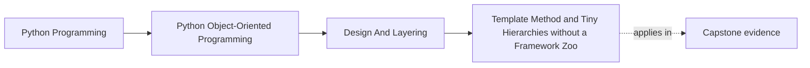
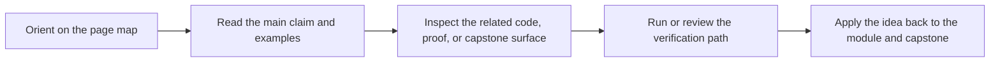

# Template Method and Tiny Hierarchies without a Framework Zoo


<!-- page-maps:start -->
## Page Maps




<!-- page-maps:end -->

## Purpose

This core refines the inheritance patterns from M02C17, focusing on the template method as a precise tool: a single abstract skeleton method orchestrating a fixed algorithm with minimal interchangeable hooks for subclasses, constrained to tiny hierarchies to avoid bloat. Building directly on M02C17's `BaseRule`, we refactor it into a stricter single-template form (`evaluate` skeleton with one hook `_filter_high`), demonstrating how to enforce override rules (for example, "preserve input order") while capping depth at 2 levels. In the monitoring domain, this eliminates duplication in rule evaluation (normalize-filter-convert) that would otherwise repeat across strategies in M02C16, but the payoff is modest—increased coupling for slight ceremony reduction—highlighting when templates shine (shared steps > variants) versus when to revert to composition. Avoid "framework zoo" pitfalls: no multi-template layers, no excessive hooks, and explicit contracts via ABCs/docs/asserts to prevent brittle extensions.

## 1. Baseline: Template Bloat and Overridden Hierarchies in the Monitoring Domain

M02C17's `BaseRule` hierarchy risks bloat if extended naively: adding hooks for "preprocess" or "postprocess" creates unnecessary layers, forcing subclasses to override everything and ignoring fixed steps. In the baseline, we layer `ExtendedRuleProcessor` on `BaseRule` with extra hooks (`_pre_filter`, `_post_filter`), resulting in 3 levels and subclasses reimplementing most of the skeleton. Smells: Excessive hooks dilute the template; deep overrides ignore base logic; zoo creep from layering abstractions for simple needs. Testability erodes as chains lengthen; evolution cascades with new hooks.

```python
# template_baseline.py (extends M02C17 BaseRule)
from __future__ import annotations
from abc import ABC, abstractmethod
from typing import List
from semantic_types_model import RuleEvaluation, RuleType, Threshold  # Semantics
from semantic_types_model import Metric  # Consistent

class BaseRule(ABC):  # From M02C17: Basic template
    def __init__(self, threshold: Threshold):
        self._threshold = threshold

    def evaluate(self, metrics: List[Metric]) -> List[RuleEvaluation]:
        normalized = self._normalize_metrics(metrics)
        filtered = self._filter_high(normalized)
        return self._to_evaluations(filtered)

    def _normalize_metrics(self, metrics: List[Metric]) -> List[Metric]:
        return metrics[:]

    @abstractmethod
    def _filter_high(self, metrics: List[Metric]) -> List[Metric]:
        pass

    def _to_evaluations(self, metrics: List[Metric]) -> List[RuleEvaluation]:
        return [RuleEvaluation(rule=self.rule_type, metric=m) for m in metrics]

    @property
    @abstractmethod
    def rule_type(self) -> RuleType:
        pass

class ExtendedRuleProcessor(BaseRule):  # Baseline bloat: Layers extra hooks
    """Bloated extension: Adds preprocess/postprocess; forces full overrides."""

    def evaluate(self, metrics: List[Metric]) -> List[RuleEvaluation]:
        # Overridden skeleton: Now 5+ steps; subclasses reimplement
        preprocessed = self._pre_filter(metrics)
        normalized = self._normalize_metrics(preprocessed)
        core_filtered = self._filter_high(normalized)
        post_filtered = self._post_filter(core_filtered)
        return self._to_evaluations(post_filtered)

    @abstractmethod
    def _pre_filter(self, metrics: List[Metric]) -> List[Metric]:
        """Extra hook: Unnecessary for most; bloat."""
        pass

    @abstractmethod
    def _post_filter(self, filtered: List[Metric]) -> List[Metric]:
        """Extra hook: Often identity; ignored."""
        pass

class ThresholdProcessor(ExtendedRuleProcessor):
    """Subclass: Overrides all; duplication and ceremony."""

    @property
    def rule_type(self) -> RuleType:
        return RuleType("threshold")

    def _pre_filter(self, metrics: List[Metric]) -> List[Metric]:
        return [m for m in metrics if m.value > 0]  # Trivial

    def _filter_high(self, metrics: List[Metric]) -> List[Metric]:
        return [m for m in metrics if m.value >= self._threshold.value]

    def _post_filter(self, filtered: List[Metric]) -> List[Metric]:
        return filtered  # Identity; hook wasted

class RateProcessor(ExtendedRuleProcessor):
    """Subclass: Full chain override; fragile to base layers."""

    @property
    def rule_type(self) -> RuleType:
        return RuleType("rate")

    def _pre_filter(self, metrics: List[Metric]) -> List[Metric]:
        return metrics  # No-op

    def _filter_high(self, metrics: List[Metric]) -> List[Metric]:
        if len(metrics) < 2:
            return []
        rates = [metrics[i].value - metrics[i-1].value for i in range(1, len(metrics))]
        high_rate_indices = [i for i, rate in enumerate(rates, start=1) if rate > 0.1]
        return [metrics[i] for i in high_rate_indices]

    def _post_filter(self, filtered: List[Metric]) -> List[Metric]:
        return filtered  # Wasted override

# Usage: Bloat in action (3 levels, excessive ceremony)
def process_rules(metrics: List[Metric]) -> List[RuleEvaluation]:
    threshold_proc = ThresholdProcessor(Threshold(0.85))
    rate_proc = RateProcessor(Threshold(0.0))
    all_evals = threshold_proc.evaluate(metrics) + rate_proc.evaluate(metrics)
    return all_evals

if __name__ == "__main__":
    metrics = [
        Metric(1, "cpu", 0.8),
        Metric(2, "cpu", 0.95),
        Metric(3, "mem", 0.7),
    ]
    evals = process_rules(metrics)
    print(f"Evaluations: {len(evals)}")  # 2
```

**Demonstrating Bloat (Concrete Example)**:  
Add `_audit_steps` hook to `ExtendedRuleProcessor`: Subclasses must now override 6+ methods; a log addition forces updates, showing zoo creep.

**Baseline Smells Exposed**:
- **Template Bloat**: Extra hooks (`_pre_filter`, `_post_filter`) dilute skeleton; subclasses override most, ignoring fixed steps.
- **Framework Zoo**: Layered abstractions for simple variants; unnecessary intermediates.
- **Override Brittleness**: Full reimplementation; base evolutions cascade.
- **Test Fragility**: Suites explode with hooks; isolation hard.
- **Low Payoff**: Ceremony outweighs polymorphism for 2 variants.

These hinder evolution: templates shine once; composition avoids bloat but inheritance suits single-skeleton needs.

## 2. Template Method Principles: Single Skeleton, Tiny Hierarchies, Contract Rules

Template method defines a fixed algorithm skeleton in the base, with abstract/concrete hooks for subclass customization. Use once: one skeleton with 2-3 interchangeable steps. Principles: Shallow hierarchies, explicit override rules (docs/asserts), no zoo (avoid multi-template bases).

### 2.1 Principles

- **Single Skeleton**: One abstract `evaluate` orchestrating fixed steps (normalize, filter hook, convert); subclasses provide hooks only.
- **Tiny Hierarchies**: <3 levels; 2-3 subclasses max; no deep chains.
- **Override Rules**: Docs specify contracts (for example, "hook preserves order"); asserts enforce (subsequence check); ABCs mandate hooks.
- **Failure Modes**: Bloat from extra hooks; brittle overrides ignoring contracts; zoo from layering templates.
- **Trade-offs**: Gains polymorphism for shared skeletons; costs coupling—use if duplication > ceremony, else compose.
- **Testing Differences**: Base: Template flow; subclasses: Hook isolation; overrides: Contract adherence.

### 2.2 Refactored Model: Single Template in Tiny Hierarchy

Refactor M02C17's `BaseRule` by stripping to single template: `evaluate` skeleton with one hook `_filter_high`, concrete normalize/convert. Subclasses implement hook; asserts enforce rules (order preservation). Tiny: 2 levels, 2 subclasses. No zoo: Single template, no extra layers. Vs. baseline: Focused, shallow. Vs. M02C16 strategies: Reduces duplication in normalize/convert (before: repeated in each strategy; after: centralized). The subsequence check assumes Metric equality is structural (as per M01C05).

**Before Duplication (M02C16-Style Strategies)**:
```python
class ThresholdStrategy:
    def evaluate(self, metrics: List[Metric]) -> List[RuleEvaluation]:
        normalized = metrics[:]  # Duplicate
        filtered = [m for m in normalized if m.value >= 0.85]
        return [RuleEvaluation(RuleType("threshold"), m) for m in filtered]  # Duplicate convert

class RateStrategy:
    def evaluate(self, metrics: List[Metric]) -> List[RuleEvaluation]:
        normalized = metrics[:]  # Duplicate
        if len(normalized) < 2:
            return []
        rates = [normalized[i].value - normalized[i-1].value for i in range(1, len(normalized))]
        high_rate_indices = [i for i, rate in enumerate(rates, start=1) if rate > 0.1]
        filtered = [normalized[i] for i in high_rate_indices]
        return [RuleEvaluation(RuleType("rate"), m) for m in filtered]  # Duplicate
```

**After (Single Template)**:
```python
from __future__ import annotations
from abc import ABC, abstractmethod
from typing import List
from semantic_types_model import RuleType, Threshold, RuleEvaluation, Metric  # Semantics

def _is_subsequence(xs: List[Metric], ys: List[Metric]) -> bool:
    """Helper: Check if xs is a subsequence of ys preserving order."""
    if not xs:
        return True
    it = iter(ys)
    for x in xs:
        for y in it:
            if x == y:
                break
        else:
            return False
    return True

class BaseRule(ABC):
    """Single template: evaluate skeleton with one hook; tiny hierarchy."""

    def evaluate(self, metrics: List[Metric]) -> List[RuleEvaluation]:
        # Single skeleton: Normalize (fixed), filter (hook), convert (fixed)
        normalized = self._normalize_metrics(metrics)
        filtered = self._filter_high(normalized)
        # Override rule: Filter preserves subsequence order
        assert _is_subsequence(filtered, normalized), "Hook must preserve order of kept items"
        return self._to_evaluations(filtered)

    def _normalize_metrics(self, metrics: List[Metric]) -> List[Metric]:
        """Fixed: Copy preserving order/count."""
        normalized = metrics[:]
        assert len(normalized) == len(metrics), "Normalize preserves count"
        return normalized

    @abstractmethod
    def _filter_high(self, metrics: List[Metric]) -> List[Metric]:
        """Single hook: Subclass provides filter; must preserve order."""
        pass

    def _to_evaluations(self, metrics: List[Metric]) -> List[RuleEvaluation]:
        """Fixed: Convert with subclass type."""
        return [RuleEvaluation(rule=self.rule_type, metric=m) for m in metrics]

    @property
    @abstractmethod
    def rule_type(self) -> RuleType:
        """Contract: Subclass provides type."""
        pass

class ThresholdRule(BaseRule):
    """Tiny subtype: Implements hook."""

    def __init__(self, threshold: Threshold):
        self._threshold = threshold

    @property
    def rule_type(self) -> RuleType:
        return RuleType("threshold")

    def _filter_high(self, metrics: List[Metric]) -> List[Metric]:
        return [m for m in metrics if m.value >= self._threshold.value]

class RateRule(BaseRule):
    """Tiny subtype: Implements hook; order-dependent."""

    def __init__(self, delta_threshold: float):
        self._delta_threshold = Threshold(delta_threshold)  # Distinct storage

    @property
    def rule_type(self) -> RuleType:
        return RuleType("rate")

    def _filter_high(self, metrics: List[Metric]) -> List[Metric]:
        if len(metrics) < 2:
            return []
        # Relies on documented order preservation
        rates = [metrics[i].value - metrics[i-1].value for i in range(1, len(metrics))]
        high_rate_indices = [i for i, rate in enumerate(rates, start=1) if rate > self._delta_threshold.value]
        return [metrics[i] for i in high_rate_indices]

# Factory: String dispatch convenience smell; production: Enum or config object
def create_rule(rule_type: str, threshold: float) -> BaseRule:
    if rule_type == "threshold":
        return ThresholdRule(Threshold(threshold))
    elif rule_type == "rate":
        return RateRule(threshold)
    raise ValueError(f"Unknown rule: {rule_type}")
```

**Rationale**:
- **Single Template**: `evaluate` as sole skeleton with one hook; fixed steps minimize overrides.
- **Tiny Hierarchy**: 2 levels, 2 subclasses; no zoo—avoids multi-template bloat.
- **Override Rules**: Docs/asserts enforce "preserve order"; ABC mandates hook/type.
- **Superiority**: Polymorphism without duplication; vs. baseline: Shallow, focused. Vs. M02C16 strategies: Centralizes normalize/convert (reduces ~10 LOC duplication). Factory string dispatch is convenience smell—highlights need for semantics.

## 3. Integrating into Responsibilities: Orchestrator Flow

Integrate template hierarchy into M02C16's `MonitoringUseCase`: Inject subtypes via factory; dispatch polymorphically in evaluator. Domain pure; ports unchanged. Replaces prior evaluator with hierarchy for template-driven polymorphism, fitting `evaluate(metrics)` slot.

```python
# template_monitor.py (application/use_cases.py extension)
from __future__ import annotations
from typing import List
from semantic_types_model import RuleEvaluation  # For return type
from ..domain.rules import BaseRule, create_rule  # Template hierarchy
from .ports import MetricFetchPort  # From M02C16
from semantic_types_model import Metric  # Consistent

class RuleEvaluationUseCase:
    """Focused use case: Polymorphic template evaluation."""

    def __init__(self, rules: List[BaseRule]):
        self._rules = rules  # Subtypes via template

    def evaluate(self, metrics: List[Metric]) -> List[RuleEvaluation]:
        all_evals = []
        for rule in self._rules:
            all_evals.extend(rule.evaluate(metrics))  # Template dispatch
        return all_evals

# Wiring in composition root (minimal extension of M02C16)
def create_orchestrator_with_template(threshold: float):
    from application.use_cases import MonitoringUseCase  # M02C16
    from application.ports import MetricFetchPort, AlertPersistencePort, AlertNotifierPort
    from infrastructure.adapters import HttpMetricAdapter, InMemoryAlertRepository, ConsoleAlertNotifier
    # Infra (M02C16)
    fetch_adapter: MetricFetchPort = HttpMetricAdapter()
    persistence_adapter: AlertPersistencePort = InMemoryAlertRepository()
    notifier_adapter: AlertNotifierPort = ConsoleAlertNotifier()
    # Domain: Template hierarchy
    rules = [
        create_rule("threshold", threshold),
        create_rule("rate", 0.1),
    ]
    evaluator = RuleEvaluationUseCase(rules)  # Fits M02C16 evaluator slot
    # Return M02C16 use case
    use_case = MonitoringUseCase(fetch_adapter, persistence_adapter, notifier_adapter, evaluator)
    return use_case
```

**Benefits Demonstrated**:
- **Template Flow**: Base orchestrates uniformly; hooks customize without boilerplate.
- **Layer Integrity**: Hierarchy in domain; application unaware of subtypes.
- **Shallow Safety**: Tiny structure limits ripple; asserts/rules guide overrides.

## 4. Tests: Verifying Template Flow and Override Rules

Assert skeleton execution, hook isolation, contract adherence, and regression for behavioral fragility.

```python
# test_template_model.py
import unittest
from unittest.mock import patch
from typing import List
from template_model import BaseRule, ThresholdRule, RateRule, create_rule, _is_subsequence
from semantic_types_model import RuleEvaluation, RuleType, Threshold, Metric

class TestTemplateMethod(unittest.TestCase):

    def setUp(self):
        self.metrics = [
            Metric(1, "cpu", 0.8),
            Metric(2, "cpu", 0.95),
            Metric(3, "mem", 0.7),
        ]

    def test_template_flow(self):
        # Skeleton executes fixed steps; hook customizes
        threshold_rule: BaseRule = ThresholdRule(Threshold(0.85))
        evals = threshold_rule.evaluate(self.metrics)
        self.assertEqual(len(evals), 1)  # Filter hook returns 1
        self.assertEqual(evals[0].rule, RuleType("threshold"))
        self.assertEqual(evals[0].metric, self.metrics[1])  # Preserved order

    def test_override_isolation(self):
        # Subclasses implement hook only; fixed steps unchanged
        rate_rule: BaseRule = RateRule(0.1)
        evals = rate_rule.evaluate(self.metrics)
        self.assertEqual(len(evals), 1)  # Hook delta >0.1
        self.assertEqual(evals[0].rule, RuleType("rate"))

    def test_contract_adherence(self):
        # Assert enforces override rule
        class ViolatingHook(BaseRule):
            @property
            def rule_type(self) -> RuleType:
                return RuleType("test")

            def _filter_high(self, metrics: List[Metric]) -> List[Metric]:
                return [metrics[1], metrics[0]]  # Reorder; violates

        violating = ViolatingHook()
        with self.assertRaises(AssertionError):
            violating.evaluate(self.metrics)

    def test_behavioral_fragility_regression(self):
        # Regression: Base evolution changes behavior, caught by test
        unsorted_metrics = [
            Metric(2, "cpu", 0.95),
            Metric(1, "cpu", 0.8),
            Metric(3, "mem", 0.7),
        ]
        rate_rule = RateRule(0.1)
        evals_pre = rate_rule.evaluate(unsorted_metrics)  # Unsorted delta -0.15 <0.1; 0 evals
        self.assertEqual(len(evals_pre), 0)
        # Simulate evolution: Sort ascending in normalize
        with patch('template_model.BaseRule._normalize_metrics') as mock_normalize:
            mock_normalize.side_effect = lambda m: sorted(m, key=lambda x: x.timestamp)
            evals_post = rate_rule.evaluate(unsorted_metrics)  # Sorted delta 0.15 >0.1; 1 eval
            self.assertEqual(len(evals_post), 1)  # Behavior change; test fails if expecting pre-evolution

    def test_tiny_hierarchy_no_bloat(self):
        # Shallow: No deep overrides
        threshold_rule = ThresholdRule(Threshold(0.85))
        self.assertEqual(len(threshold_rule._to_evaluations([self.metrics[0]])), 1)  # Fixed convert
```

**Execution**: `python -m unittest test_template_model.py` passes; confirms flow, isolation, and regression.

## Practical Guidelines

- **Single Skeleton**: Limit to one template method with 2-3 hooks; fixed steps >80% of flow.
- **Tiny Hierarchies**: <3 levels; audit for bloat (hooks > steps? Refactor to compose).
- **Override Rules**: Docs/asserts for contracts (for example, "preserve subsequence"); ABCs for mandates.
- **Domain Fit**: Templates for shared algorithms (rule evaluation); avoid for variants → strategies.
- **Trade-off Check**: If duplication < ceremony, compose; else template.

**Impacts on Design**:
- **Polymorphism**: Uniform skeleton; hooks enable variants without duplication.
- **Maintainability**: Shallow limits fragility; but watch for zoo creep.

## Exercises for Mastery

1. **Template CRC**: Extend `BaseRule` with `TrendRule` hook; trace skeleton and assert contract.
2. **Bloat Simulation**: Add extra hook to base; refactor subclass overrides and test isolation.
3. **Hierarchy Audit**: Layer `BaseRule` with mixin; cap at 3 levels and verify no zoo.

This core refines inheritance for templates in Module 2. Core 19 explores interfaces via duck typing, ABCs, and protocols.
