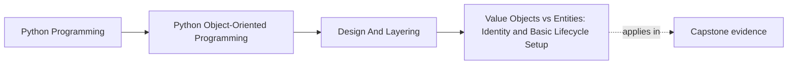

# Value Objects vs Entities: Identity and Basic Lifecycle Setup


<!-- page-maps:start -->
## Page Maps




<!-- page-maps:end -->

## Purpose

This core distinguishes value objects—structures defined wholly by their attributes, with equality based on content—from entities, which maintain unique identities independent of attributes. In the monitoring domain, classify a `MetricConfig` as a value object (substitutable if attributes match) versus an `Alert` as an entity (distinguished by a persistent ID, enabling updates without recreation). Explore implications for equality, hashing, mutability, and aliasing in collections; apply basic patterns to enforce these without advanced constructs. Extending M02C12's composition, refactor to illuminate these roles, preventing aliasing collapses and mutation drift while preserving domain intent. Note: We replace the earlier content-based `Alert` (from M02C11) with an identity-based version here, aligning with entity semantics. Lifecycle mechanics (e.g., state transitions) are previewed minimally but elaborated in Module 3.

## 1. Baseline: Indistinct Objects in the Monitoring Domain

Prior cores treat objects like `Metric` and `Alert` agnostically: `Metric` (from M01C10) acts as an immutable snapshot but without value-specific equality emphasis; `Alert` (from M02C11) equates by content, inviting aliasing pitfalls in containers and hindering unique tracking. Indistinct designs expose smells: content-based equality collapses duplicates (e.g., sets discard distinct alerts); mismatched equality/hashing leads to inconsistent containers; mutability allows drift (e.g., shared config altered unexpectedly). This blurs responsibilities—objects neither prioritize content nor anchor identity—leading to fragile collections and untraceable updates.

```python
# baseline_objects.py
from __future__ import annotations
from typing import List, Set, Dict
from refactored_model import Metric  # From M01C10: Immutable snapshot
from disciplined_model import Alert  # From M02C11: Equality by content (rule, metric)

class MetricConfig:
    """Baseline: Mutable; equality by content, hashing by identity (mismatch)."""

    def __init__(self, name: str, threshold: float):
        self.name = name
        self.threshold = threshold  # Mutable: Drift risk

    def __eq__(self, other: object) -> bool:
        if not isinstance(other, MetricConfig):
            return NotImplemented
        return self.name == other.name and self.threshold == other.threshold

    def __hash__(self) -> int:
        return object.__hash__(self)  # Identity-based, mismatches __eq__

def process_alerts(alerts: List[Alert], config: MetricConfig) -> List[Alert]:
    # Mutability smell: Alters shared config
    config.threshold += 0.05  # Drift: Affects reuse elsewhere
    return [a for a in alerts if a.metric.value > config.threshold]

if __name__ == "__main__":
    config1 = MetricConfig("cpu", 0.85)
    config2 = MetricConfig("cpu", 0.85)
    configs_set: Set[MetricConfig] = {config1, config2}  # Len 2: Equal but different hashes
    print(f"Configs equal: {config1 == config2}")  # True
    print(f"Configs in set: {len(configs_set)}")  # 2 (hash mismatch smell)
    # Concrete failure: Dict lookup
    d = {config1: "A"}
    print(f"Value in dict: {'A' in d.values()}")  # True
    print(f"config2 in dict: {config2 in d}")  # False (despite equality)
    
    metric = Metric(1, "cpu", 0.9)
    alert1 = Alert("threshold", metric)
    alert2 = Alert("threshold", metric)  # Equivalent content
    alerts_set: Set[Alert] = {alert1, alert2}  # Collapses to 1
    print(f"Alerts in set: {len(alerts_set)}")  # 1 (aliasing failure)
    
    process_alerts([alert1], config1)
    print(f"Drifted threshold: {config1.threshold}")  # 0.90
```

**Baseline Smells Exposed**:
- **Equality/Hash Mismatch**: `MetricConfig` equals by content but hashes by identity; sets retain "equals" instances (e.g., len=2 despite equality); dict lookups fail intuitively (e.g., equal key not found).
- **Content Equality Pitfall**: `Alert` equates by attributes (ignoring object identity); sets/dicts collapse distinct instances (e.g., two identical-threshold alerts treated as one).
- **Mutability Drift**: `MetricConfig` changes propagate globally (e.g., one process alters threshold, invalidating comparisons elsewhere).
- **Aliasing in Containers**: Equality/hash disregard identity; collections discard "duplicates," masking domain uniqueness.
- **Testing Fragility**: Container tests inconsistent; drift breaks reuse assertions.

These undermine reliability: configs require consistent content and deduplication; alerts demand persistent distinction.

## 2. Value Objects vs Entities: Core Distinctions and Design Principles

Value objects capture concepts exhaustively via attributes (e.g., `MetricConfig`: equal if attributes align, immutable for consistency). Entities denote unique entities via identity (e.g., `Alert`: ID endures, allowing attribute evolution without loss).

### 2.1 Principles

- **Value Objects**: Immutable; equality/hashing by attributes; no ID; interchangeable (e.g., deduplicate freely). Suited for configs, snapshots (leverage `Metric`'s immutability).
- **Entities**: Dedicated ID (e.g., UUID string); equality by ID; mutable attributes with care; enable lifecycle tracking (e.g., update alert without recreating).
- **Design Trade-offs**: Values simplify sharing (no tracking); entities support queries (by ID). Implement via constructors (no value setters) and auto-ID generation.
- **Testing Differences**: Values: Content equality, aligned hashing, container deduplication. Entities: ID uniqueness, mutation isolation, no content-based collapse.

### 2.2 Refactored Model: Distinguished Types

Refactor simply: `MetricConfig` as immutable value (private attributes, read-only properties, aligned equality/hash); `Alert` as entity (auto-ID, content from evaluator). Evaluator yields simple content dicts (value-like); construct entities explicitly. Reuse `Metric` as value. Note: We use `Dict[str, Any]` for content here for simplicity; in Core 14, we replace such dicts with explicit value types to avoid primitive obsession.

```python
# value_entity_model.py
from __future__ import annotations
from typing import Dict, Any, List
from uuid import uuid4
from refactored_model import Metric  # Value: Immutable

class MetricConfig:
    """Value Object: API-level immutable; equality/hashing by attributes."""

    def __init__(self, name: str, threshold: float):
        if not 0 <= threshold <= 1:
            raise ValueError("Threshold must be between 0 and 1")
        self._name = name
        self._threshold = threshold

    @property
    def name(self) -> str:
        return self._name

    @property
    def threshold(self) -> float:
        return self._threshold

    def with_threshold(self, threshold: float) -> 'MetricConfig':
        """New instance: Enables safe 'updates'."""
        return MetricConfig(self._name, threshold)

    def __eq__(self, other: object) -> bool:
        if not isinstance(other, MetricConfig):
            return NotImplemented
        return self._name == other._name and self._threshold == other._threshold

    def __hash__(self) -> int:
        return hash((self._name, self._threshold))

class Alert:
    """Entity: Identity via ID; attributes from content (replaces M02C11 Alert)."""

    def __init__(self, rule: str, metric: Metric):
        self.id = str(uuid4())  # Unique identity
        self.rule = rule
        self.metric = metric  # Immutable value reference
        self.status = "triggered"  # Mutable field for basic lifecycle preview

    def update_status(self, new_status: str) -> None:
        """Guarded mutation: Basic preview of lifecycle (elaborated in M03)."""
        if new_status not in ["triggered", "acknowledged", "resolved"]:
            raise ValueError(f"Invalid status: {new_status}")
        self.status = new_status

    def __eq__(self, other: object) -> bool:
        if not isinstance(other, Alert):
            return NotImplemented
        return self.id == other.id  # By identity

    def __hash__(self) -> int:
        return hash(self.id)

# Example: Distinguished usage (evaluator yields content dict)
def create_alerts_from_content(content_list: List[Dict[str, Any]]) -> List[Alert]:
    """Expects dicts with 'rule': str, 'metric': Metric."""
    return [Alert(c["rule"], c["metric"]) for c in content_list]

def process_alerts(alerts: List[Alert], config: MetricConfig) -> List[Alert]:
    # Immutable: Create new for adjusted threshold
    new_config = config.with_threshold(config.threshold + 0.05)
    # Filter retains entity identities
    return [a for a in alerts if a.metric.value > new_config.threshold]
```

**Rationale**:
- **Value Immutability**: `MetricConfig` enforces API-level immutability via private attributes (`_name`, `_threshold`), read-only properties, and a `with_threshold` factory for variants—prevents drift at the public surface, supports sharing (full enforcement, e.g., frozen objects, in Module 3). Python can’t stop you mutating `_threshold` by force; that’s deliberate for now.
- **Entity Identity**: `Alert` auto-generates ID; equality ignores attributes, preserving uniqueness. Basic status field previews mutability for lifecycle (e.g., `update_status` constrains allowed values but not transitions; proper typestate in M03).
- **Content-to-Entity**: Evaluation remains pure value computation (content dicts); entities materialize only at tracking boundaries (e.g., persistence), decoupling core logic from identity concerns.
- **Superiority**: Containers deduplicate values, distinguish entities; values avoid drift. Vs. baseline: Sets retain duplicate configs (len=2 despite equality) and collapse alerts (len=1). Refactor: Sets dedup configs (len=1) and retain alerts (len=2); hashing aligned.

## 3. Integrating into Responsibilities: Orchestrator Flow

Refactor `MonitoringOrchestrator` (from M02C12) minimally: Update `ThresholdContentStrategy` to yield content dicts (value-like); construct entities post-evaluation. Inject `MetricConfig` as value. In M02C12, `ThresholdStrategy` returned `Alert` objects directly; here, we refactor it to return value content (dicts with rule and metric), constructing entities later at the persistence boundary.

```python
# value_entity_monitor.py
from __future__ import annotations
from typing import List, Dict, Any
from value_entity_model import MetricConfig, Alert, create_alerts_from_content
from composition_model import MetricFetcher, RuleEvaluator, PersistenceService, ReportAggregator
from refactored_model import Metric

# Refactor: Strategy yields value content (vs. prior Alert objects)
class ThresholdContentStrategy:
    """Yields value content dicts (rule, metric)."""

    def __init__(self, threshold: float):
        self.threshold = threshold

    def evaluate(self, metrics: List[Metric]) -> List[Dict[str, Any]]:
        high_metrics = [m for m in metrics if m.value > self.threshold]
        return [{"rule": "threshold", "metric": m} for m in high_metrics]

class MonitoringOrchestrator:
    """Integrates values/entities: Config as value, alerts as entities."""

    def __init__(self, config: MetricConfig):
        self.config = config  # Immutable value
        self.fetcher = MetricFetcher()
        self.evaluator = RuleEvaluator(ThresholdContentStrategy(config.threshold))
        self.persister = PersistenceService()
        self.aggregator = ReportAggregator()

    def run_cycle(self) -> List[Alert]:
        raw_metrics = self.fetcher.fetch()
        metrics: List[Metric] = [Metric(r["timestamp"], r["name"], r["value"]) for r in raw_metrics]
        content = self.evaluator.evaluate(metrics)  # Value content (pure computation)
        entity_alerts = create_alerts_from_content(content)  # To entities (for persistence/tracking)
        for alert in entity_alerts:
            alert.update_status("acknowledged")  # Basic lifecycle preview
        self.persister.persist(entity_alerts)  # By ID
        return entity_alerts

if __name__ == "__main__":
    config = MetricConfig("cpu", 0.85)
    orch = MonitoringOrchestrator(config)
    alerts = orch.run_cycle()
    alerts_set = set(alerts)
    print(f"Processed {len(alerts)} entities; Unique in set: {len(alerts_set)}")
```

**Output** (simulated):  
Processed 2 entities; Unique in set: 2

**Benefits Demonstrated**:
- **No Collapse**: Sets retain all entities via ID equality.
- **Drift-Free Reuse**: Config immutable; new orchestrator uses original unchanged.
- **Coupling/Flex**: Values for computation (strategies); entities only at persistence boundary—loose integration.

## 4. Tests: Verifying Distinctions and Containers

Assert value content equality, entity ID equality, container behavior, drift prevention, and basic status validity.

```python
# test_value_entity_model.py
import unittest
from value_entity_model import MetricConfig, Alert, create_alerts_from_content
from refactored_model import Metric

class TestValueEntity(unittest.TestCase):

    def test_value_equality_no_drift(self):
        config1 = MetricConfig("cpu", 0.85)
        config2 = MetricConfig("cpu", 0.85)
        new_config = config1.with_threshold(0.9)
        self.assertEqual(config1, config2)  # Content equality
        self.assertEqual(hash(config1), hash(config2))  # Aligned hashing
        self.assertEqual(config1.threshold, 0.85)  # No drift
        self.assertNotEqual(config1, new_config)  # Distinct variant
        configs_set = {config1, config2}
        self.assertEqual(len(configs_set), 1)  # Deduplication works
        # Contrast baseline: len({config1, config2}) == 2 despite equality

    def test_entity_identity_containers(self):
        metric = Metric(1, "cpu", 0.9)
        content1 = {"rule": "threshold", "metric": metric}
        content2 = {"rule": "threshold", "metric": metric}  # Equivalent
        alert1 = Alert(content1["rule"], content1["metric"])
        alert2 = Alert(content2["rule"], content2["metric"])
        self.assertNotEqual(alert1, alert2)  # Distinct IDs
        self.assertEqual(hash(alert1), hash(alert1))  # Self-hash
        alerts_set = {alert1, alert2}
        self.assertEqual(len(alerts_set), 2)  # No collapse
        # Contrast baseline: len({alert1, alert2}) == 1 (content collapse)

    def test_entity_basic_lifecycle(self):
        metric = Metric(1, "cpu", 0.9)
        alert = Alert("threshold", metric)
        self.assertEqual(alert.status, "triggered")
        alert.update_status("acknowledged")  # Valid
        self.assertEqual(alert.status, "acknowledged")
        with self.assertRaises(ValueError):
            alert.update_status("invalid")  # Invalid value raises

    def test_integration_drift_prevention(self):
        config = MetricConfig("cpu", 0.85)
        metric = Metric(1, "cpu", 0.95)
        content = {"rule": "threshold", "metric": metric}
        alerts = create_alerts_from_content([content])
        alert = alerts[0]
        # Simulate reuse: New config, original unchanged
        new_config = config.with_threshold(0.9)
        self.assertEqual(config.threshold, 0.85)  # Preserved
        # Container: Entities unique
        self.assertEqual(len({alert}), 1)
        dup_content = {"rule": "threshold", "metric": metric}
        dup_alert = Alert(dup_content["rule"], dup_content["metric"])
        combined_set = {alert, dup_alert}
        self.assertEqual(len(combined_set), 2)  # Distinct
```

**Execution**: `python -m unittest test_value_entity_model.py` passes; confirms equality contracts, container integrity, immutability, and basic status validity.

## Practical Guidelines

- **Classify by Persistence**: Values for ephemeral descriptions (e.g., `MetricConfig`); entities for durable items (e.g., `Alert`). Query: "Trackable over time?" Yes → entity.
- **Immutability Basics**: Hide value attributes; use factories for variants.
- **Equality Rules**: Values: Attributes (with matching hash); entities: ID. Test alignment.
- **Container Checks**: Verify sets/dicts: Values deduplicate, entities accumulate.
- **Domain Fit**: Values for monitoring configs/content; entities for alerts with persistence needs.

**Impacts on Design**:
- **Clarity**: Demarcates computation (values) from tracking (entities).
- **Robustness**: Averts collapses/drift; bolsters composability.

## Exercises for Mastery

1. **Classification CRC**: Assign value/entity to M02C12 components (e.g., `Strategy` params); simulate set-based deduplication failure/fix.
2. **Container Audit**: Test baseline alert set collapse; refactor and assert full retention.
3. **Drift Refactor**: Reuse config across two orchestrators; mutate in one (baseline fails), reconstruct in refactor (succeeds).

This core refines Module 2's collaborations with identity focus. Core 14 tackles primitive obsession for semantics.
