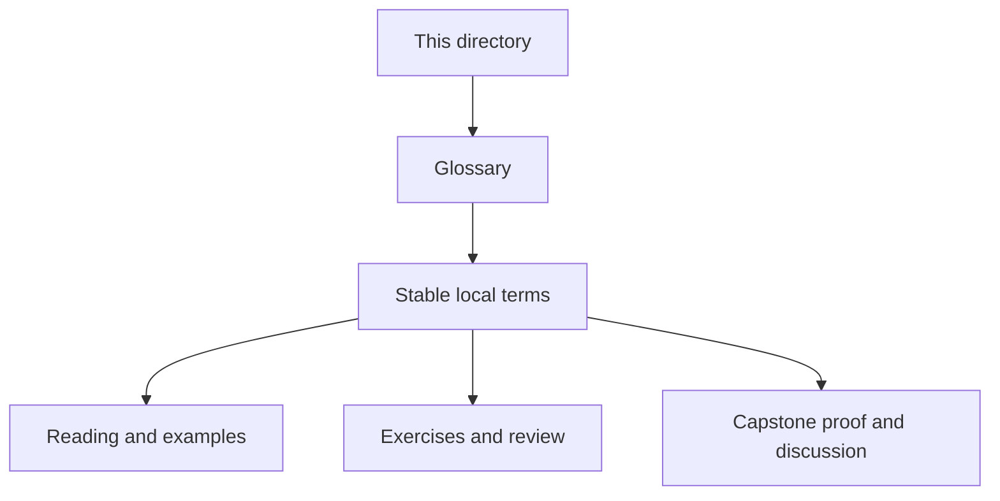
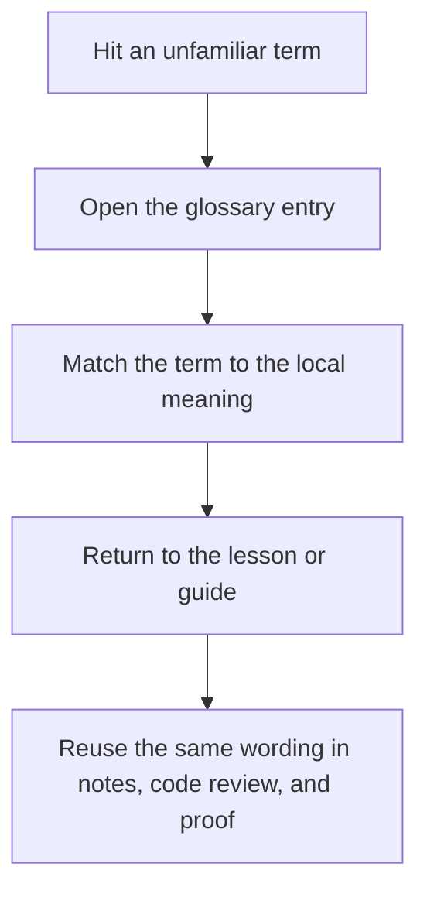

# Module Glossary

<!-- page-maps:start -->
## Glossary Fit

<!-- page-maps:end -->

This glossary belongs to **Module 02: Design Roles, Interfaces, and Layering** in **Python Object-Oriented Programming**. It keeps the language of this directory stable so the same ideas keep the same names across reading, practice, review, and capstone proof.

## How to use this glossary

Read the directory index first, then return here whenever a page, command, or review discussion starts to feel more vague than the course intends. The goal is stable language, not extra theory.

## Terms in this directory

| Term | Meaning in this directory |
| --- | --- |
| Avoiding Primitive Obsession: Semantic Types, Not Raw Str/Int | the module's treatment of avoiding primitive obsession: semantic types, not raw str/int, used to make the module's main design claim concrete in design work, refactoring, and capstone evidence. |
| Composition over Inheritance as Default | the module's treatment of composition over inheritance as default, used to make the module's main design claim concrete in design work, refactoring, and capstone evidence. |
| Cooperative Inheritance, MRO, and Mixins | the module's treatment of cooperative inheritance, mro, and mixins, used to make the module's main design claim concrete in design work, refactoring, and capstone evidence. |
| Factories, Dependency Injection, and Composition Roots | the module's treatment of factories, dependency injection, and composition roots, used to make the module's main design claim concrete in design work, refactoring, and capstone evidence. |
| Inheritance: Legit Use Cases and the Fragile Base Class Problem | the module's treatment of inheritance: legit use cases and the fragile base class problem, used to make the module's main design claim concrete in design work, refactoring, and capstone evidence. |
| Interfaces in Python: Duck Typing, ABCs, Protocols (Prescriptive Choices) | the module's treatment of interfaces in python: duck typing, abcs, protocols (prescriptive choices), used to make the module's main design claim concrete in design work, refactoring, and capstone evidence. |
| Layering: Domain, Application, Infrastructure in a Python Codebase | the module's treatment of layering: domain, application, infrastructure in a python codebase, used to make the module's main design claim concrete in design work, refactoring, and capstone evidence. |
| Refactor 1: Thin Layered Architecture with Explicit Roles, Small Hierarchies, and Interfaces | the module's treatment of refactor 1: thin layered architecture with explicit roles, small hierarchies, and interfaces, used to make the module's main design claim concrete in design work, refactoring, and capstone evidence. |
| Responsibilities, Cohesion, and Object Smells | the module's treatment of responsibilities, cohesion, and object smells, used to make the module's main design claim concrete in design work, refactoring, and capstone evidence. |
| Service Objects and Operations vs Stateful Entities | the module's treatment of service objects and operations vs stateful entities, used to make the module's main design claim concrete in design work, refactoring, and capstone evidence. |
| Template Method and Tiny Hierarchies without a Framework Zoo | the module's treatment of template method and tiny hierarchies without a framework zoo, used to make the module's main design claim concrete in design work, refactoring, and capstone evidence. |
| Value Objects vs Entities: Identity and Basic Lifecycle Setup | the module's treatment of value objects vs entities: identity and basic lifecycle setup, used to make the module's main design claim concrete in design work, refactoring, and capstone evidence. |
