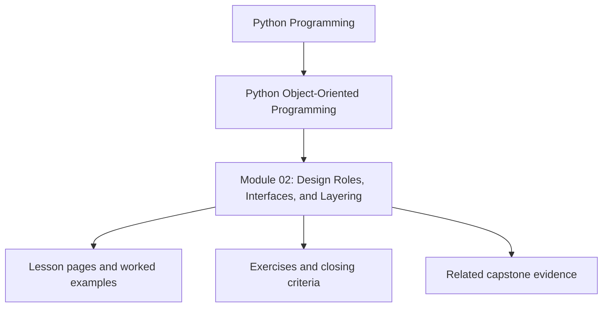
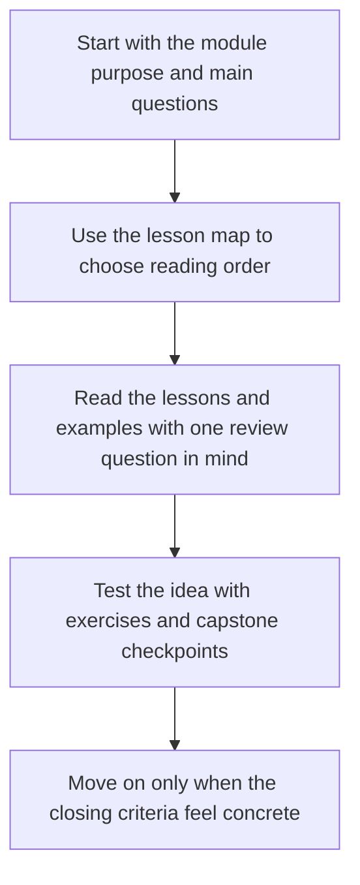

# Module 02: Design Roles, Interfaces, and Layering

<!-- page-maps:start -->
## Module Position

<!-- page-maps:end -->

Read the first diagram as a placement map: this page sits between the course promise, the lesson pages listed below, and the capstone surfaces that pressure-test the module. Read the second diagram as the study route for this page, so the diagrams point you toward the `Lesson map`, `Exercises`, and `Closing criteria` instead of acting like decoration.

Once the object model is clear, the next problem is assignment of responsibility.
This module moves from isolated objects to collaborating roles.

Keep one question in view while reading:

> Which role should own this behavior, and which neighboring role should stay simpler because of that choice?

That question matters because bad layering usually starts with a correct behavior placed
in the wrong object.

## Preflight

- You should already be able to describe object identity and value semantics from Module 01 without hesitation.
- If composition, inheritance, or construction boundaries still blur together, keep the capstone package map open while reading.
- Treat every layering example as an ownership decision, not a directory-layout exercise.

## Learning outcomes

- assign behavior to objects, policies, factories, and composition roots with explicit cohesion criteria
- explain when composition clarifies design and when inheritance remains reviewable
- evaluate wrapper types, protocols, and layered boundaries as correctness tools instead of style markers
- identify assembly boundaries that keep construction logic from leaking across the codebase

## Why this module matters

Many codebases become difficult not because individual objects are broken, but because
responsibilities are assigned arbitrarily. Work ends up split between "smart" entities,
"utility" modules, accidental god services, and inheritance trees that encode history
rather than design intent.

This module gives you criteria for deciding where behavior should live and how objects
should collaborate without turning the system into framework theater.

## Main questions

- Which responsibilities belong inside an object and which should move out?
- Why should composition be the default and inheritance the exception?
- How do `super()`, mixins, and MRO affect whether inheritance is reviewable at all?
- Where should object graphs be assembled so construction does not leak into the domain?
- When do semantic wrapper types improve correctness?
- How do duck typing, ABCs, and protocols fit different design pressures?
- How do you layer a Python system without turning it into framework theater?

## Reading path

1. Start with responsibilities, cohesion, and object smells.
2. Compare composition, inheritance, cooperative inheritance, factories, and semantic wrapper types before looking at layering.
3. Read interfaces and protocols after the role boundaries are clear.
4. Finish with the refactor chapter to see a thin layered design emerge from concrete pressure.

## Keep these support surfaces open

- `../guides/outcomes-and-proof-map.md` when you want the role-assignment promise tied to a capstone proof route.
- `../guides/pressure-routes.md` when the ownership question feels clearer than the chapter title.
- `../reference/self-review-prompts.md` when you want to test whether you can justify one owner and reject a nearby wrong owner.

## Common failure modes

- placing behavior wherever the current developer happens to be editing
- reaching for inheritance to reuse code that should have been composed
- using mixins or `super()` without being able to explain the full call chain
- using raw strings and integers where domain meaning should be explicit
- creating a service layer so broad that it becomes a second god object
- letting object construction sprawl across the system instead of one visible assembly boundary
- introducing layers by directory naming alone without real boundary discipline

## Exercises

- Take one behavior from the capstone and justify why it belongs in a domain object, a policy object, or the runtime facade.
- Review one inheritance example and explain whether it is semantic extension, reuse pressure, or avoidable coupling.
- Sketch a composition root for one workflow and explain why the rest of the system should not assemble that graph itself.

## Capstone connection

The capstone separates domain objects, evaluation policies, runtime orchestration,
repositories, and adapters on purpose. This module gives the reasoning for that split:
why `MonitoringPolicy` should not fetch metrics, why strategies should own evaluation
variability, and why the runtime facade should coordinate without absorbing domain logic.

## Closing criteria

You should finish this module able to decompose object-heavy code into explicit
roles with cleaner cohesion and more stable collaboration boundaries.

## Directory glossary

Use [Glossary](glossary.md) when you want the recurring language in this module kept stable while you move between lessons, exercises, and capstone checkpoints.
