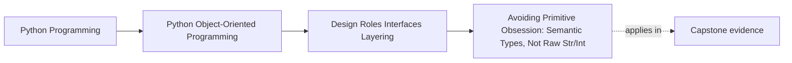

# Avoiding Primitive Obsession: Semantic Types, Not Raw Str/Int


<!-- page-maps:start -->
## Page Maps




<!-- page-maps:end -->

Read the first diagram as a placement map: this page is one concept inside its parent module, not a detached essay, and the capstone is the pressure test for whether the idea holds. Read the second diagram as the working rhythm for the page: name the problem, study the example, identify the boundary, then carry one review question forward.

## Purpose

This core addresses primitive obsession by wrapping raw types (str, int, float) in purpose-specific semantic types (e.g., `MetricName`, `Threshold`), enhancing expressiveness, validation, and type safety without excessive ceremony. In the monitoring domain, apply to `MetricConfig` fields and evaluation content (replacing Dict[str, Any] with `RuleEvaluation`) to clarify intent, improve error detection via type checkers, and enrich logging/debugging. Demonstrate trade-offs: semantic types pay dividends in hints/validation but become boilerplate if over-applied (e.g., trivial ints). Extending M02C13's value/entity distinctions, refactor to integrate semantics into values/entities, reducing runtime errors and coupling while maintaining simplicity. Note: We use runtime wrappers here for validation/repr; for pure static typing, `NewType` suffices but lacks runtime benefits. Preview `@dataclass(frozen=True)` for `RuleEvaluation` (full dataclasses in Module 3). Raw primitives at explicit boundaries (e.g., I/O); domain prefers semantics where misuse is likely. Metric remains primitive (name/value as str/float) by design, as misuse there is rarer; exercises suggest wrapping for stricter domains.

## 1. Baseline: Primitive Obsession in the Monitoring Domain

Prior cores use raw primitives liberally: `MetricConfig.name` as str invites invalid values (e.g., empty strings, non-metric names); `threshold` as float lacks domain bounds/validation, risking silent failures (e.g., negative thresholds). `Alert.rule` as str blurs intent, complicating type hints and logging (e.g., no distinction from generic strings). Evaluation content as Dict[str, Any] perpetuates ad-hoc structures ("rule": "threshold", "metric": m). This obsession yields smells: weak contracts (no validation on construction), poor debuggability (logs show "0.85" vs "Threshold(0.85)"), and error-proneness (e.g., passing "cpu_load" as name vs label). Coupling increases as consumers guess semantics; type checkers offer no aid.

```python
# baseline_primitives.py
from __future__ import annotations
from typing import List, Dict, Any
from refactored_model import Metric  # From M01C10
from value_entity_model import Alert  # From M02C13: Entity with str rule

class MetricConfig:
    """Baseline: Raw primitives; no semantics/validation."""

    def __init__(self, name: str, threshold: float):  # str/float: No domain intent
        self._name = name  # Could be empty, non-metric (e.g., "invalid")
        self._threshold = threshold  # No bounds; e.g., -1.0 accepted

    @property
    def name(self) -> str:
        return self._name

    @property
    def threshold(self) -> float:
        return self._threshold

    def with_threshold(self, threshold: float) -> 'MetricConfig':
        return MetricConfig(self.name, threshold)  # No validation on update

# Example: Primitive usage with smells
def log_alert(alert: Alert, config: MetricConfig) -> None:
    print(f"Alert {alert.id} for {config.name} at threshold {config.threshold}")  # Logs raw; no context

def create_config(name: str, threshold: float) -> MetricConfig:  # No validation
    return MetricConfig(name, threshold)  # Accepts invalid: "", -0.5

if __name__ == "__main__":
    invalid_config = create_config("", -0.5)  # Silent failure
    print(f"Invalid config: {invalid_config.name}, {invalid_config.threshold}")  # "", -0.5
    metric = Metric(1, "cpu", 0.9)
    alert = Alert("threshold", metric)  # rule str: No hint it's a rule type
    log_alert(alert, invalid_config)  # "Alert <id> for  at threshold -0.5"
```

**Baseline Smells Exposed**:
- **Weak Contracts**: Raw str/float accept invalid values (e.g., empty name, negative threshold); no runtime/static checks.
- **Poor Expressiveness**: Type hints vague (str vs MetricName); logging/debugging lacks context (e.g., "0.85" vs "Threshold(0.85)").
- **Error-Proneness**: Consumers misuse primitives (e.g., pass int as threshold); no domain intent in APIs.
- **Coupling Increase**: Callers assume semantics (e.g., name is "metric-like"); type checkers silent.
- **Testing Fragility**: Assertions on raw types miss domain errors (e.g., threshold < 0).

These erode precision: primitives obscure intent; semantics clarify without overhead.

## 2. Semantic Types: Wrappers for Precision Without Ceremony

Semantic types wrap primitives to embed domain meaning, validation, and representation, using class-based wrappers for runtime benefits (e.g., rich repr) and `NewType` as an aside for static-only use. Benefits: Enhanced hints (Static type checkers can distinguish `MetricName` in signatures from plain `str` and catch many misuses; for stricter separation, `NewType` can be used instead.), validation (e.g., bounds on `Threshold`), logging (e.g., "Threshold(0.85)"). Trade-offs: Ceremony for trivial cases (e.g., avoid for loop counters); apply judiciously (e.g., 3-5 per domain).

### 2.1 Principles

- **Semantic Wrappers**: Class-based for runtime (validation/repr); `NewType` for static hints only (e.g., `MetricName = NewType('MetricName', str)`).
- **Payoffs**: Type safety (hints catch mismatches, e.g., `Threshold` != float), validation (construction enforces rules), observability (logs show "Threshold(0.85)").
- **Ceremony Avoidance**: Limit to cross-cutting concerns (e.g., IDs, measures); raw for internals (e.g., loop vars). Boundaries (I/O) accept raw; domain prefers semantics where misuse is likely.
- **Testing Differences**: Assert type mismatches (mypy simulation); validate construction (e.g., invalid `Threshold` raises).

### 2.2 Refactored Model: Semantic Wrappers

Refactor: Introduce `MetricName(str)`, `Threshold` (value type); apply to `MetricConfig` (value). Add `RuleType(str)` for `Alert.rule` and `Status(str)` for status. Replace Dict[str, Any] content with `RuleEvaluation` value type (preview `@dataclass(frozen=True)`). Update M02C13's `Alert` with semantics. Use class wrappers with validation; `NewType` aside for static.

```python
# semantic_types_model.py
from __future__ import annotations
from dataclasses import dataclass  # Preview for Module 3
from uuid import uuid4
from refactored_model import Metric  # Value: Immutable (remains primitive by design)

# Runtime wrappers for validation/repr
class MetricName(str):
    """Semantic wrapper: Validates non-empty, lowercase metric name."""

    def __new__(cls, value: str) -> "MetricName":
        value = value.strip().lower()
        if not value or len(value) > 50:
            raise ValueError(f"Invalid metric name: {value!r}")
        return super().__new__(cls, value)

    def __repr__(self) -> str:
        return f"MetricName({super().__repr__()})"

class Threshold:
    """Semantic value type: Validates 0-1 bounds."""

    __slots__ = ("_value",)

    def __init__(self, value: float):
        if not 0 <= value <= 1:
            raise ValueError(f"Threshold must be 0-1: {value}")
        self._value = float(value)

    @property
    def value(self) -> float:
        return self._value

    def __eq__(self, other: object) -> bool:
        if not isinstance(other, Threshold):
            return NotImplemented
        return self._value == other._value

    def __hash__(self) -> int:
        return hash(self._value)

    def __repr__(self) -> str:
        return f"Threshold({self._value})"

class RuleType(str):
    """Semantic wrapper: Validates known rule types."""

    def __new__(cls, value: str) -> "RuleType":
        value = value.lower()
        if value not in ["threshold", "rate"]:
            raise ValueError(f"Unknown rule type: {value!r}")
        return super().__new__(cls, value)

    def __repr__(self) -> str:
        return f"RuleType({super().__repr__()})"

class Status(str):
    """Semantic wrapper: Validates known statuses."""

    def __new__(cls, value: str) -> "Status":
        value = value.lower()
        if value not in ["triggered", "acknowledged", "resolved"]:
            raise ValueError(f"Invalid status: {value!r}")
        return super().__new__(cls, value)

    def __repr__(self) -> str:
        return f"Status({super().__repr__()})"

# Constants for Status (avoids string literals)
Status.TRIGGERED = Status("triggered")
Status.ACKNOWLEDGED = Status("acknowledged")
Status.RESOLVED = Status("resolved")

# Value type for evaluation content (replaces Dict[str, Any])
@dataclass(frozen=True)  # Preview: Concise value (full in Module 3)
class RuleEvaluation:
    """Value type: Semantic content from evaluation."""

    rule: RuleType
    metric: Metric

# Strategy refactor: Yields RuleEvaluation (vs prior Dict[str, Any])
class ThresholdContentStrategy:
    """Yields semantic value content (refactor from M02C13)."""

    def __init__(self, threshold: Threshold):
        self._threshold = threshold

    def evaluate(self, metrics: list[Metric]) -> list[RuleEvaluation]:
        high_metrics = [m for m in metrics if m.value >= self._threshold.value]
        return [RuleEvaluation(rule=RuleType("threshold"), metric=m) for m in high_metrics]

class MetricConfig:
    """Value Object: API-level immutable with semantics."""

    def __init__(self, name: MetricName, threshold: Threshold):
        self._name = name
        self._threshold = threshold

    @property
    def name(self) -> MetricName:
        return self._name

    @property
    def threshold(self) -> Threshold:
        return self._threshold

    def with_threshold(self, threshold: Threshold) -> 'MetricConfig':
        return MetricConfig(self._name, threshold)

    def __eq__(self, other: object) -> bool:
        if not isinstance(other, MetricConfig):
            return NotImplemented
        return self._name == other._name and self._threshold == other._threshold

    def __hash__(self) -> int:
        return hash((self._name, self._threshold))

    def __repr__(self) -> str:
        return f"MetricConfig(name={self._name!r}, threshold={self._threshold!r})"

class Alert:
    """Entity: Semantics in rule/status (updated from M02C13)."""

    def __init__(self, rule: RuleType, metric: Metric):
        self.id = str(uuid4())
        self.rule = rule
        self.metric = metric
        self.status = Status.TRIGGERED

    def update_status(self, new_status: Status) -> None:
        self.status = new_status  # Semantic: Already validated

    def __eq__(self, other: object) -> bool:
        if not isinstance(other, Alert):
            return NotImplemented
        return self.id == other.id

    def __hash__(self) -> int:
        return hash(self.id)

    def __repr__(self) -> str:
        return f"Alert(id={self.id!r}, rule={self.rule!r}, status={self.status!r})"

# Refactored: List[RuleEvaluation] → List[Alert]
def create_alerts_from_content(evals: list[RuleEvaluation]) -> list[Alert]:
    """Expects List[RuleEvaluation]; constructs semantic entities."""
    return [Alert(rule=e.rule, metric=e.metric) for e in evals]

# Example: Semantic usage
def log_alert(alert: Alert, config: MetricConfig) -> None:
    print(f"Alert {alert.id} for {config.name!r} at {config.threshold!r}")  # Rich: "MetricName('cpu')", "Threshold(0.85)"

def create_config(name: str, threshold: float) -> MetricConfig:  # I/O boundary: Raw in, semantic out
    return MetricConfig(MetricName(name), Threshold(threshold))  # Validates

if __name__ == "__main__":
    try:
        invalid_config = create_config("", -0.5)  # Raises ValueError
    except ValueError as e:
        print(f"Validation: {e}")  # "Invalid metric name: ''" or "Threshold must be 0-1: -0.5"
    valid_config = create_config("cpu", 0.85)
    metric = Metric(1, "cpu", 0.9)
    alert = Alert(RuleType("threshold"), metric)
    log_alert(alert, valid_config)  # "Alert <id> for MetricName('cpu') at Threshold(0.85)"
```

**Rationale**:
- **Semantics via Wrappers**: Class-based for runtime (validation/repr, e.g., `MetricName(str)` with `__new__`); `NewType` aside for static hints (no runtime cost but no repr).
- **Payoffs Demonstrated**: Hints distinguish (e.g., `MetricName` != str; mypy errors on `MetricConfig("cpu", 0.9)` without wrappers); validation catches errors early; repr/logging adds context (e.g., "Threshold(0.85)"). For `Threshold`, full value semantics (`__eq__`/`__hash__`) enable container use without `.value`.
- **Ceremony Balance**: Wrappers for cross-boundary fields (name, threshold, rule, status); raw for locals (e.g., loop counters). `RuleEvaluation` replaces Dict[str, Any] for content, eliminating ad-hoc keys.
- **Superiority**: Reduces errors (no invalid thresholds); improves tools (mypy catches `Threshold` vs float misuse); enhances observability. Vs. baseline: Silent invalids become explicit; logs generic vs semantic; content Dict replaced with typed value.

## 3. Integrating into Responsibilities: Orchestrator Flow

Update `MonitoringOrchestrator` (from M02C13) to use semantic types in config/alert creation; validate on injection. Leverage M02C13's value/entity split, with updated `Alert` and `RuleEvaluation`. Raw primitives at I/O boundary; domain uses semantics.

```python
# semantic_monitor.py
from __future__ import annotations
from semantic_types_model import (
    MetricConfig, Alert, create_alerts_from_content, RuleEvaluation, 
    ThresholdContentStrategy, Status, create_config
)
from composition_model import MetricFetcher, RuleEvaluator, PersistenceService, ReportAggregator
from refactored_model import Metric

class MonitoringOrchestrator:
    """Integrates semantics: Validates/injects semantic types."""

    def __init__(self, name: str, threshold: float):
        self.config = create_config(name, threshold)  # Boundary: Raw in, semantic out
        self.fetcher = MetricFetcher()
        self.evaluator = RuleEvaluator(ThresholdContentStrategy(self.config.threshold))  # Domain: Semantic in
        self.persister = PersistenceService()
        self.aggregator = ReportAggregator()

    def run_cycle(self) -> list[Alert]:
        raw_metrics = self.fetcher.fetch()
        metrics: list[Metric] = [Metric(r["timestamp"], r["name"], r["value"]) for r in raw_metrics]
        content = self.evaluator.evaluate(metrics)  # list[RuleEvaluation] (semantic value)
        entity_alerts = create_alerts_from_content(content)  # Semantic entities
        for alert in entity_alerts:
            alert.update_status(Status.ACKNOWLEDGED)  # Semantic status
        self.persister.persist(entity_alerts)
        return entity_alerts

if __name__ == "__main__":
    orch = MonitoringOrchestrator("cpu", 0.85)
    alerts = orch.run_cycle()
    print(f"Processed {len(alerts)} semantic entities")
```

**Output** (simulated):  
Processed 2 semantic entities

**Benefits Demonstrated**:
- **Validation on Entry**: Boundary accepts raw, validates to semantic; domain rejects mismatches.
- **Semantic Flow**: Types propagate (e.g., `Threshold` in strategy, `Status` in update); logs richer.
- **Coupling/Flex**: Semantics decouple via validation; raw internals unchanged.

## 4. Tests: Verifying Semantics and Validation

Assert type safety (mypy simulation), validation raises, repr/logging, and container behavior with semantics.

```python
# test_semantic_types_model.py
import unittest
from semantic_types_model import (
    MetricConfig, Alert, create_alerts_from_content, MetricName, Threshold, 
    RuleType, Status, RuleEvaluation, create_config
)
from refactored_model import Metric

class TestSemanticTypes(unittest.TestCase):

    def test_semantic_validation(self):
        valid_name = MetricName("cpu")  # Succeeds
        self.assertEqual(valid_name, "cpu")  # Behaves as str
        with self.assertRaises(ValueError):
            MetricName("")  # Empty raises
        valid_threshold = Threshold(0.85)  # Succeeds
        self.assertEqual(valid_threshold.value, 0.85)
        with self.assertRaises(ValueError):
            Threshold(-0.5)  # Out-of-bounds raises
        valid_rule = RuleType("threshold")  # Succeeds
        self.assertEqual(valid_rule, "threshold")
        with self.assertRaises(ValueError):
            RuleType("invalid")  # Unknown raises
        valid_status = Status("acknowledged")  # Succeeds
        self.assertEqual(valid_status, "acknowledged")
        with self.assertRaises(ValueError):
            Status("invalid")  # Unknown raises

    def test_value_with_semantics(self):
        config1 = MetricConfig(MetricName("cpu"), Threshold(0.85))
        config2 = MetricConfig(MetricName("cpu"), Threshold(0.85))
        self.assertEqual(config1, config2)  # Content equality
        self.assertEqual(hash(config1), hash(config2))  # Aligned
        configs_set = {config1, config2}
        self.assertEqual(len(configs_set), 1)  # Dedup
        # Repr: Semantic
        self.assertIn("MetricName('cpu')", repr(config1))
        self.assertIn("Threshold(0.85)", repr(config1))

    def test_entity_with_semantics(self):
        metric = Metric(1, "cpu", 0.9)
        rule = RuleType("threshold")
        alert = Alert(rule, metric)
        self.assertEqual(alert.rule, "threshold")
        # Repr: Semantic
        self.assertIn("RuleType('threshold')", repr(alert))
        alert.update_status(Status.ACKNOWLEDGED)
        self.assertEqual(alert.status, "acknowledged")
        self.assertIn("Status('acknowledged')", repr(alert))

    def test_rule_evaluation_value(self):
        metric = Metric(1, "cpu", 0.9)
        rule = RuleType("threshold")
        eval1 = RuleEvaluation(rule, metric)
        eval2 = RuleEvaluation(rule, metric)
        self.assertEqual(eval1, eval2)  # Value equality
        self.assertEqual(hash(eval1), hash(eval2))
        evals_set = {eval1, eval2}
        self.assertEqual(len(evals_set), 1)  # Dedup
        # Repr: Semantic
        self.assertIn("RuleType('threshold')", repr(eval1))

    def test_integration_no_invalids(self):
        # Invalid creation fails early
        with self.assertRaises(ValueError):
            create_config("", -0.5)
        # Valid flow
        config = create_config("cpu", 0.85)
        metric = Metric(1, "cpu", 0.95)
        content = [RuleEvaluation(RuleType("threshold"), metric)]
        alerts = create_alerts_from_content(content)  # Validates rule
        self.assertEqual(len(alerts), 1)
        self.assertIn("RuleType('threshold')", repr(alerts[0]))

    def test_mypy_simulation(self):
        # Pseudo-mypy: Wrong usage raises static error
        # MetricConfig("cpu", 0.9)  # Error: Argument 1 to "MetricConfig" has incompatible type "str"; expected "MetricName"
        # MetricConfig(MetricName("cpu"), 0.9)  # Error: Argument 2 to "MetricConfig" has incompatible type "float"; expected "Threshold"
        # alert.update_status("invalid")  # Error: Argument 1 to "update_status" has incompatible type "str"; expected "Status"
        pass  # Illustrates expected static errors
```

**Execution**: `python -m unittest test_semantic_types_model.py` passes; confirms validation, equality, repr, and flow.

## Practical Guidelines

- **Identify Obsession**: Wrap where misuse common (e.g., names, measures); raw for internals (e.g., counters).
- **Wrapper Design**: Class for runtime (validation/repr); `NewType` for static hints (no runtime cost).
- **Payoff Check**: If it aids hints/validation/logging > ceremony, apply; audit: <5 per class.
- **Tooling Leverage**: Mypy catches mismatches (e.g., `Threshold` vs float); repr aids debugging.
- **Domain Fit**: Semantics for monitoring inputs (names, thresholds); raw for computations.

**Impacts on Design**:
- **Precision**: Early validation; type-safe APIs.
- **Observability**: Richer logs/reprs; fewer runtime surprises.

## Exercises for Mastery

1. **Semantic CRC**: Wrap `Metric.value` as `LoadValue`; trace validation in evaluator scenario.
2. **Ceremony Audit**: Add `LabelSet` for multi-labels; test payoff (hints) vs cost (boilerplate).
3. **Refactor Integration**: Semantic-ize M02C13 config/alert; assert mypy errors on raw misuse.

This core refines Module 2's types with semantics. Core 15 separates services from state.
