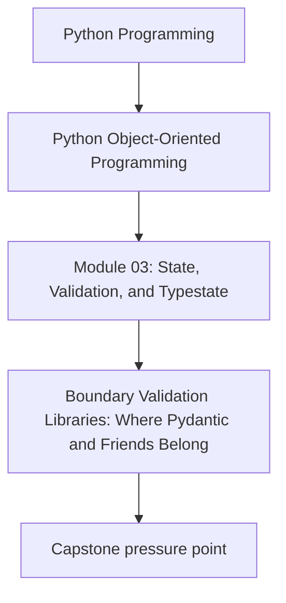
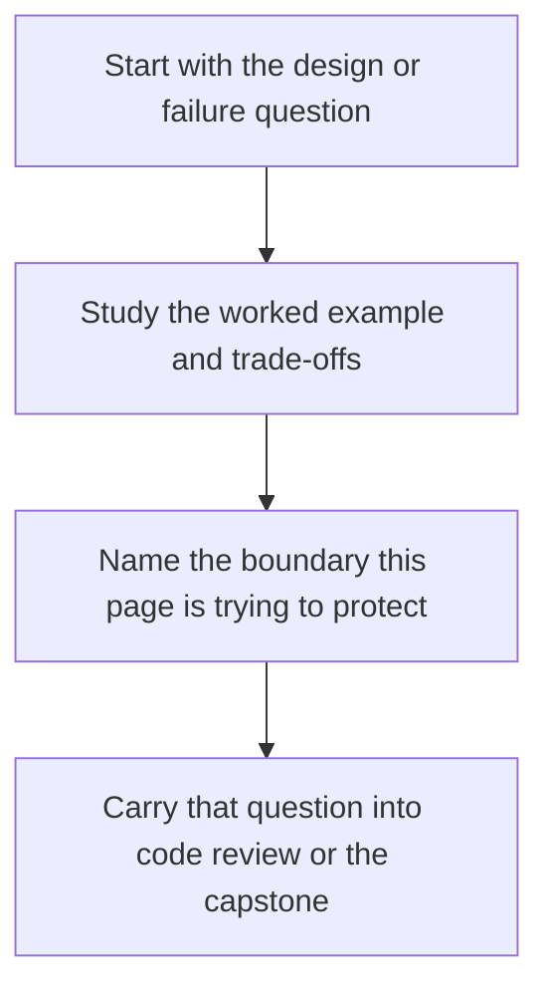

# Boundary Validation Libraries: Where Pydantic and Friends Belong


<!-- page-maps:start -->
## Concept Position




<!-- page-maps:end -->

Read the first diagram as a placement map: this page is one concept inside its parent module, not a detached essay, and the capstone is the pressure test for whether the idea holds. Read the second diagram as the working rhythm for the page: name the problem, study the example, identify the boundary, then carry one review question forward.

## Purpose

Use validation libraries (Pydantic, attrs validators, Marshmallow, etc.) **at the boundary**, not in the core domain.

You want:
- fast, strict, user-facing validation when accepting input,
- and small, dependency-light domain objects inside the system.

## Where This Fits

Running example: a monitoring service that fetches metrics, evaluates rules, and emits alerts. In earlier modules we refactored toward a layered design (domain/application/infrastructure) with explicit roles. From M03 onward, we tighten *data integrity* and *lifecycle semantics* so the system stays correct under change.

## 1. The Boundary Pattern: DTO → Domain

Think in two steps:

1. Parse and validate input into a **DTO** (data transfer object).
2. Convert DTO → **domain types** (semantic dataclasses) and enforce invariants (M03C25).

Why two steps?
- Input concerns: missing fields, wrong types, coercions, error formatting.
- Domain concerns: invariants and behavior.

Keeping them separate prevents your core from being coupled to a library and to external representation choices.

## 2. Example: Pydantic at the Edge

A typical flow for rule configuration:

- External: JSON / dict.
- Boundary: Pydantic model (`RuleConfigDTO`).
- Domain: `DraftRule(metric: MetricName, threshold: Threshold, window: Window)`.

Sketch:

```python
# boundary/dto.py (pydantic lives here)
from pydantic import BaseModel, Field

class RuleConfigDTO(BaseModel):
    metric: str
    threshold: float = Field(gt=0)
    window_seconds: int = Field(gt=0)
```

Conversion:

```python
# application/translate.py
def to_draft_rule(dto: RuleConfigDTO) -> DraftRule:
    return DraftRule(
        metric=MetricName(dto.metric),
        threshold=Threshold(dto.threshold),
        window=Window(dto.window_seconds),
    )
```

Notice: the domain stays free of Pydantic, and invariants still live in domain constructors.

## 3. Don’t Leak DTOs Across Layers

A common failure mode is to let DTO types “infect” the domain:

- domain methods accept `RuleConfigDTO`,
- storage persists DTO JSON directly,
- tests use DTOs everywhere.

That erases the boundary and makes it hard to change the external API without breaking the domain.

Rule: **DTOs may enter the application layer, but the domain should not depend on them**.

## 4. Error Handling: Human-Friendly Outside, Precise Inside

Boundary errors should be human-friendly:
- “threshold must be > 0”

Domain errors should be precise and stable:
- `ValueError("Threshold must be finite")` or a custom `DomainInvariantError`.

Keep translation explicit:
- boundary catches and formats domain errors if needed.

This separation improves pedagogy: learners can see where “bad input” ends and “domain integrity” begins.

## Practical Guidelines

- Use validation libraries for inbound/outbound schemas at the edges (HTTP, CLI, config files).
- Keep domain dataclasses lightweight; avoid depending on Pydantic inside `domain/`.
- Convert DTO → domain in a small translator function; test it.
- Let boundary handle coercion (`"5m"` → `300`); let domain enforce invariants (`seconds > 0`).

## Exercises for Mastery

1. Define a boundary DTO for rule configuration and write a translator into your domain dataclasses.
2. Write a test proving that malformed input fails at the boundary, and invalid-but-well-typed input fails in domain construction.
3. Refactor one domain method that currently accepts a dict/JSON into one that accepts domain types only.
