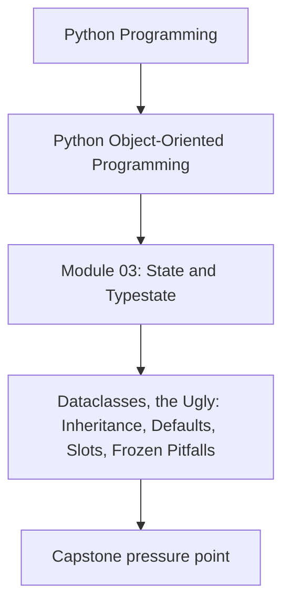
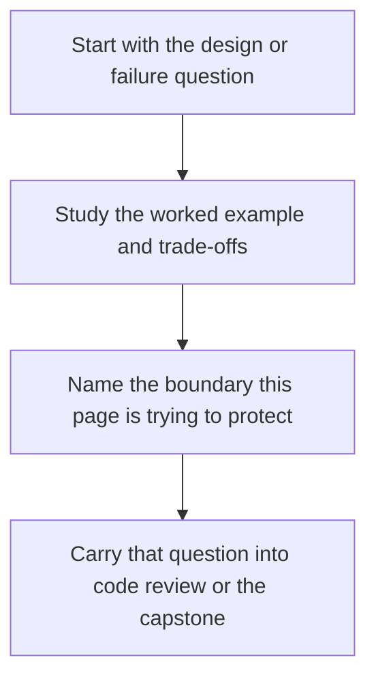

# Dataclasses, the Ugly: Inheritance, Defaults, Slots, Frozen Pitfalls


<!-- page-maps:start -->
## Concept Position




<!-- page-maps:end -->

Read the first diagram as a placement map: this page is one concept inside its parent module, not a detached essay, and the capstone is the pressure test for whether the idea holds. Read the second diagram as the working rhythm for the page: name the problem, study the example, identify the boundary, then carry one review question forward.

## Purpose

Learn the common dataclass pitfalls that create *surprising runtime behavior* or silently weaken your model.

The theme: dataclasses are great for *simple shapes*; they get tricky when you push them into deep inheritance or clever metaprogramming.

## 1. Inheritance Is the First Trap

Dataclass inheritance looks elegant until it isn’t.

Problems you will hit:
- field order constraints (non-default fields cannot follow default fields),
- `__init__` signatures that become confusing,
- base class invariants that are accidentally bypassed,
- fragile “mixins” that rely on generated methods.

Rule: **prefer composition over dataclass inheritance**.

If you need polymorphism, consider:
- small immutable value dataclasses, plus
- a strategy/policy object (M04C37), or
- explicit base classes without dataclass generation.

## 2. `frozen=True` Is Not Deep Immutability

`frozen=True` prevents rebinding attributes, but it does **not** freeze nested mutable objects.

```python
from dataclasses import dataclass

@dataclass(frozen=True)
class Config:
    tags: list[str]

c = Config(tags=["a"])
c.tags.append("b")  # allowed! the list itself is still mutable
```

If you need deep immutability:
- use immutable containers (tuple, frozenset),
- or copy defensively on construction.

Teaching takeaway: “frozen” means *field rebinding is blocked*, not “the whole graph is immutable”.

## 3. `slots=True` Changes Some Behaviors

Slots remove `__dict__` by default, which affects:
- dynamic attribute assignment (now disallowed),
- some serialization patterns,
- debugging that relies on `obj.__dict__`.

This is usually good, but don’t surprise your tooling.

Recommendation:
- use `slots=True` for domain values/entities,
- but be cautious for objects that must be dynamically extended (rare in disciplined designs).

## 4. Defaults: The Subtle Case Beyond “Don’t Use []”

Even with `default_factory`, defaults can encode the wrong meaning.

Example: treating “not provided” as “empty” is not always correct.

- `rules: list[Rule] = field(default_factory=list)` means “there are zero rules”.
- If you need to represent “rules are not loaded”, that is a different state (M03C27).

**Design test**: can you distinguish “empty by truth” from “missing by truth”? If not, you may be baking a bug into the data model.

## 5. Generated Ordering and Hashing Can Lie

`order=True` generates ordering comparisons by field order. That is rarely what you want in a domain model.

Similarly, hashing:
- frozen dataclasses can generate `__hash__`,
- but only if equality is by value and the fields are hashable.

If ordering has domain meaning, implement it explicitly or define a key function. Avoid “accidental ordering” as a teaching rule.

## 6. `__post_init__` and Inheritance Can Double-Run or Not Run

With inheritance, `__post_init__` requires explicit super-calls if multiple classes define it.

This is fragile and easy to get wrong.

If you find yourself stacking `__post_init__` up a hierarchy, that’s a sign you should refactor toward:
- factories,
- composition,
- or dedicated validation functions.

## Practical Guidelines

- Keep dataclasses shallow: values + small entities, minimal inheritance.
- Treat `frozen=True` as *shallow immutability*; use immutable field types for deep safety.
- Use `slots=True` intentionally; document it if your tooling relies on `__dict__`.
- Avoid `order=True` in domain models unless ordering is truly meaningful and stable.
- If dataclass inheritance becomes necessary, add tests specifically for initialization and invariant enforcement.

## Exercises for Mastery

1. Write a `frozen=True` dataclass that accidentally exposes a mutable list. Fix it by switching to `tuple[str, ...]`.
2. Create a dataclass hierarchy with `__post_init__` in both base and child. Demonstrate the bug when `super().__post_init__()` is forgotten.
3. Add `order=True` to a domain model and show a surprising ordering result. Replace it with an explicit comparison key.
