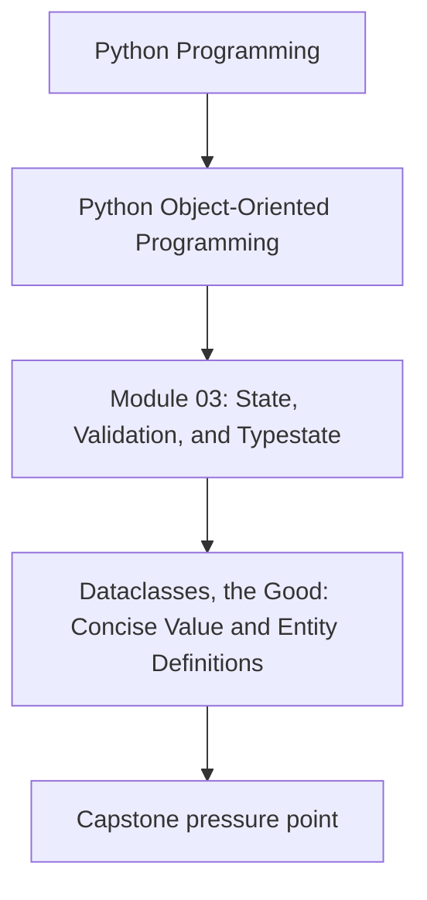
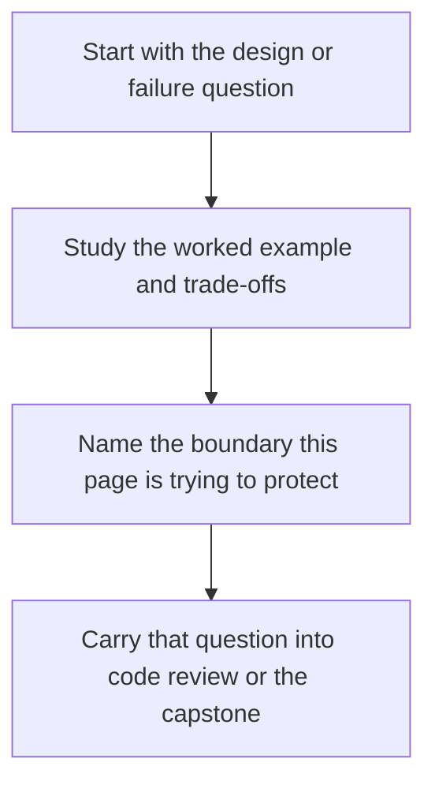

# Dataclasses, the Good: Concise Value and Entity Definitions


<!-- page-maps:start -->
## Concept Position




<!-- page-maps:end -->

Read the first diagram as a placement map: this page is one concept inside its parent module, not a detached essay, and the capstone is the pressure test for whether the idea holds. Read the second diagram as the working rhythm for the page: name the problem, study the example, identify the boundary, then carry one review question forward.

## Purpose

Use `dataclasses` to define domain objects that are:

- easy to read,
- hard to misuse,
- and honest about equality/identity.

This core focuses on the *good path*: clear value objects and small entities with explicit invariants.

## Where This Fits

Running example: a monitoring service that fetches metrics, evaluates rules, and emits alerts. In earlier modules we refactored toward a layered design (domain/application/infrastructure) with explicit roles. From M03 onward, we tighten *data integrity* and *lifecycle semantics* so the system stays correct under change.

## 1. Dataclasses Are Syntax for an Explicit Contract

A dataclass can generate:

- `__init__` (construction),
- `__repr__` (debuggability),
- `__eq__` (equality semantics),
- and optionally ordering / hashing.

Treat these as **public contracts**, not convenience.

Two key questions you must answer up front:

1. Is this a **value** (equality by content) or an **entity** (identity matters)?
2. Is this object **immutable** (preferred) or mutable (needs stronger discipline)?

## 2. Value Objects: Frozen Dataclasses + Semantic Types

In the monitoring domain, `MetricName` and `Threshold` should be *values*.

```python
from dataclasses import dataclass

@dataclass(frozen=True, slots=True)
class MetricName:
    value: str

    def __post_init__(self):
        if not self.value or " " in self.value:
            raise ValueError("MetricName must be non-empty and contain no spaces")
```

Why this is good:
- `frozen=True` makes it immutable (safer to share, safe as dict keys).
- `slots=True` reduces accidental attribute creation and saves memory.
- Validation in `__post_init__` makes invalid states impossible.

**Equality**: values compare by fields, which is what you want.

```python
assert MetricName("cpu") == MetricName("cpu")
```

## 3. Entities: Dataclasses With Explicit Identity

Entities should not “accidentally” compare equal just because fields match.

If a `Rule` has a stable identifier, make identity explicit and consider turning off generated equality.

```python
from dataclasses import dataclass
from uuid import UUID

@dataclass(slots=True, eq=False)
class Rule:
    rule_id: UUID
    metric: MetricName
    threshold: float

    def same_identity_as(self, other: "Rule") -> bool:
        return self.rule_id == other.rule_id
```

This avoids subtle bugs in sets/dicts and makes “what does equality mean?” unambiguous.

If you *do* want `Rule` equality by ID, implement `__eq__` and `__hash__` explicitly, and keep it stable.

## 4. Defaults Done Right: `default_factory` and Explicit Optionality

Never use mutable defaults.

Bad:
```python
@dataclass
class Group:
    rules: list[Rule] = []  # shared across instances (bug)
```

Good:
```python
from dataclasses import field

@dataclass
class Group:
    rules: list[Rule] = field(default_factory=list)
```

Optionality: be deliberate. If “missing” is a real state, model it (M03C27). If it’s only a parsing concern, keep it at the boundary (M03C26).

## 5. Dataclasses as a Teaching Tool

A dataclass is readable because it makes the *shape* of the object visible:

- fields are listed in one place,
- default values are visible,
- invariants can be local to `__post_init__`.

This is excellent for education and code review: the contract is literally at the top of the file.

## Practical Guidelines

- Use `frozen=True` for value objects unless you have a strong reason not to.
- For entities, decide equality explicitly (`eq=False` is often safer than the default).
- Use `slots=True` when objects are numerous or you want to prevent accidental attributes.
- Use `field(default_factory=...)` for any mutable default.
- Prefer semantic wrappers (`MetricName`, `Window`, `Threshold`) over raw `str`/`float` when misuse is plausible.

## Exercises for Mastery

1. Convert two primitive fields in your domain (e.g., `metric: str`, `threshold: float`) into semantic value objects with validation.
2. Create an entity dataclass with `eq=False`. Write a unit test showing why generated equality would be dangerous.
3. Add `slots=True` to a frequently-instantiated dataclass and confirm accidental attributes now raise `AttributeError`.
