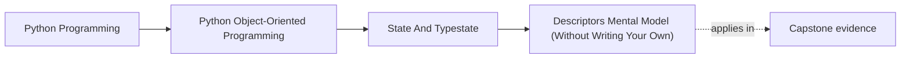
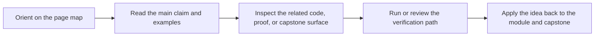

# Descriptors Mental Model (Without Writing Your Own)


<!-- page-maps:start -->
## Page Maps




<!-- page-maps:end -->

## Purpose

Build a *working* mental model of Python’s descriptor protocol so you can reason about:

- why `@property` behaves differently from a plain attribute,
- why methods become bound methods when accessed on instances,
- why class attributes sometimes “win” over instance attributes and sometimes don’t,
- and where *surprising work* may be hiding in attribute access.

You will **not** write custom descriptors here. The goal is to *use* the existing ones confidently (properties, functions/methods, `staticmethod`, `classmethod`).

## 1. Attribute Access Is a Protocol, Not a Dict Lookup

When you write:

```python
obj.attr
```

Python does not simply check `obj.__dict__`. The lookup is roughly:

1. Look on the **type**: `type(obj)` (the class), following the MRO.
2. If the class attribute is a **data descriptor** (defines `__set__` or `__delete__`), it wins immediately.
3. Otherwise check the **instance dictionary**: `obj.__dict__`.
4. Otherwise, if the class attribute is a **non-data descriptor** (defines `__get__` only), bind/compute it.
5. Otherwise, return the plain class attribute.

This precedence explains many “why is my attribute ignored?” bugs.

**Key terms**:
- **descriptor**: any object with `__get__`, `__set__`, and/or `__delete__`.
- **data descriptor**: has `__set__` or `__delete__` (often used for managed storage).
- **non-data descriptor**: only has `__get__` (functions/methods are the classic case).

## 2. The Four Usual Descriptors You Already Use

### 2.1 `property` is a data descriptor

`property` defines `__get__` and `__set__`/`__delete__` depending on how you build it. That means it can *override* an instance attribute:

```python
class User:
    def __init__(self, name: str):
        self._name = name

    @property
    def name(self) -> str:
        return self._name

u = User("Ada")
u.__dict__["name"] = "Evil shadow"
assert u.name == "Ada"   # property wins (data descriptor precedence)
```

This is why `@property` is a reliable way to expose a computed/read-only view.

### 2.2 Functions are non-data descriptors

A function stored on a class is a descriptor. Access via an instance produces a **bound method**:

```python
class Greeter:
    def hello(self, who: str) -> str:
        return f"hi {who}"

g = Greeter()
m = g.hello            # bound method
assert m("world") == "hi world"
```

The binding is the descriptor’s `__get__` producing a wrapper that remembers `self`.

### 2.3 `staticmethod` disables binding

```python
class Math:
    @staticmethod
    def add(a, b): return a + b

Math.add(1, 2)  # no implicit self
```

### 2.4 `classmethod` binds the class, not the instance

```python
class Rule:
    @classmethod
    def from_dict(cls, data: dict) -> "Rule":
        return cls(...)
```

This is useful for alternate constructors and factory patterns.

## 3. The “Hidden Work” Rule for Pedagogy and Design

Descriptors enable *work during attribute access*. That is powerful, but it is also a source of “invisible costs”.

Treat attribute access as **should-be-cheap** by default.

Good uses:
- exposing a **derived** value that is cheap and deterministic,
- enforcing invariants on assignment (rare; consider explicit methods instead),
- bridging to a cached computation.

Dangerous uses:
- I/O inside a property (`user.profile` hits the database),
- time-dependent behavior (`obj.now` changes per access),
- raising domain exceptions on “read” (surprising control flow).

If the read can fail or is expensive, consider a method:
- `obj.load_profile()` communicates “work may happen”.

## 4. Debugging Descriptor Surprises

When you see odd behavior, inspect where the attribute is coming from.

Checklist:

- Does the class define the name?
  ```python
  type(obj).__dict__.get("attr")
  ```
- Is it a descriptor?
  ```python
  import inspect
  inspect.isdatadescriptor(type(obj).__dict__["attr"])
  ```
- Is the instance trying to shadow it?
  ```python
  obj.__dict__.get("attr")
  ```

Rule of thumb: if an attribute is defined on the class and seems to ignore instance assignment, you are probably looking at a **data descriptor** (often `property`).

## Practical Guidelines

- Use `@property` for **computed views** and **read-only surfaces**, not to hide I/O.
- Prefer explicit methods when a read is expensive, can fail, or performs state changes.
- Keep descriptor usage shallow: properties + methods + (rare) `classmethod` constructors is plenty for most codebases.
- If you must override attribute behavior, document it: “accessing `x` computes …”

## Exercises for Mastery

1. **Precedence drill**: Create a class with a `@property` and set the same name in `__dict__`. Predict the output before running.
2. **Binding drill**: Show the difference between `C.f`, `C().f`, `staticmethod`, and `classmethod` by printing the objects and calling them.
3. **Smell hunt**: Find one property in your codebase that does work (I/O, mutation, exceptions). Rewrite it as a method and document why.
