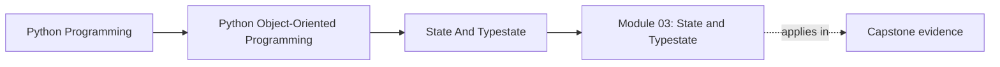
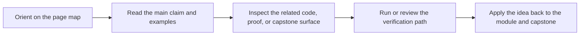

# Module 03: State and Typestate

<!-- page-maps:start -->
## Page Maps

<!-- page-maps:end -->

State is where object-oriented systems usually become ambiguous. This module treats
state as something designed deliberately rather than accumulated incidentally.

## Why this module matters

Object-oriented systems often look clean at the class level while hiding most of
their real complexity in state: optional fields, invalid combinations, lifecycle
transitions, cached values, and partial objects that "should never exist" but do.

This module turns those hidden pressures into explicit design decisions so state is
represented as a contract instead of a pile of tolerated exceptions.

## Main questions

- When is `@property` a clarity tool and when is it a trap?
- Which dataclass subsets are reliable and which combinations become brittle?
- How do you keep invalid states from leaking into the domain?
- How should `None`, partial objects, and lifecycle transitions be represented?
- How can Python APIs make illegal operations difficult without pretending to be a theorem prover?

## Reading path

1. Start with properties, descriptors, and dataclasses so the language mechanics are clear.
2. Move into validation, boundary schemas, and null-handling.
3. Finish with lifecycle and typestate because they build on the earlier representation choices.
4. Use the refactor chapter to see state constraints made explicit in one coherent model.

## Common failure modes

- hiding expensive or stateful work behind innocent-looking properties
- treating `dataclass` as a shortcut without checking what equality, hashing, or mutability it implies
- letting `None` mean several different things at once
- creating objects that are technically constructible but semantically unusable
- allowing lifecycle transitions through informal caller discipline instead of explicit APIs

## Capstone connection

The capstone's lifecycle states, constructor validation, and rule definitions are examples
of this module's core point: internal state should communicate legal operations clearly.
The `MonitoringPolicy` aggregate is only trustworthy because draft, active, and retired
rules are explicit, and because invalid inputs are rejected at the edges of object creation.

## Outcome

You should finish this module able to model lifecycles, validation rules, and null
semantics with fewer hidden states and fewer ad hoc runtime checks.
