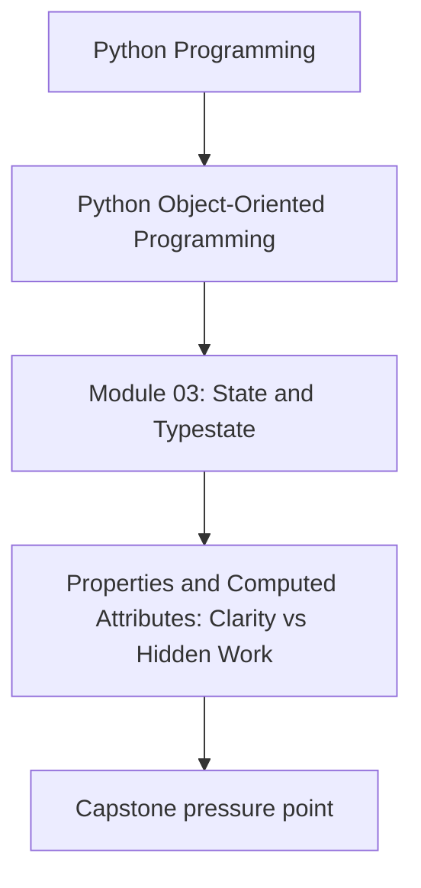
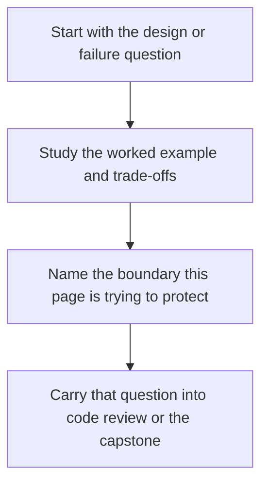

# Properties and Computed Attributes: Clarity vs Hidden Work


<!-- page-maps:start -->
## Concept Position




<!-- page-maps:end -->

Read the first diagram as a placement map: this page is one concept inside its parent module, not a detached essay, and the capstone is the pressure test for whether the idea holds. Read the second diagram as the working rhythm for the page: name the problem, study the example, identify the boundary, then carry one review question forward.

## Purpose

The `@property` decorator enables methods to behave as attributes, providing fluent access to derived values without exposing implementation details. In the monitoring domain, this allows direct expressions like `alert.active` for status checks or `metric.category` for classifications, reducing verbose method calls in orchestration. Properties must adhere to a strict contract—pure, local, and cheap—to avoid concealing side effects or computational costs that complicate testing and performance. This core contrasts suitable uses (simple derivations) with misapplications (I/O or expensive operations in "getters"), refactoring simplified M02C20 entities to apply properties for pure reads and reserve methods for actions or complexity. The contract: Properties for pure, local, data-like reads; methods for all else. This supports Module 3's state design, where properties act as descriptors (detailed in M03C22) and integrate with dataclasses (M03C23).

## 1. Baseline: Verbose Methods and Hidden Costs in the Monitoring Domain

M02C20 entities use explicit methods for derived state, resulting in repetitive calls like `alert.is_active()` that clutter code and expose internals. Some methods hide side effects, like logging during a "query," or repeat computations, like threshold checks on every access. This leads to verbose flows, unexpected I/O in loops, and inefficiency without recompute hints. Testing requires mocks for each call, reducing isolation. In the baseline `MonitoringUseCase`, methods couple layers directly. (Simplified entities restated for illustration; in full system, extend M02C20 versions.)

```python
# property_baseline.py (domain/semantic_types_model.py extension; M02C20 priors)
from __future__ import annotations
from typing import List
from semantic_types_model import Status, RuleType  # Priors

class Alert:  # Simplified baseline entity
    """Baseline: Verbose methods; hidden costs."""

    def __init__(self, rule: RuleType, metric: 'Metric'):
        self.rule = rule
        self.metric = metric
        self.status = Status.TRIGGERED

    def is_active(self) -> bool:  # Verbose; repeated calls
        return self.status != Status.RESOLVED

    def status_with_log(self) -> bool:  # Hidden side effect
        """Query with I/O: Unexpected log."""
        if self.is_active():
            print(f"Logging active alert")  # Simulate write
            return True
        return False

class Metric:  # Simplified baseline value
    """Baseline: Method with redundancy."""

    def __init__(self, timestamp: int, name: str, value: float):
        self.timestamp = timestamp
        self.name = name
        self.value = value

    def get_category(self) -> str:  # Recomputed each time
        """Derivation: Repeated threshold checks."""
        if self.value > 0.9:
            return "critical"
        elif self.value > 0.7:
            return "warning"
        return "normal"

# App usage (M02C20 extension): Verbose, costly
class MonitoringUseCase:  # Partial
    def process_alerts(self, alerts: List[Alert]) -> List[str]:
        summaries = []
        for alert in alerts:
            if alert.is_active():  # Verbose
                alert.status_with_log()  # Hidden log
                category = alert.metric.get_category()  # Recompute
                summaries.append(f"{alert.metric.name}: {category}")
        return summaries

if __name__ == "__main__":
    metric = Metric(1, "cpu", 0.95)
    alert = Alert(RuleType("threshold"), metric)
    use_case = MonitoringUseCase()
    summaries = use_case.process_alerts([alert])
    print(summaries)  # ['cpu: critical']; output: Logging...
```

**Baseline Smells Exposed**:
- **Verbose Calls**: `alert.is_active()` litters code.
- **Hidden Side Effects**: `status_with_log()` logs unexpectedly.
- **Redundant Computation**: `get_category()` rechecks thresholds per access.
- **Coupling**: Methods expose logic; tests mock heavily.
- **Isolation Loss**: Side effects force full mocks.

These obscure costs: Access should be direct.

## 2. Property Principles: Pure Reads vs Explicit Actions

Properties provide attribute-like access to method logic for derived state. Limit to pure, local computations to maintain field-like predictability.

### 2.1 Principles

**Property Contract** (all required):
- Pure: No I/O, mutation, or external dependencies.
- Local and cheap: Simple in-memory operations on the object's fields; no subsystem calls.
- Data-like: Views the object's state, not an operation (e.g., `alert.active`, not `alert.check_status`).

- **Invariants**: Deterministic from current fields; avoid caching to prevent staleness (document if used).
- **Trade-offs**: Enhances fluency but risks opacity—audit rigorously.
- **Migration**: Side effects → App delegation via ports. Expense → Methods with parameters (e.g., `refresh=True`).
- **Testing**: Verify equivalence to manual logic; confirm inertness on access.

Note: `@property` creates a descriptor; accessing `metric.category` invokes `Metric.category.__get__(metric, Metric)`—the mechanism unpacked in M03C22.

### 2.2 Refactored Model: Pure Properties in Domain Types

Refactored simplified entities: `@property` for pure derivations (e.g., `Alert.active`). Effects handled in app via ports (domain ignorant). Expense via method with app input. (Simplified for illustration; extend M02C20 in full system.)

```python
# property_model.py (domain/semantic_types_model.py extension; M02C20 priors)
from __future__ import annotations
from typing import List
from semantic_types_model import Status, RuleType  # Priors

class Alert:  # Simplified refactored entity
    """Pure properties for derivations."""

    def __init__(self, rule: RuleType, metric: 'Metric'):
        self.rule = rule
        self.metric = metric
        self.status = Status.TRIGGERED

    @property
    def active(self) -> bool:
        """Pure read: Local, cheap state view."""
        return self.status != Status.RESOLVED

class Metric:  # Simplified refactored value
    """Pure property for cheap derivation."""

    def __init__(self, timestamp: int, name: str, value: float):
        self.timestamp = timestamp
        self.name = name
        self.value = value

    @property
    def category(self) -> str:
        """Pure read: Simple field checks."""
        if self.value > 0.9:
            return "critical"
        elif self.value > 0.7:
            return "warning"
        return "normal"

    def compute_category_with_history(self, history: List['Metric']) -> str:  # Method for expense
        """Explicit: Heavier; app supplies input."""
        if not history:
            raise ValueError("History required")
        avg = sum(m.value for m in history) / len(history)
        if avg > 0.9:
            return "critical"
        elif avg > 0.7:
            return "warning"
        return "normal"

# App integration: Fluent reads, explicit delegation (M02C20 extension)
class MonitoringUseCase:  # Minimal for illustration
    def __init__(self, persistence_port: object):  # M02C20 port
        self._persistence_port = persistence_port

    def process_alerts(self, alerts: List[Alert]) -> List[str]:
        summaries = []
        for alert in alerts:
            if alert.active:  # Fluent read
                self._persistence_port.persist([alert])  # Delegated action
                category = alert.metric.category  # Pure read
                summaries.append(f"{alert.metric.name}: {category}")
        return summaries
```

**Rationale**:
- **Pure Reads**: `alert.active` and `metric.category` local and cheap.
- **Explicit Delegation**: App calls port on active read.
- **Expense Handling**: Method requires app-provided history.
- **Migration**: Baseline methods/effects → Pure properties + app logic.
- **Superiority**: Fluent, isolated. Vs. baseline: Transparent, efficient.

## 3. Integrating into Responsibilities: Orchestrator Flow

Update M02C20's `MonitoringUseCase`: Read properties fluently; delegate via ports. Domain pure; app acts.

```python
# In the real application use case (simplified excerpt):
for alert in alerts:
    if alert.active:  # Fluent read
        persistence_port.persist([alert])  # Delegated action
        category = alert.metric.category  # Pure read
        summary = f"{alert.metric.name}: {category}"
```

**Benefits Demonstrated**:
- **Fluent Reads**: Properties simplify state checks.
- **Clear Delegation**: App owns I/O on pure signals.
- **Layer Adherence**: Domain ignorant of ports.

## 4. Tests: Verifying Purity and Delegation

Assert properties match manual logic, remain inert, and delegation occurs in app.

```python
# test_property_model.py
import unittest
from unittest.mock import Mock
from typing import List
from property_model import Alert, Metric, MonitoringUseCase
from semantic_types_model import RuleType, Status
from application.ports import AlertPersistencePort

class TestProperties(unittest.TestCase):

    def setUp(self):
        self.metric = Metric(1, "cpu", 0.95)
        self.rule = RuleType("threshold")
        self.alert = Alert(self.rule, self.metric)

    def test_property_purity_equivalence(self):
        # Matches manual; inert
        self.assertTrue(self.alert.active)
        self.assertEqual(self.alert.active, self.alert.status != Status.RESOLVED)
        self.assertEqual(self.metric.category, "critical")

    def test_inert_access(self):
        # No effects
        port_mock = Mock(spec=AlertPersistencePort)
        _ = self.alert.active  # Read
        port_mock.persist.assert_not_called()

    def test_method_delegation_in_app(self):
        # App acts on read
        port_mock = Mock(spec=AlertPersistencePort)
        use_case = MonitoringUseCase(port_mock)
        summaries = use_case.process_alerts([self.alert])
        port_mock.persist.assert_called_once_with([self.alert])

    def test_method_expense(self):
        # App supplies input
        history = [self.metric, Metric(2, "cpu", 0.8)]
        category = self.metric.compute_category_with_history(history)
        self.assertEqual(category, "warning")  # Avg 0.875

if __name__ == "__main__":
    unittest.main()
```

**Execution**: `python -m unittest test_property_model.py` passes; confirms purity, delegation.

## Practical Guidelines

- **Property Contract**: Pure (no I/O/mutation), local and cheap (in-memory expressions), data-like (state view).
- **Audit Surprises**: Access without mocks; expect no calls.
- **Migrate Effects**: To app methods with ports (domain reads only).
- **Handle Expense**: Methods with app-supplied inputs.
- **Domain Fit**: Properties for single-entity reads; methods for aggregation.

**Impacts on Design**:
- **Fluency**: Attribute access over methods.
- **Purity**: Simpler unit tests.

## Exercises for Mastery

1. **Contract Check**: Add `Alert.severity` property from metric; test purity.
2. **Surprise Audit**: Add effect to property; refactor to app delegation.
3. **Migration**: Baseline verbose method to property; verify fluency.

This core refines computed access with properties in Module 3. Core 22 examines descriptors.
