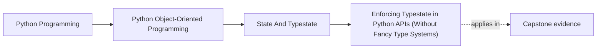
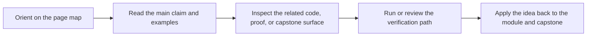

# Enforcing Typestate in Python APIs (Without Fancy Type Systems)


<!-- page-maps:start -->
## Page Maps




<!-- page-maps:end -->

## Purpose

Make typestate *stick* by designing APIs that accept only the right state.

You will learn pragmatic enforcement techniques that work in plain Python:
- signatures that take the correct type,
- small runtime guards at boundaries,
- and structural separation of collections (draft vs active).

## Where This Fits

Running example: a monitoring service that fetches metrics, evaluates rules, and emits alerts. In earlier modules we refactored toward a layered design (domain/application/infrastructure) with explicit roles. From M03 onward, we tighten *data integrity* and *lifecycle semantics* so the system stays correct under change.

## 1. The Goal: Push Checks to the Edges

If every method starts with:

```python
if self.state != ACTIVE: raise ...
```

…your design is leaking. Typestate should reduce internal checks, not multiply them.

Strategy:
- enforce state at the API boundary (method signatures / container separation),
- keep internal code “assume valid”.

## 2. Separate Collections by State

Instead of:

```python
rules: list[Rule]  # where Rule has state field
```

use:

```python
draft_rules: list[DraftRule]
active_rules: list[ActiveRule]
retired_rules: list[RetiredRule]
```

This makes it impossible to “accidentally evaluate drafts” because the evaluator only sees `active_rules`.

## 3. Accept the Right Type in the Right Place

Make illegal calls awkward or impossible:

```python
class RuleEvaluator:
    def evaluate(self, rule: ActiveRule, metric_value: float) -> bool:
        ...
```

Now callers must *possess* an `ActiveRule` to evaluate.

Similarly, activation is a method on `DraftRule`, not a free function that accepts anything.

## 4. Runtime Guards Where Types Are Not Enough

In dynamic Python, you still need guards at system boundaries:

- when reading from storage,
- when receiving JSON,
- when deserializing older versions.

Pattern:
- boundary loads a “raw” record,
- translator constructs the correct typestate object,
- invalid records fail fast.

This mirrors the DTO → domain pattern (M03C26).

## 5. Teachability: Your Types Become Documentation

A learner reading:

```python
def evaluate(rule: ActiveRule, ...) -> ...
```

immediately learns:
- only active rules are evaluatable,
- state is not a comment; it is structural.

This is one of the strongest pedagogical arguments for typestate in Python.

## Practical Guidelines

- Design APIs so methods naturally accept only valid states (via distinct types).
- Keep state-separated collections in aggregates and services.
- Use boundary translators to reconstruct typestate from storage/input; fail fast on invalid records.
- Prefer “no method exists” over “method exists but raises” for illegal operations.

## Exercises for Mastery

1. Refactor a function that accepts `Rule` + `state` into one that accepts `ActiveRule` only.
2. Split a mixed rules list into `draft_rules` and `active_rules`. Remove at least one runtime `if state == ...` check.
3. Write a boundary translator from dict → typestate that rejects invalid combinations.
