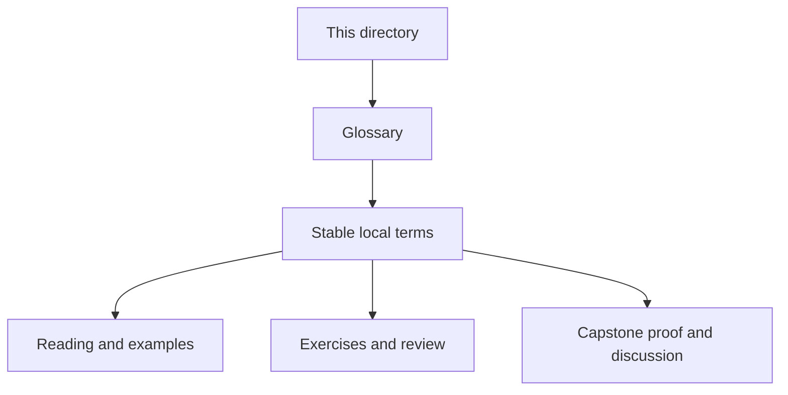
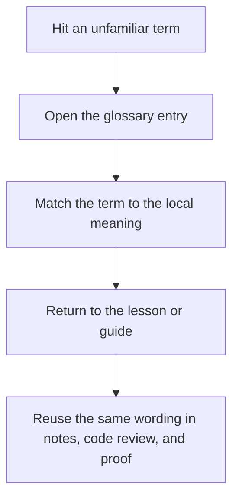

# Module Glossary

<!-- page-maps:start -->
## Glossary Fit

<!-- page-maps:end -->

This glossary belongs to **Module 03: State, Validation, and Typestate** in **Python Object-Oriented Programming**. It keeps the language of this directory stable so the same ideas keep the same names across reading, practice, review, and capstone proof.

## How to use this glossary

Read the directory index first, then return here whenever a page, command, or review discussion starts to feel more vague than the course intends. The goal is stable language, not extra theory.

## Terms in this directory

| Term | Meaning in this directory |
| --- | --- |
| Boundary Validation Libraries: Where Pydantic and Friends Belong | the module's treatment of boundary validation libraries: where pydantic and friends belong, used to make the module's main design claim concrete in design work, refactoring, and capstone evidence. |
| Dataclasses, the Good: Concise Value and Entity Definitions | the module's treatment of dataclasses, the good: concise value and entity definitions, used to make the module's main design claim concrete in design work, refactoring, and capstone evidence. |
| Dataclasses, the Ugly: Inheritance, Defaults, Slots, Frozen Pitfalls | the module's treatment of dataclasses, the ugly: inheritance, defaults, slots, frozen pitfalls, used to make the module's main design claim concrete in design work, refactoring, and capstone evidence. |
| Descriptors Mental Model (Without Writing Your Own) | the module's treatment of descriptors mental model (without writing your own), used to make the module's main design claim concrete in design work, refactoring, and capstone evidence. |
| Enforcing Typestate in Python APIs (Without Fancy Type Systems) | the module's treatment of enforcing typestate in python apis (without fancy type systems), used to make the module's main design claim concrete in design work, refactoring, and capstone evidence. |
| Lifecycle and Typestate: Draft → Active → Retired Objects | the module's treatment of lifecycle and typestate: draft → active → retired objects, used to make the module's main design claim concrete in design work, refactoring, and capstone evidence. |
| Nulls, Optionals, and Partial Objects: Designing Instead of Hoping | the module's treatment of nulls, optionals, and partial objects: designing instead of hoping, used to make the module's main design claim concrete in design work, refactoring, and capstone evidence. |
| Post-Init Validation and “Invalid States Unrepresentable” | the module's treatment of post-init validation and “invalid states unrepresentable”, used to make the module's main design claim concrete in design work, refactoring, and capstone evidence. |
| Properties and Computed Attributes: Clarity vs Hidden Work | the module's treatment of properties and computed attributes: clarity vs hidden work, used to make the module's main design claim concrete in design work, refactoring, and capstone evidence. |
| Refactor 2: Configs and Rules → Dataclasses, Null-Safe APIs, Typestate & Hypothesis | the module's treatment of refactor 2: configs and rules → dataclasses, null-safe apis, typestate & hypothesis, used to make the module's main design claim concrete in design work, refactoring, and capstone evidence. |
