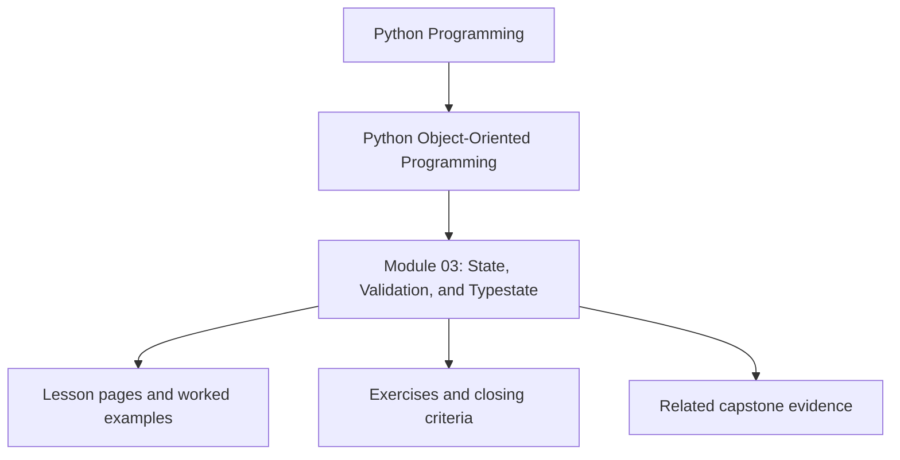
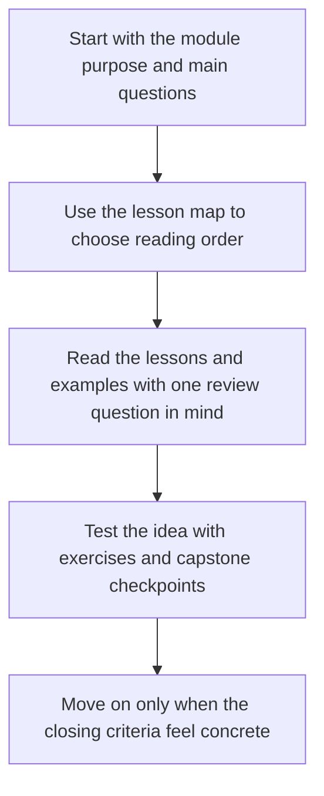

# Module 03: State, Validation, and Typestate

<!-- page-maps:start -->
## Module Position

<!-- page-maps:end -->

Read the first diagram as a placement map: this page sits between the course promise, the lesson pages listed below, and the capstone surfaces that pressure-test the module. Read the second diagram as the study route for this page, so the diagrams point you toward the `Lesson map`, `Exercises`, and `Closing criteria` instead of acting like decoration.

State is where object-oriented systems usually become ambiguous. This module treats
state as something designed deliberately rather than accumulated incidentally.

Keep one question in view while reading:

> Which states are legal, and how should the object make illegal states difficult to construct or preserve?

That question is what turns state from tolerated mess into an explicit design contract.

## Preflight

- You should already be able to distinguish ownership boundaries from convenience wrappers after Module 02.
- If properties, dataclasses, or validation hooks still feel magical, verify them with small examples before moving into typestate.
- Keep asking whether a state representation makes illegal operations harder or merely documents them after the fact.

## Learning outcomes

- model legal and illegal states explicitly instead of relying on caller discipline
- choose between properties, constructors, boundary validation, and lifecycle APIs with clear trade-offs
- represent nullability, partial objects, and transitions without collapsing meaning into `None`
- use typestate-inspired APIs to make invalid operations harder to express

## Why this module matters

Object-oriented systems often look clean at the class level while hiding most of
their real complexity in state: optional fields, invalid combinations, lifecycle
transitions, cached values, and partial objects that "should never exist" but do.

This module turns those hidden pressures into explicit design decisions so state is
represented as a contract instead of a pile of tolerated exceptions.

## Main questions

- When is `@property` a clarity tool and when is it a trap?
- Which dataclass subsets are reliable and which combinations become brittle?
- How do you keep invalid states from leaking into the domain?
- How should `None`, partial objects, and lifecycle transitions be represented?
- How can Python APIs make illegal operations difficult without pretending to be a theorem prover?

## Reading path

1. Start with properties, descriptors, and dataclasses so the language mechanics are clear.
2. Move into validation, boundary schemas, and null-handling.
3. Finish with lifecycle and typestate because they build on the earlier representation choices.
4. Use the refactor chapter to see state constraints made explicit in one coherent model.

## Keep these support surfaces open

- `../guides/outcomes-and-proof-map.md` when you want the state and lifecycle promise connected to evidence.
- `../guides/module-checkpoints.md` when you need a sharper bar for legal and illegal state reasoning.
- `../reference/self-review-prompts.md` when you want to test whether nullability, validation, and transitions now sound like contract language.

## Common failure modes

- hiding expensive or stateful work behind innocent-looking properties
- treating `dataclass` as a shortcut without checking what equality, hashing, or mutability it implies
- letting `None` mean several different things at once
- creating objects that are technically constructible but semantically unusable
- allowing lifecycle transitions through informal caller discipline instead of explicit APIs

## Exercises

- Pick one object lifecycle and list the legal transitions, the illegal transitions, and the method boundary that should enforce them.
- Review one property or constructor and explain whether it clarifies state or hides work that should stay explicit.
- Replace one ambiguous `None` meaning with a sharper representation and explain what bug surface that removes.

## Capstone connection

The capstone's lifecycle states, constructor validation, and rule definitions are examples
of this module's core point: internal state should communicate legal operations clearly.
The `MonitoringPolicy` aggregate is only trustworthy because draft, active, and retired
rules are explicit, and because invalid inputs are rejected at the edges of object creation.

## Closing criteria

You should finish this module able to model lifecycles, validation rules, and null
semantics with fewer hidden states and fewer ad hoc runtime checks.
